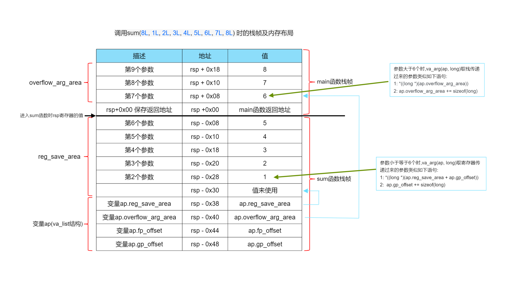

# C语言可变参数原理


> 我测试的环境文 WSL(windows subsystem linux), Ubuntu 20.04.4

---

## 示例

首先我们来看一下可变参数的用法:
```C
// demo.c
#include <stdio.h>
#include <stdarg.h> //引入相关头文件

long sum(long num, ...)
{
  va_list ap;   // 定义ap变量
  long sum = 0;

  va_start(ap, num);  // 初始化ap

  while (num--)
  {
    sum += va_arg(ap, long);  // 获取当前正在遍历的可变参数
  }

  va_end(ap); // 清空
  return sum;
}

int main()
{
  long ret;
  ret = sum(8L, 1L, 2L, 3L, 4L, 5L, 6L, 7L, 8L);
  printf("sum(1..8) = %ld\n", ret);

  return 0;
}
```

可以看到可变参数的使用方式非常简单。这篇文章分两部分介绍原理, 分别是
-  `X86-64` 下的C语言可变参数原理
-  `IA-32` 下的C语言可变参数原理

## `X86-64` 下的实现方式

因为`X86-64`体系下,函数传参相较于`IA32`发生了比较大的变化, 函数调用遵循 System V AMD64 ABI 约定,前6个参数使用寄存器传参, 当参数大于6个时,再使用栈传参数,具体参看,请参考 [CSAPP第三章](../csapp/chapter3程序的机器级表示.md#registers)

其实现方式也相对复杂,我们将通过反汇编来分析。

我们继续使用上面示例(`demo.c`)的代码,并使用如下编译: `gcc -Wall -g -O1 -fno-stack-protector demo.c -o demo`

其`main`函数反汇编如下:
```
00000000000011cb <main>:
    11cb:       f3 0f 1e fa             endbr64
    11cf:       48 83 ec 08             sub    $0x8,%rsp
    11d3:       6a 08                   pushq  $0x8      # 第9个参数
    11d5:       6a 07                   pushq  $0x7      # 第8个参数
    11d7:       6a 06                   pushq  $0x6      # 第7个参数
    11d9:       41 b9 05 00 00 00       mov    $0x5,%r9d # 第6个参数
    11df:       41 b8 04 00 00 00       mov    $0x4,%r8d # 第5个参数
    11e5:       b9 03 00 00 00          mov    $0x3,%ecx # 第4个参数
    11ea:       ba 02 00 00 00          mov    $0x2,%edx # 第3个参数
    11ef:       be 01 00 00 00          mov    $0x1,%esi # 第2个参数
    11f4:       bf 08 00 00 00          mov    $0x8,%edi # 第1个参数
    11f9:       b8 00 00 00 00          mov    $0x0,%eax 
    11fe:       e8 46 ff ff ff          callq  1149 <sum>
    1203:       48 89 c2                mov    %rax,%rdx
    1206:       48 83 c4 18             add    $0x18,%rsp
    120a:       48 8d 35 f3 0d 00 00    lea    0xdf3(%rip),%rsi        # 2004 <_IO_stdin_used+0x4>
    1211:       bf 01 00 00 00          mov    $0x1,%edi
    1216:       b8 00 00 00 00          mov    $0x0,%eax
    121b:       e8 30 fe ff ff          callq  1050 <__printf_chk@plt>
    1220:       b8 00 00 00 00          mov    $0x0,%eax
    1225:       48 83 c4 08             add    $0x8,%rsp
    1229:       c3                      retq
    122a:       66 0f 1f 44 00 00       nopw   0x0(%rax,%rax,1)
```

其`sum` 函数反汇编如下:
```
0000000000001149 <sum>:
    1149:       f3 0f 1e fa             endbr64
    114d:       48 89 74 24 d8          mov    %rsi,-0x28(%rsp)  # 第2个参数
    1152:       48 89 54 24 e0          mov    %rdx,-0x20(%rsp)  # 第3个参数
    1157:       48 89 4c 24 e8          mov    %rcx,-0x18(%rsp)  # 第4个参数
    115c:       4c 89 44 24 f0          mov    %r8,-0x10(%rsp)   # 第5个参数
    1161:       4c 89 4c 24 f8          mov    %r9,-0x8(%rsp)    # 第6个参数
    1166:       c7 44 24 b8 08 00 00    movl   $0x8,-0x48(%rsp)  # ap变量的首元素, 即ap.gp_offset, 因为第一个参数num是可变参数个数,所以跳过第一个参数,故此gp_offset设置为 0x08
    116d:       00
    116e:       48 8d 44 24 08          lea    0x8(%rsp),%rax    # 0x8(%rsp)为第7个参数
    1173:       48 89 44 24 c0          mov    %rax,-0x40(%rsp)  # -0x40(%rsp),即ap.overflow_arg_area指了第一个用栈传参的变量
    1178:       48 8d 44 24 d0          lea    -0x30(%rsp),%rax  # -0x30(%rsp), 感觉上像是给第一个参数,但该位置并未实际使用,只用来标记第一个参数的前一个位置
    117d:       48 89 44 24 c8          mov    %rax,-0x38(%rsp)  # -0x38(%rsp) 是 ap.reg_save_area,即ap.reg_save_area指向了-0x30(%rsp)
    1182:       48 8d 4f ff             lea    -0x1(%rdi),%rcx   # -0x1(%rdi)即(num-1),也就是rcx保存的是可变参数的个数,用于遍历计数
    1186:       48 85 ff                test   %rdi,%rdi         # 检测rdi 是整数、零、还是负数
    1189:       74 3c                   je     11c7 <sum+0x7e>   # 等于零就跳转
    118b:       48 89 c6                mov    %rax,%rsi         # 此时 rsi 存放的是-0x30(%rsp) 的地址
    118e:       bf 00 00 00 00          mov    $0x0,%edi         # edi 等于 0
    1193:       eb 1b                   jmp    11b0 <sum+0x67>
    1195:       48 8b 54 24 c0          mov    -0x40(%rsp),%rdx  # 读取栈的参数到遍历对象rdx中, 等价C语句: sum = *((long *)(ap.overflow_arg_area))
    119a:       48 8d 42 08             lea    0x8(%rdx),%rax    # 把下一个栈传递的参数传给rax
    119e:       48 89 44 24 c0          mov    %rax,-0x40(%rsp)  # 即ap.overflow_arg_area 指向下一个栈传参的参数, 等价C语句: ap.overflow_arg_area += sizeof(long)
    11a3:       48 03 3a                add    (%rdx),%rdi       # sum变量保存在寄存器rdi中, rdx保存当前遍历的可变参数,等价C语句:sum = *((long *)(ap.reg_save_area + ap.gp_offset))
    11a6:       48 83 e9 01             sub    $0x1,%rcx         # rcx 减一
    11aa:       48 83 f9 ff             cmp    $0xffffffffffffffff,%rcx  # rcx跟-1 比较, 如果相等, 就跳转结束
    11ae:       74 17                   je     11c7 <sum+0x7e>
    11b0:       8b 44 24 b8             mov    -0x48(%rsp),%eax  # eax 保存的是 ap.gp_offset
    11b4:       83 f8 2f                cmp    $0x2f,%eax        # if(eax > 0x2f) then jump <sum+0x4c>
    11b7:       77 dc                   ja     1195 <sum+0x4c>   # 0x2f = 47, 这个数很奇怪, 不过细想以下,寄存器传参数最多为6个, 可以猜到可变参数超出寄存器传参范围就跳转到栈里面读取参数
    11b9:       89 c2                   mov    %eax,%edx         # 
    11bb:       48 01 f2                add    %rsi,%rdx         # rdx 遍历存放可变参数,从第2个参数(即第一个可变参数)开始
    11be:       83 c0 08                add    $0x8,%eax         # 
    11c1:       89 44 24 b8             mov    %eax,-0x48(%rsp)  # 等价C语句: ap.gp_offset += sizeof(long)
    11c5:       eb dc                   jmp    11a3 <sum+0x5a>
    11c7:       48 89 f8                mov    %rdi,%rax         # rax保存返回值
    11ca:       c3                      retq
```

然后使用 `gdb -q ./demo`,在`sum`函数处打断点, 然后gdb打印结果如下:
```
(gdb) ptype ap           # ap是一个结构体。 另外说一下的是,如果是IA32架构下, ap的类型是char*
type = struct __va_list_tag {
    unsigned int gp_offset;
    unsigned int fp_offset;
    void *overflow_arg_area;
    void *reg_save_area;
} [1]
(gdb) p $rsp
$11 = (void *) 0x7fffffffe0c0          # 当前$rsp指向的值得
(gdb) p &ap
$12 = (va_list *) 0x7fffffffe078       # 相当于(-0x48(%rsp))
(gdb) p &(ap.gp_offset)
$13 = (unsigned int *) 0x7fffffffe078  # 相当于(-0x48(%rsp))
(gdb) p &(ap.fp_offset)
$14 = (unsigned int *) 0x7fffffffe07c  # 相当于(-0x44(%rsp))
(gdb) p &(ap.overflow_arg_area )
$15 = (void **) 0x7fffffffe080         # 相当于(-0x40(%rsp))  
(gdb) p &(ap.reg_save_area)
$16 = (void **) 0x7fffffffe088         # 相当于(-0x38(%rsp))  
```

然后根据`sum`函数的反汇编和`gdb`调试的输出,我们可以画出下面函数调用的`栈帧`



下面对结构体`ap`作出的说明

| 成员名称 | 描述 |
| :----: | :----: | 
| reg_save_area | 是个指针,指向使用寄存器传递(参数小于等于6个时)参数的区域 |
| overflow_arg_area | 是个指针,指向栈传递(参数大于6个时)的参数区 |
| gp_offset	| 参数个数小于等于6个时, 下一个整型数据相较于reg_save_area的偏移，即指下个va_arg(ap, xxx)的值在 ap.reg_save_area + ap.gp_offset  |
| fp_offset	| 参数个数小于等于6个时,下一个浮点型型数据相较于reg_save_area 的偏移，这里不讨论浮点传参的例子, 故略 |

用C语言伪代码来表示可变参数的原来, 如下:
```C
long sum(long num, ...)
{
  va_list ap;
  long sum = 0;

 /**
  * va_start执行过成相当于:
  *  1. 把第2到6个参数(即前5个可变参数), 1L, 2L, 3L, 4L, 5L搬到sum函数栈帧, 其中可变参数6L, 7L, 8L在main函数的栈帧中
  *  2. ap.reg_save_area 指向第一个可变参数(1L)的下一个位置,同时 ap.gp_offset设置为8, 即sizeof(long)
 */
  va_start(ap, num);

for (int i = 1; i <= num; i++)
{
    if (i < 6 )
    {
      // va_arg(ap, long) 在使用寄存器传参时的取参数情况
      sum + = *((long *)(ap.reg_save_area + ap.gp_offset));
      ap.gp_offset += sizeof(long)
    }else {
      // va_arg(ap, long) 在使用栈传参时的取参数情况
     sum += *((long *)(ap.overflow_arg_area));
     ap.overflow_arg_area += sizeof(long)
    }
}
  va_end(ap);
  return sum;
}

int main()
{
  long ret;
  ret = sum(8L, 1L, 2L, 3L, 4L, 5L, 6L, 7L, 8L);
  printf("sum(1..8) = %ld\n", ret);

  return 0;
}
```

---
<br>

## `IA-32` 下的实现方式

在介绍 `IA-32`可变参数的实现原理, 我们将不引入`#include <stdarg.h>`,自己一步一步演进, 介绍其原来, 其实现原理比较简单，具体看代码(`arg-32.c`)和注释就可以看懂,不再详细赘述。编译器的实现发生也跟此例子实现方式类。
```C

#include <stdio.h>

//  gcc  -m32 -Wall -g -O0 -fno-stack-protector arg-32.c
void func(int count, ...)
{
  // va_start
  char *p = (char *)&count;
  printf("1st arg: %d\n", *((int *)p));

  // va_arg
  p += sizeof(int);
  int i1 = *((int *)p);

  printf("2nd arg: %d\n", i1);

  // va_arg
  p += sizeof(int);
  int i2 = *((int *)p);
  printf("3rd arg: %d\n", i2);

  // va_arg
  p += sizeof(int);
  int i3 = *((int *)p);
  printf("4th arg: %d\n", i3);

  p = NULL;
}

/**
 * 通过观察func1，发现规律, 于是改成用遍历方式实现
 */
void func2(int count, ...) {
    // va_start
  char *p = (char *)&count;
  printf("1st arg: %d\n", *((int *)p));

  for (int i = 0; i < count; i++)
  {
      p += sizeof(int);
      printf("%dth arg: %d\n", i + 2,*((int *)p));
  }

  p = NULL;
}

//////////////////////////////////////////
typedef char* va_list;                                               // 思考一下这里为什么要用char * 
#define va_start(ap, num) (ap = (va_list)&num)                      // 指向第一个固定参数 (gcc编译出来的是指向第二个参数(即第一个可变参数))
#define va_arg(ap,type)	((ap += sizeof(type)), *((type *)ap))       // 递增, 然后获取当前参数的值,这里用了逗号(,)表达式, 相当于逗号最后的一条语句作返回值
#define va_end(ap) (ap = ((va_list)NULL))                           // 设置为空
/////////////////////////////

/**
 *  将fuc2的实现抽取以下, 用宏实现
 */
void func3(int count, ...) {
   
   va_list ap;
   va_start(ap, count);

  printf("1st arg: %d\n", *((int *)ap));

  for (int i = 0; i < count; i++)
  {
      printf("%dth arg: %d\n", i + 2, va_arg(ap, int));
  }

  va_end(ap);
}

int main(int argc, char const *argv[])
{

  func(3, 4, 5, 6);
  printf("===============================\n");
  func2(3, 4, 5, 6);
  printf("===============================\n");
  func3(3, 4, 5, 6);
  
  return 0;
}
```


