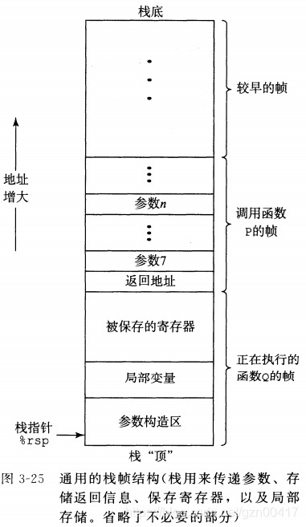

## gcc编译选项
- -Og 告诉编译器生成符合原始C代码整体结构的机器及代码


***

## x86-64 数据类型大小
Sizes of C data types in x86-64. With a 64-bit machine, pointers are 8 bytes long

| C declaration | Intel data type | Assembly-code suffifix | Size (bytes) |
| :----: | :----: | :----: | :----: |
|char    |   Byte           | b | 1 |
|short   | Word             | w | 2 |
|int     | Double word      | l | 4 |
|long    | Quad word        | q | 8 |
|char *  | Quad word        | q | 8 |
|float   | Single precision | s | 4 |
|double  | Double precision | l | 8 |

***
## Registers
|64-bit register | Lower 32 bits | Lower 16 bits | Lower 8 bits| |
| :----: | :----: | :----: | :----: | :----: |
|rax | eax | ax | al|return value|
|rbx | ebx | bx | bl|callee saved|
|rcx | ecx | cx | cl|4th argument|
|rdx | edx | dx | dl|3th argument|
|rsi | esi | si | sil|2th argument|
|rdi | edi | di | dil|1th argument|
|rbp | ebp | bp | bpl|callee saved|
|rsp | esp | sp | spl|stack pointer|
|r8 | r8d | r8w | r8b|5th argument|
|r9 | r9d | r9w | r9b|6th argument|
|r10 | r10d | r10w | r10b|caller saved|
|r11 | r11d | r11w | r11b|caller saved|
|r12 | r12d | r12w | r12b|callee saved|
|r13 | r13d | r13w | r13b|callee saved|
|r14 | r14d | r14w | r14b|callee saved|
|r15 | r15d | r15w | r15b|callee saved|

***
## 寻址方式
- `imm(ediate)` 立即数  `R(egister)`寄存器

| 类型 | 格式 | 操作数值 | 名称 |
| :----: | :----: | :----: | :----: |
| 立即数 | $Imm | Imm | 立即数寻址  |
| 寄存器 | ra | R[ra] | 寄存器寻址  |
| 存储器 | Imm | M[Imm] | 绝对(直接)寻址 |
| 存储器 | (ra) | M[R[ra]] | 间接寻址 |
| 存储器 | Imm(rb) | M[Imm + R[rb]] | (基址+偏移量)寻址 |
| 存储器 | (rb,ri) | M[R[rb] + R[ri]] | 变地寻址 |
| 存储器 | Imm(rb,ri) | M[Imm + R[rb] + R[ri]] | 变地寻址 |
| 存储器 | (,ri,s) | M[R[ri].s] | 比例变地寻址 |
| 存储器 | Imm(,ri,s) | M[Imm + R[ri].s] | 比例变地寻址 |
| 存储器 | (rb,ri,s) | M[R[rb] + R[ri].s] | 比例变地寻址 |
| 存储器 | Imm(rb,ri,s) | M[Imm + R[rb] + R[ri].s] | 比例变地寻址 |

- 例子
假设下main的值存放在指明的内存和寄存器中

| Address | Value | | Register | Value |
| :----: | :----: | :----: |  :----: |:----: |
| 0x100 | 0xFF | | %rax | 0x100 |
| 0x104 | 0xAB | | %rcx | 0x1 |
| 0x108 | 0x13 | | %rdx | 0x3 |
| 0x10C | 0x11 | |      |     |

下表是操作数所示的值

| 操作数 | 值 | 注释 |
| :----: | :----: | :----: |
| %rax           | 0x100  | 寄存器寻址 |
| 0x104          | 0xAB   | 直接(绝对)寻址 |
| $0x108         | $0x108 | 立即数寻址 |
| (%rax)         | 0xFF   | 间接寻址 |
| 4(%rax)        | 0xAB   |基址+偏移量寻址|
| 9(%rax,%rdx)   | 0x11   | 变址寻址 rax + rcx + 9 |
| 260(%rcx,%rdx) | 0x13   |变址寻址 rcx + rdx + 260 = 0x108|
| 0xFC(,%rcx,4)  | 0xFF   | 比例变地寻址, rcx * 4 + 0fc|
| (%rax,%rdx,4)  | 0x11   | 比例变地寻址, rax + rdx * 4 |


***
## push & pop 指令
- push %rbp 等价于: subq $8, $rsp; movq %rbp, (%rsp)
- popq %rax 等价于: movq $rax, %rax; addq $8, %rsp;

***
<br>
算术指令

|指令 | 结果 | 描述 |
| :----: | :----: | :----: |
| leaq S, D | D ← &S | Load effective address |
| inc D | D ← D+1 | Increment |
| dec D | D ← D−1 | Decrement |
| neg D | D ← -D | Negate |
| not D | D ← ~D | Complement |
| add S, D | D ← D + S | Add |
| sub S, D  | D ← D − S | Subtract |
| imul S, D | D ← D ∗ S | Multiply |
| xor S, D | D ← D ^ S | Exclusive-or |
| or S, D | D ← D or S | Or |
| and S, D | D ← D & S | And |
| sal k, D | D ← D << k | Left shift |
| shl k, D | D ← D << k | Left shift (same as sal) |
| sar k, D | D ← D >>A k | Arithmetic right shift |
| shr k, D | D ← D >>L k | Logical right shift |

## 加载有效地址
加载有效地址(load effective address)指令leaq实际上是movq指令的变形。这个指令看上去好像是从内存上读指定地址的数据到目标操作数中, 但实际上它并没有从内存读, 而是把该有效地址写入到目标操作数中。
用法:
- 可以为内存引用产生指针
- 还可以简洁地描述普通的运算操作。如: 假设%rdx的值为x, 那么leaq 7(%rdx, %rdx, 4), %rax. 则%rax等于 x + x * 4 + 7 = 5x+7

### leaq 与 movq 的区别
同样, 假设%rdx的值为x, 那么movq 7(%rdx, %rdx, 4), %rax. 则%rax等于从内存地址为 5x + 7 中的内存单元拿数据, 再赋值给%rax


***
## 条件码
- CF(Carry flag):进位标志。最近的操作使最高位产生了进位，可检查无符号数操作的溢出。
- ZF(Zero flag): 零标志,最近的操作结果得出零的结果
- SF(Signed flag): 符号标志,最近的操作结果为负数
- OF(Overflow flag0):一处标志,最近的操作导致一个补码正溢出或负溢出

比如, 一条add指令执行操作 t = a + b的功能(a、b、t睡是整型的)。然后结构根据下面的结果设置条件码:

| 标志 | 结果 | 注释 |
| :----: | :----: | :----: |
| CF | (unsigend) t < (unsigned)a  | 无符号溢出  |
| ZF | (t == 0 )                   | 零         | 
| SF | (t < 0)                     | 负数       | 
| OF | (a<0==b<0) && (t<0 !=a<0>)  | 有符号溢出  |

leaq 不会改变条件码, 其他指令INC,DECNEG,NOT, ADD,SUB,IMUL,XOR.OR,ANDSAL,SHL,SAR,SHR都会设置条件码。例如XOR, 进位和溢出标志都会被设置成0。对于移位操作, 进位标志经设置为最后一个被溢出的位,而溢出标志设置为0.INC和DEC会设置溢出和零标志, 但是不会改变进位标志位。

有些指令只设置条件码而不改变任何寄存器, 如CMP、TEST指令。
- CMP (CMP S1, S2,基于S2-S1)根据两个操作数只差来设置条件码,而不更新寄存器，如果两个操作数相等, Zero flag的结果为1。除此之外, 它是跟SUB指令是一样的。
- TEST TEST指令除了他们只设置条件码而不改变目其寄存器的值，其它与and指令一样。典型用法如(testq %rax, %rax来检查%rax是负数零,还是正数),或者其中一个操作数是掩码, 用来指示哪些位应该被测试

<br>

## 条件码访问
条件码访问有三种:
- 根据条件码组合, 将一个字节设置为1或者1 (SET指令)
- 条件跳转到程序的其他地方
- 有条件的传送数据

### set指令
一条set指令的目的操作数是低位单字节寄存器或一个字节的内存, 指令会将这个字节设置成0或1。为了得到一个32/64位的结果, 必须将高位清零。主义下面的setl的l是less, setb的b是below。
举个例子:
```asm
movq $0, %rax
movq $3, %rdi
movq $3, %rsi    # %rsi == %rdi
cmpq %rdi, %rsi  # 因为相等, 所以ZF为1,假如不相等ZF为0
setq %al         #把ZF=1赋值给%al,若ZF=0,也会把ZF=0赋值给%al
```
|指令 | 同义名 | 效果 | 条件 |
| :----: | :----: | :----: | :----: |
|sete D | setz | D ← ZF | 相等/零 |
|setne D | setnz | D ← ~ ZF | 不等/非零 |
|sets D | | D ← SF | 负数 | 
|setns D | | D ← ~ SF | 非负数 |
|setg D | setnle | D ← ~ (SF ^ OF) & ~ZF | 大于(有符号>)  |
|setge D | setnl | D ← ~ (SF ^ OF) | 大于或者等于 (有符号 >=) |
|setl D | setnge | D ← SF ^ OF | 小于 (有符号 <)
|setle D | setng | D ← (SF ^ OF) or ZF | 小于或等于 (有符号 <=) |
|seta D | setnbe | D ← ~ CF & ~ZF | 超过 (无符号 >) |
|setae D | setnb | D ← ~ CF | 超过或等于 (无符号 >=)  |
|setb D | setnae | D ← CF | 低于 (无符号 <)  |
|setbe D | setna | D ← CF or ZF | 低于或等于 (无符号 <=) |

### 跳转指令

| 指令 | 同义名 | 跳转条件 | 描述 |
| :----: | :----: | :----: | :----: |
| jmp Label | | 1 | unconditionally Direct jump |
| jmp *Operand | | 1 | unconditionally Indirect jump |
| je Label | jz | ZF | Equal / zero
| jne Label | jnz | ~ZF |  Not equal / not zero |
| js Label | | SF | Negative |
| jns Label | | ~SF | Nonnegative |
| jg Label | jnle | ~(SF ^ OF) & ~ZF | Greater (signed >) |
| jge Label | jnl | ~(SF ^ OF)  | Greater or equal (signed >=) |
| jl Label | jnge | SF ^ OF  | Less (signed <) |
| jle Label | jng | (SF ^ OF) or ZF  | Less or equal (signed <=) |
| ja Label | jnbe | ~CF & ~ZF  | Above (unsigned >) |
| jae Label | jnb | ~CF  | Above or equal (unsigned >=) |
| jb Label | jnae | CF | Below (unsigned <) |
| jbe Label | jna | CF or ZF | Below or equal (unsigned <=) |


- 相对寻址
假设有如下代码`branch.c`:
```c
long loop(long x)
{
    while (x > 0) {
        x = x >> 1;
    }
    return x;
}

int main()
{
    return loop(-2);
}
```
执行`gcc -Og -S branch.c` 得到`branch.s`, `loop`函数如下:
```asm
loop:
.LFB0:
        endbr64
        movq    %rdi, %rax
.L2:
        testq   %rax, %rax
        jle     .L4
        sarq    %rax
        jmp     .L2
.L4:
        ret
```
执行`gcc -C -Og branch.c`, 然后`objdump -d branch.o`得到
```asm
 0000000000000000 <loop>:
1   0:   f3 0f 1e fa             endbr64
2   4:   48 89 f8                mov    %rdi,%rax
3   7:   48 85 c0                test   %rax,%rax
4   a:   7e 05                   jle    11 <loop+0x11>
5   c:   48 d1 f8                sar    %rax
6   f:   eb f6                   jmp    7 <loop+0x7>
7  11:   c3                      retq
```
第4行中跳转指令的目标指明为`0x11`,第6行中跳转指令的目标指明为`0x07`.
不过观察指令的编码,会看到第一条指令的目标编码(在第二个字节中)为`0x05`, 把它加上`0x0c`(因为目标编码`0x05`距离函数`loop`开头为 `0x0c`)，即`0x11 = 0x05 + 0x0c`,即第7行处的指令
类似地, 第二个跳转指令的目标用单字节补码表示为`0xF6`(十进制-10)。将这个数数加上`0x11`, 即 `0x07 = 0x11 - 0x0a`,即跳转第3行的指令
下面是链接后反汇编的代码
```asm
 0000000000001129 <loop>:
1    1129:       f3 0f 1e fa             endbr64
2    112d:       48 89 f8                mov    %rdi,%rax
3    1130:       48 85 c0                test   %rax,%rax
4    1133:       7e 05                   jle    113a <loop+0x11>
5    1135:       48 d1 f8                sar    %rax
6    1138:       eb f6                   jmp    1130 <loop+0x7>
7    113a:       c3                      retq
```
这些指令被重定位到不同的地址, 但是第4和第6行的跳转目标编码并没有变。通过使用与PC相对的跳转目标编码, 指令只需要很简洁(只需要2个自己), 而且目标代码可以不做改变就能移到内存中不同的位置。


- 绝对寻址
 todo

<br>
<br>

 ### 有条件的数据传送
来看两个例子:
- 条件控制实现条件分支
来看一段代码
```C
long lt_cnt = 0;
long ge_cnt = 0;

long absdiff_se(long x, long y)
{
    long result;
    if (x < y) {
      lt_cnt++;
      result = y - x;
    } else {
     ge_cnt++;
     result = x - y;
    }
    return result;
}
```
其对应的汇编代码控制流程类似下面这段C代码
```C
long gotodiff_se(long x, long y)
{
    long result;
    if (x >= y)
        goto x_ge_y;
    lt_cnt++;
    result = y - x;
    return result;
x_ge_y:
    ge_cnt++;
    result = x - y;
    return result;
}
```
产生的汇编代码 `-O2` 编译选项
```asm
absdiff_se:
.LFB0:
        endbr64
        movq    %rsi, %rax
        cmpq    %rsi, %rdi
        jge     .L2
        addq    $1, lt_cnt(%rip)
        subq    %rdi, %rax
        ret
.L2:
        subq    %rsi, %rdi
        addq    $1, ge_cnt(%rip)
        movq    %rdi, %rax
        ret
```
在这里因为`lt_cnt`和`ge_cnt`这两个全局变量存在而产生副作用, 编译器没有办法做进一步的优化。这种条件控制的方法,当条件满足是,程序沿着一条路径执行, 当条件不满足时, 就走另外一条路径。这种机制简单而通用, 但是在现代处理器上, 它可能会非常低效。

<br>

- 条件传送实现条件分支
再看一个例子:
```C
long absdiff(long x, long y)
{
    long result;
    if (x < y)
      result = y - x;
    else
      result = x - y;
    return result;
}
```
其实现逻辑对应的C代码:
```C
long cmovdiff(long x, long y)
{
    long rval = y - x;
    long eval = x - y;
    long ntest = x >= y;
    if (ntest) rval = eval; //这一行需要单指令实现, 即cmov指令
    return rval;
}
```
产生的汇编代码 `-O2` 编译选项
```asm
# long absdiff(long x, long y)
# x in %rdi, y in %rsi
absdiff:
        endbr64
        movq %rsi, %rax
        subq %rdi, %rax  #rval = y-x
        movq %rdi, %rdx
        subq %rsi, %rdx  #eval = x-y
        cmpq %rsi, %rdi  #Compare x:y
        cmovge %rdx, %rax #If >=, rval = eval
        ret Return tval
```
可以看到,因为这个例子中不像条件控制实现条件分支的那个例子, 那个例子中因为`lt_cnt`和`ge_cnt`这两个全局变量而无法优化。而当前这里例子, 因为没有全局变量, 所以把`if`和`else`都算一遍都没有问题, 然后使用`cmovge`实现条件传送.

以下内容摘自CSAPP3e中文译本 Page 146
> 为了理解为什么基于条件数据传送的代码会比基于条件控制转移的代码性能要好，我们必须了解一些关于现代处理器如何运行的知识。正如我们在第4章和第5章中看到的，处理器通过流水线（pipelining）来获得高性能，在流水线中，一条指令的处理要经过一些列的阶段，每个阶段执行所需操作的一小部分（例如，从内存取指令，确定指令类型，从内存读数据，执行算术运算，向内存写数据，以及更新程序计数器）。这种方法通过重叠连续指令的步骤来获得高性能，例如，在取一条命令的同时，执行它前面一条指令的算术运算。要做到这一点，要求能够事先确定要执行的指令序列，这样才能保持流水线中充满了待执行的指令。当机器要到条件跳转（也称为“分支”）时，只有当分支条件求值完成后，才能决定分支往哪边走，处理器采用非常精密的分支预测逻辑来猜测每条跳转指令是否会执行。只要它的猜测还比较可靠（现代微处理器设计试图达到90%以上的成功率），指令流水线就会充满着指令。另一方面，错误预测一个跳转，要求处理器丢掉它为该跳转指令后所有指令已做的工作，然后再开始从正确位置其实的指令取填充流水线，正如我们会看到的，这样一个错误预测会招致很严重的处罚，浪费大约15~30个时钟周期，导致程序性能严重下降。

<br>

| 指令 | 同义名 | 传送条件 |  描述 |
| :----: | :----: | :----: | :----: |
| cmove S, R | cmovz | ZF | Equal / zero |
| cmovne S, R | cmovnz | ~ZF | Not equal / not zero |
| cmovs S, R | |SF | Negative |
| cmovns S, R | | ~SF | Nonnegative |
| cmovg S, R | cmovnle | ~(SF ^ OF) & ~ZF|  Greater (signed >) |
| cmovge S, R | cmovnl | ~(SF ^ OF) | Greater or equal (signed >=) |
| cmovl S, R | cmovnge | SF ^ OF | Less (signed <) |
| cmovle S, R | cmovng | (SF ^ OF) or ZF | Less or equal (signed <=) |
| cmova S, R | cmovnbe | ~CF & ~ZF |  Above (unsigned >) |
| cmovae S, R | cmovnb | ~CF | Above or equal (Unsigned >=) |
| cmovb S, R | cmovnae | CF | Below (unsigned <) |
| cmovbe S, R | cmovna | CF | ZF Below or equal (unsigned <=) |


当然条件传送也不是完美的， 

- 比如下面代码:
```C
long cread(long *xp) {
    return (xp ? *xp : 0);
}
```
因为存在空指针引用的问题, 就只能使用条件控制来编译这段代码.

- 再比如, `if` 和 `else` 都需要大量的计算, 如果条件不满足, 那么这些计算也就白白浪费了.

***
<br>

## 循环
`do-while`,`while`,`for`循环，略


## switch
编译器对switch的优化, 看以下代码:

```C
void switch_eg(long x, long n, long *dest)
{
    long val = x;
    switch (n)
    {
    case 100:
        val *= 13;
        break;
    case 102:
        val += 10;
    /* Fall through */
    case 103:
        val += 11;
        break;
    case 104:
    case 106:
        val *= val;
        break;
    default:
        val = 0;
    }
    *dest = val;
}
```

翻译到拓展的C语言:
```C
void switch_eg_impl(long x, long n, long *dest)
{
    /* Table of code pointers */
    static void *jt[7] = {
        &&loc_A, &&loc_def, &&loc_B,
        &&loc_C, &&loc_D, &&loc_def,
        &&loc_D};
    unsigned long index = n - 100;
    long val;

    if (index > 6)
        goto loc_def;
    /* Multiway branch */
    goto *jt[index];

loc_A: /* Case 100 */
    val = x * 13;
    goto done;
loc_B: /* Case 102 */
    x = x + 10;
/* Fall through */
loc_C: /* Case 103 */
    val = x + 11;
    goto done;
loc_D: /* Cases 104, 106 */
    val = x * x;
    goto done;
loc_def: /* Default case */
    val = 0;
done:
    *dest = val;
}
```

其对应的汇编代码
```asm
# void switch_eg(long x, long n, long *dest)
# x in %rdi, n in %rsi, dest in %rdx
switch_eg:
    subq $100, %rsi Compute index = n-100
    cmpq $6, %rsi Compare index:6
    ja .L8 If >, goto loc_def
    jmp *.L4(,%rsi,8) Goto *jg[index]
  .L3: loc_A:
    leaq (%rdi,%rdi,2), %rax 3*x
    leaq (%rdi,%rax,4), %rdi val = 13*x
    jmp .L2 Goto done
  .L5: loc_B:
    addq $10, %rdi x = x + 10
  .L6: loc_C:
    addq $11, %rdi val = x + 11
    jmp .L2 Goto done
  .L7: loc_D:
    imulq %rdi, %rdi val = x * x
    jmp .L2 Goto done
  .L8: loc_def:
    movl $0, %edi val = 0
  .L2: done:
    movq %rdi, (%rdx) *dest = val
    ret Return
```
可以看到,在这个例子中, 编译器用一个跳转表来优化switch语句

---
<br>

# 过程

### 运行时栈(csapp第三版中文版第164页)


### CALL 和RET指令
还是用一段代码和GDB调试说明吧
