# 网络互连模型（OSI参考模型）

## 什么是协议？为什么要有协议？

协议就是通用的标准。
如果没有一个国际通用的标准，那么各大公司按照自己的标准来，相互之间的交互就会很麻烦。比如我编写的代码在微软的服务器可以运行，但是要在苹果的服务器运行又需要重新编写…
为了更好地促进互联网络的研究和发展，国际标准化组织 ISO 在 1985 年制定了网络互连模型 OSI 参考模型(Open System Interconnect Reference Model)，具有7层结构。

实际上 OSI参考模型(7层) 更偏理论，而 TCP/IP 协议(4层) 在才是在实际中使用的协议，而为了研究和学习计算机网络，又常将之划分为 5层。

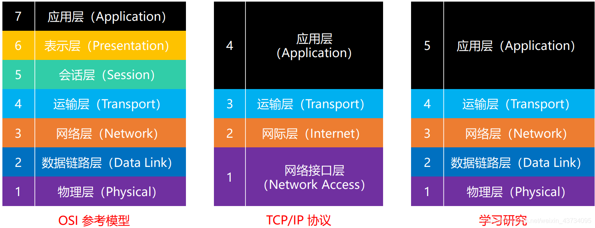
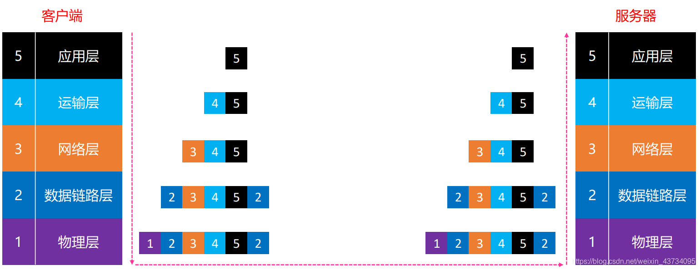
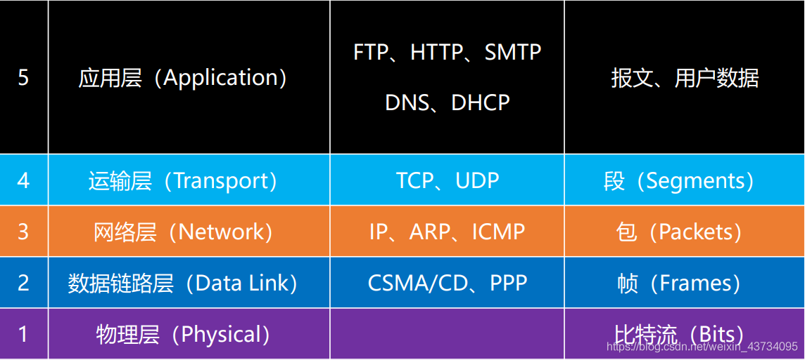

---

## 计算机之间的通信基础
两台计算机要实现通信, 需要:
- 需要得知对方的 IP地址

- 最终是根据 MAC地址（网卡地址），输送数据到网卡，被网卡接收
> 如果网卡发现数据的目标MAC地址是自己，就会将数据传递给上一层进行处理.如果网卡发现数据的目标MAC地址不是自己，就会将数据丢弃，不会传递给上一层

### 计算机之间的连接方式-网线(交叉线)直连

两台计算机交叉线直连通信的实验(使用:`Cisco Packet Tracer`)

在这里,我们把`PC0`和`PC1`用交叉线直接相连, 并且`IP`设置如图所示, 而且一开始它们没有任何通讯. 然后我们点击右下角的`simulation`进行反正模拟, 然后我们在`PC0`的主机上`ping` 主机`PC1`
然后可以点击三角符号来控制仿真的速度.

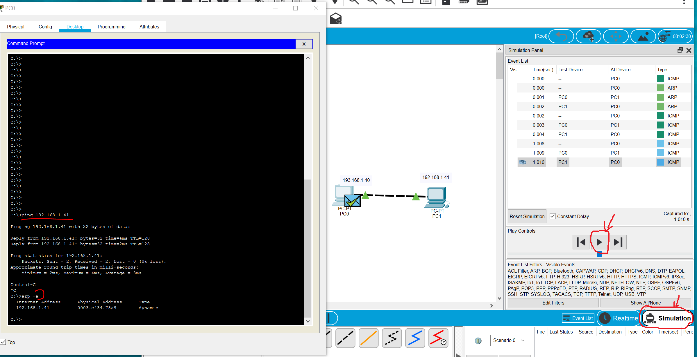 

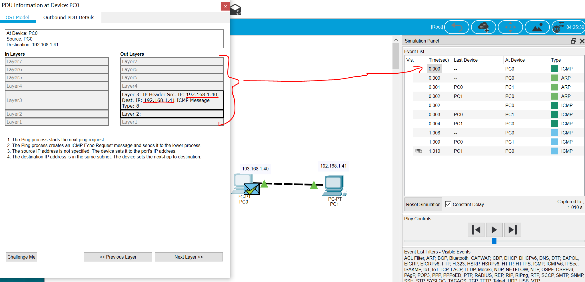

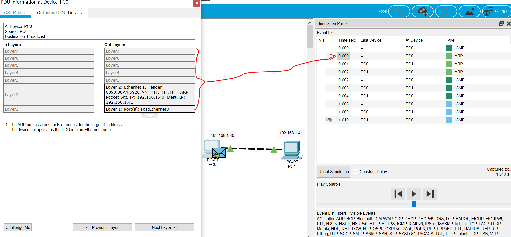

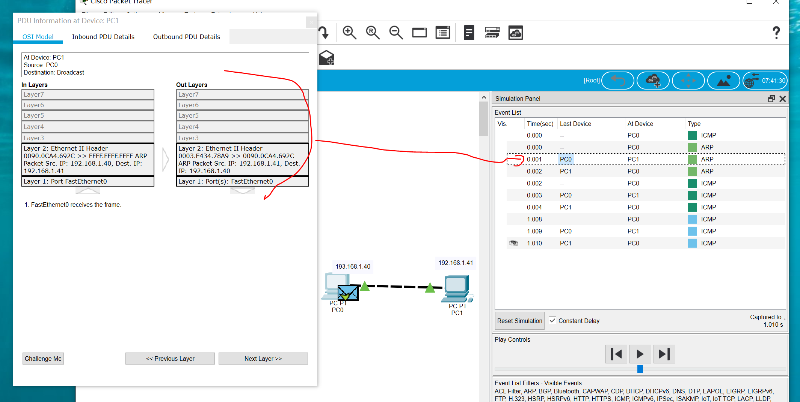

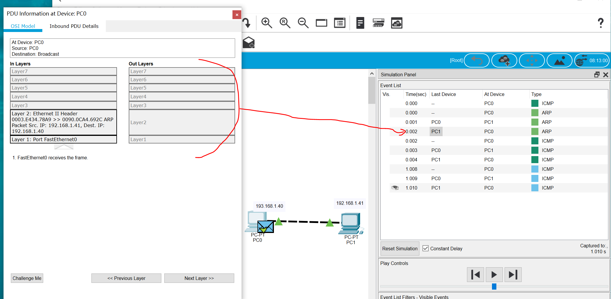

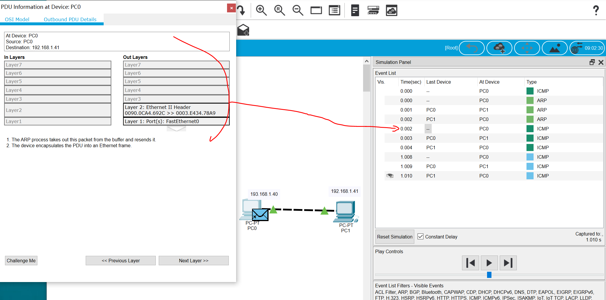

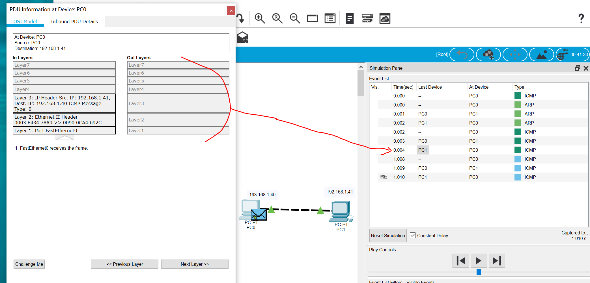

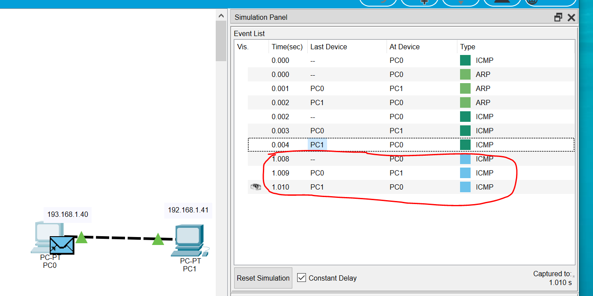

从上面的图,可以看到两台主机通信的详细过程(相同颜色的可以认为是相同的一次请求),可以看到`ping`命令是基于`ICMP`协议的,由于第一次`ICMP`通信时, `PC0`不知道目标机器的物理MAC地址, 所以马上发出`ARP`请求(注意:发出的目标物理地址是`FFFF.FFFF.FFFF`,说明这是一个广播请求, 同一子网的所有机器都可以这个`ARP`包),以此来获取目标主机的物理地址了, `PCO`获取到物理地址后继续之前的ICMP请求。继续后续的`ICMP`请求,我们就看不到`ARP`请求了, 因为`PC0`主机已经把`PC1`的物理地址缓存起来了(可以用`arp -a`查看缓存)。

其中:
`ARP协议`:`Address Resolution Protocol`,是根据IP地址获取物理地址的一个TCP/IP协议
`RARP协议`:`Reverse Address Resolution Protocol`,与`ARP`协议相反,根据物理地址来获取IP地址
`ICMP协议`: `Internet Control Message Protocol`,译为：互联网控制消息协议,它是TCP/IP协议簇的一个子协议，用于在IP主机、路由器之间传递控制消息。控制消息是指网络通不通、主机是否可达、路由是否可用等网络本身的消息。这些控制消息虽然并不传输用户数据，但是对于用户数据的传递起着重要的作用

### 计算机之间的连接方式 - 同轴电缆(Coaxial)(已淘汰)
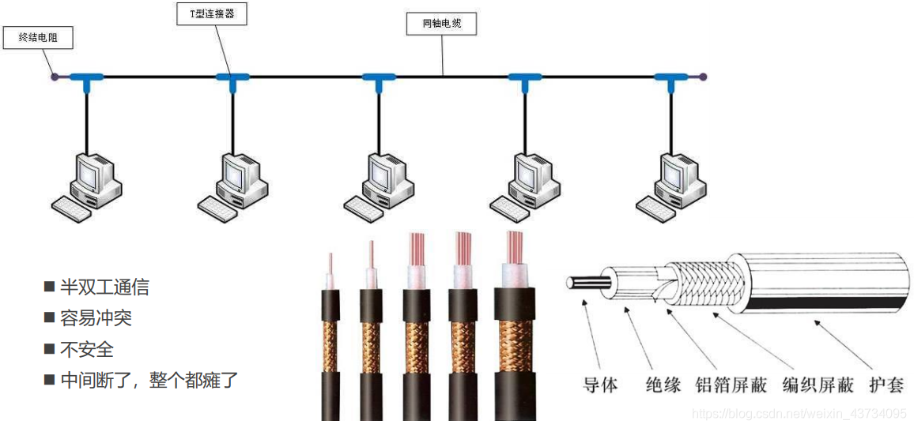
注意：同轴电缆只要有一个地方线断了，整个线路都瘫痪了。

### 计算机之间的连接方式 - 集线器(Hub)
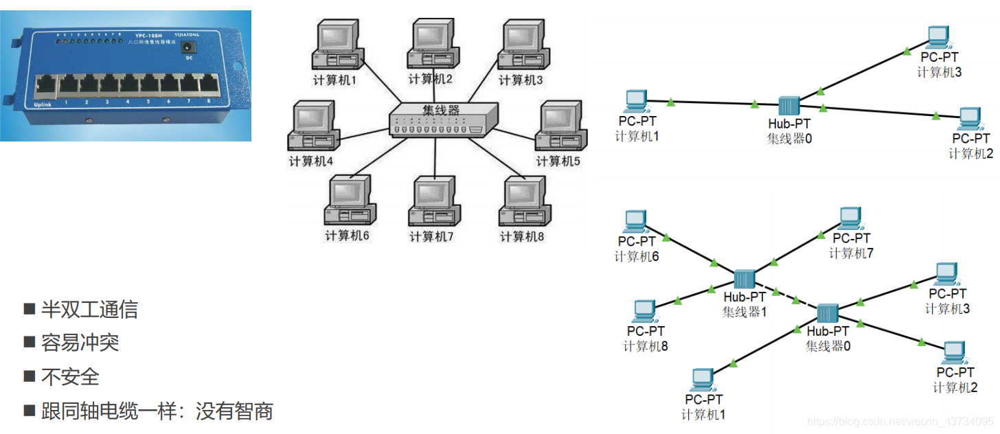
集线器相比同轴电缆唯一的优点就是：哪怕连着集线器的某一个设备中间线路出问题，不会影响到连着集线器的其他设备,所以它跟同轴电缆一样,是半双工通信, 没有缓存功能,没有智商, 收到什么包, 都会转发出去给所有的设备.

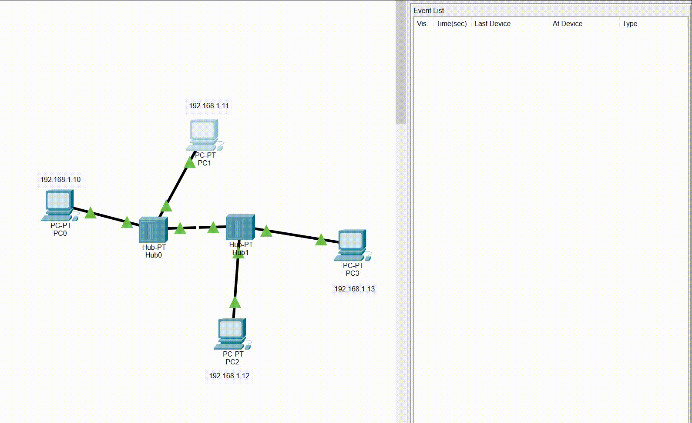
从上图可以看到, 我们这里`PC1(192.168.1.11)` 去ping `PC2(192.168.1.12)`,可以看到集线器(HUB)都会把包转发出去,当主机收到的包不是发给自己的,就会被丢弃掉, 当PC2收到包后, 发现是发给自己的, 就会回复该包。

### 计算机之间的连接方式 - 网桥（Bridge）
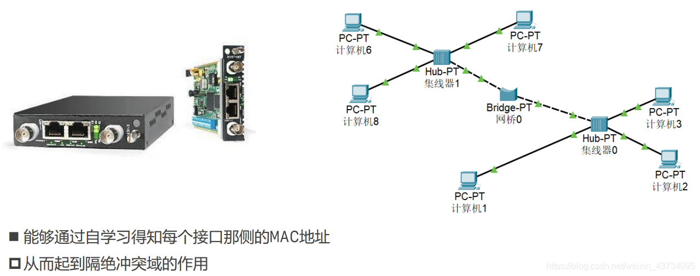
由于集线器没有智商,它收到的包都会转发出去,会导致网络资源的浪费。
于是网桥改变了集线器的缺点, 下图演示集线器 + 网桥ping的过程(注:开始时,各设备之间没有通讯过)

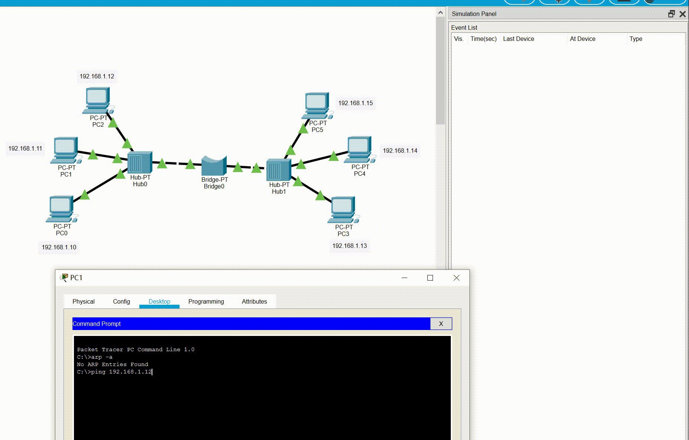

网桥有缓存功能,可以记住设备的物理地址,以及它是从哪一边的接口进来的。类似如下:
|  接口   | 物理地址  |
|  ----  | ----  |
| 左边接口  | XXX设备物理地址 |
| 右边接口  | XXX设备物理地址 |

所以当第一次`PC1` ping `PC2`时, 因为`PCI`不知道`PC2`物理地址,所以使用`ARP`协议来获取`PC2`的物理地址,在`ARP`的request和response的过程中,网桥会分别记住`PC1`和`PC2`的物理地址(具体参考上面的动态图)。

当第二次`ICMP`请求时, `PC1`会带上源物理地址和目标物理地址, 当该数据包从左边接口进入网桥时, 发现目标的物理地址也在网桥的左侧接口, 于是网桥会丢弃该数据包。

由此可看到网桥可以做到`隔绝冲突域`(网桥的左右两边为不同冲突域),所以在相同冲突域通信,不会影响另外一个冲突域。

### 计算机之间的连接方式 - 交换机（Switch）

上面网桥说到可以解决冲突域的问题, 但是网桥同一接口一侧所在的网络根本问题还尚未解决。如果网桥设备同一侧接的设备很多,就会有问题,比如发生没有必要的转发,整体性能问题。

于是交换机就来的, 可以这么认为, 交换机是多个集线器和多个网桥的封装。
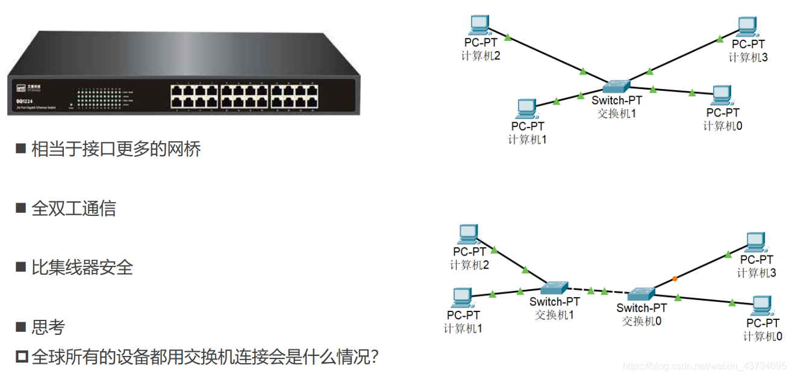

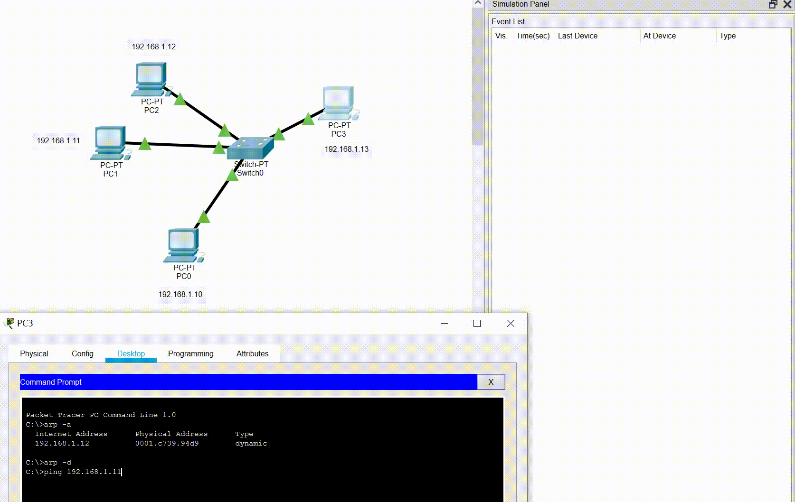

从上图动图可以看住,交换机更加牛逼, 除了第一次通信不知道mac地址需要广播之外, 之后主机之间的通信通信都可以精准转发.

若全球所有设备都用交换机连接：
1、他们必然处于同一网段，因此 IP地址可能会不够用
2、即使使用交换机，第一次发送数据包仍然需要ARP广播，耗费大量时间。
3、形成广播风暴，只要有一个设备发送ARP广播，全球设备都能收到

### 计算机之间的连接方式 - 路由器（Router）

上面所讲的设备,网线直连、同轴电缆、集线器、网桥、交换机
- 连接的设备必须在同一网段
- 连接的设备处在同一广播域

他们在同一网段,就会有上面说的`所有设备都用交换机连接`的缺点, 于是路由器来了。
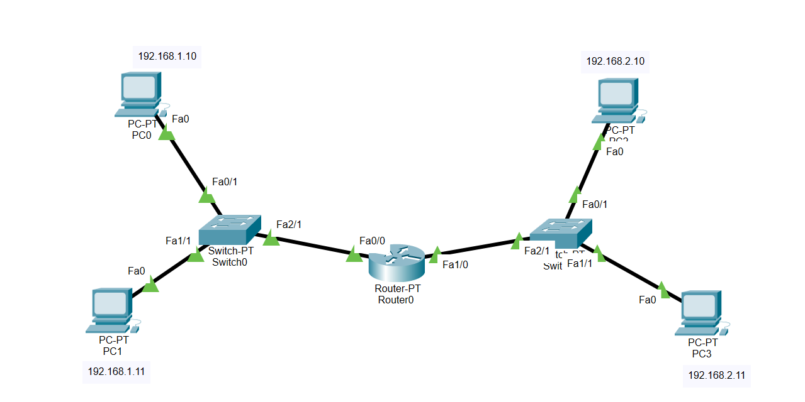

路由器可以
- 可以在不同网段之间转发数据
- 隔绝广播域

我自己录制的[具体实验视频](https://www.bilibili.com/video/BV1LP411E7UD/)
 
文字总结如下:
 
假设第一次的时候`PC0(192.168.1.10)`去ping `PC3(192.168.2.11)`,
刚开始, PC0发现该PC3目标地址跟自己不在同一个子网,于是它先把目标地址设置成路由器网关的地址, 然后发`ARP`请求广播去问路由器的`FA0/0`端口物理MAC地址。`PC0`拿到网关的MAC地址后再发出`ICMP`请求,请求如下: [src ip:192.168.1.10,dst ip:192.168.2.11, src mac: PC0的, dest mac: 路由器的FA0/0端]。路由器收到该报文后,发现该请求IP不在本子网(注:如果是本子网的请求的话,路由器会丢掉该请求,所以路由器可以做到隔绝网络),于是就交给路由器的`FA1/0`来处理,由于第一次, 路由器也不知道目标IP`192.168.2.11`的物理mac地址，所以它也会用ARP请求来获取PC3的捂脸mac地址。当路由的`FA1/0`端拿到PC3的物理地址后, 然后它会继续发ICMP请求, 请求如下: [src ip:192.168.1.10,dst ip:192.168.2.11, src mac: 路由器的FA1/0端, dest mac: PC3的], 当`PC3`收到后,然后返回, 返回报文如下: [src ip:192.168.2.11,dst ip:192.168.1.10, src mac: PC3的, dest mac: 路由器的FA1/0端],路由器收到报文后,也是相同的方法转发给会`PC0`

