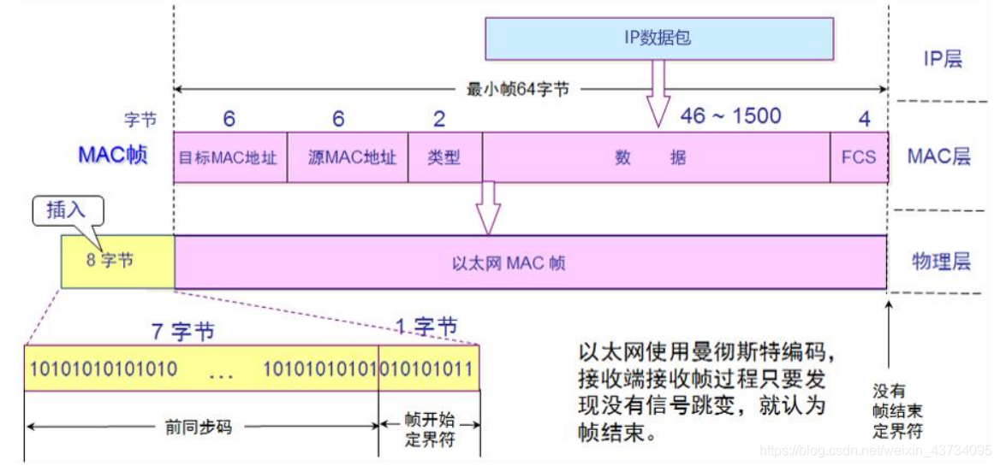

数据链路层（Data Link）
链路：从1个节点到相邻节点的一段物理线路（有线或无线），中间没有其他交换节点

数据链路：在一条链路上传输数据时，需要有对应的通信协议来控制数据的传输；不同类型的数据链路，所用的通信协议可能是不同的

- 广播信道：`CSMA/CD协议`（比如同轴电缆、集线器等组成的网络）
- 点对点信道：`PPP协议`（比如2个路由器之间的信道）
数据链路层的3个基本问题（任何链路都需要）

- 封装成帧
- 透明传输
- 差错检验

## 封装成帧

帧（Frame）的数据部分：
- 就是网络层传递下来的 数据包（IP数据包，Packet）

最大传输单元`MTU（Maximum Transfer Unit）`：
- 每一种数据链路层协议都规定了所能够传送的帧的数据长度上限
- 以太网的MTU为1500个字节

## 透明传输
- 使用 SOH（Start Of Header）作为 帧开始符
- 使用 EOT（End Of Transmission）作为 帧结束符

若数据部分出现 EOT，容易让接收端产生错误的理解：

所以数据部分一旦出现了SOH、EOT，就需要进行转义：在后面加上ESC

## 差错检验

FCS是根据数据部分 + 首部计算得出的，数据传输前和传输后都会计算FCS用来检验数据是否出错。

## CSMA/CD协议
`CSMA/CD（Carrier Sense Multiple Access with Collision Detectio）`

- 载波侦听多路访问/冲突检测

使用了CSMA/CD的网络可以称为是以太网（Ethernet），它传输的是以太网帧

- 以太网帧的格式有：`Ethernet V2标准`、`IEEE的802.3标准`
- 使用最多的是：`Ethernet V2标准`

为了能够检测正在发送的帧是否产生了冲突，以太网的帧至少要`64`字节

用交换机组建的网络，已经支持全双工通信，不需要再使用`CSMA/CD`，但它传输的帧依然是以太网帧

所以，用交换机组建的网络，依然可以叫做以太网

## Ethernet V2帧的格式、Ethernet V2标准

Ethernet V2帧的格式：

- 首部：目标MAC + 源MAC + 网络类型
- 以太网帧：首部 + 数据 + FCS
- 数据的长度至少：`64-目标MAC(6)-源MAC(6)-类型(2)-FCS(4) = 46字节`

Ethernet V2标准：
当数据部分的长度小于 46 字节时

- 数据链路层会在数据的后面加入一些字节填充
- 接收端会将添加的字节去掉

长度总结

- 以太网帧的数据长度：46~1500 字节
46字节 = 64 - 目标MAC(6) - 源MAC(6) - 类型(2) - FCS(4)
以太网的MTU为 1500 个字节

- 以太网帧的长度：64~1518字节
为了能够检测正在发送的帧是否产生了冲突，以太网的帧至少要 64 字节
1518字节 = 目标MAC(6) + 源MAC(6) + 网络类型(2) + 数据(1500) + FCS(4)

## PPP协议（Point to Point Protocol）

- 帧开始符、帧结束符：0x7E
- Address 字段：图中的值是 0xFF，形同虚设，点到点信道不需要源MAC、目标MAC地址
- Control 字段：图中的值是 0x03，目前没有什么作用
- Protocol 字段：内部用到的协议类型
PPP协议 —— 字节填充

- 将 0x7E 替换成 0x7D5E
- 将 0x7D 替换成 0x7D5D
