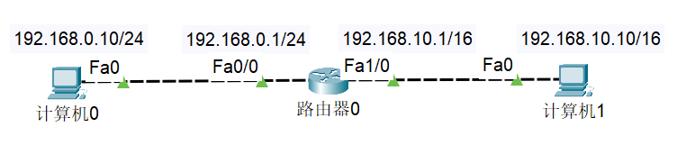

## MAC地址（40-55-82-0A-8C-6D）
每个网卡都有一个 6字节(48bit) 的 MAC地址 (Media Access Control Address)


MAC地址全球唯一，固化在网卡的ROM中，由 IEEE802 标准规定

- 前3字节：OUI (Organizationally Unique Identifier)，组织唯一标识符。由 IEEE 的注册管理机构分配给厂商
- 后3字节：网络接口标识符,由厂商自行分配

OUI 查询：可以根据OUI查询出对应的厂商

- http://standards-oui.ieee.org/oui.txt
- https://mac.bmcx.com/

### MAC地址的表示格式（Windows、Linux）
- Windows
`40-55-82-0A-8C-6D`
- Linux、Android、Mac、iOS（类Unix操作系统）
`40:55:82:0A:8C:6D`
- Packet Tracer
`4055.820A.8C6D`

> 注：当48位全为1时，代表广播地址:FF-FF-FF-FF-FF-FF

### MAC地址操作（`ipconfig /all`）
查看MAC地址：ipconfig /all

修改MAC地址：更改适配器选项-属性-配置-高级-网络地址（填写的时候需要把 减号- 去掉）


> 注： 有时可以通过修改 MAC地址蹭网(比如大学里的校园网)

### MAC地址的获取（`arp -a`）
当不知道对方主机的MAC地址时，可以通过发送ARP广播获取对方的MAC地址

- 获取成功后，会缓存IP地址、MAC地址的映射信息，俗称：ARP缓存
- 通过ARP广播获取的MAC地址，属于 动态（dynamic）缓存
存储时间比较短（默认是2分钟），过期就自动删除

`arp -a` [主机地址]：查看ARP缓存
`arp -d` [主机地址]：删除ARP缓存
`arp -s` 主机地址 MAC地址：增加一条缓存信息（这是静态缓存，存储时间较久，不同系统的存储时间不同）

### ARP（Address Resolution Protocol）

ARP (Address Resolution Protocol)，地址解析协议

- 作用：通过 IP地址 获取 MAC地址

### RARP (`Reverse Address Resolution Protocol`)，逆地址解析协议

- 使用与ARP相同的报头结构
- 作用与ARP相反，用于将MAC地址转换为IP地址
- 后来被 `BOOTP`、`DHCP` 所取代

## ICMP（Internet Control Message Protocol）
ICMP (`Internet Control Message Protocol`)，互联网控制消息协议

- IPv4中的ICMP被称作 ICMPv4，IPv6中的ICMP则被称作 ICMPv6
通常用于返回错误信息
- 比如 TTL值过期、目的不可达
- ICMP的错误消息总是包括了源数据并返回给发送者

### IP地址（127.0.0.1）
IP地址 (Internet Protocol Address)：互联网上的每一个主机都有一个IP地址

- 最初是 IPv4 版本，32bit（4字节），2019年11月25日，全球的IP地址已经用完
- 后面推出了 IPv6 版本，128bit（16字节）
- 我们在学习中讨论的都是 IPV4


### IP地址的组成（网络ID + 主机ID）

IP地址 由2部分组成：`网络标识（网络ID）`、`主机标识（主机ID）`

通过`子网掩码（subnet mask`）可以得知 网络ID 、主机ID
主机所在的`网段 = 子网掩码 & IP地址`
例如：

```
IP地址：192.168.1.10
子网掩码：255.255.255.0

	1100 0000 . 1010 1000 . 0000 0001 . 0000 1010
&	1111 1111 . 1111 1111 . 1111 1111 . 0000 0000
----------------------------------------------------
	1100 0000 . 1010 1000 . 0000 0001 . 0000 0000

网段：192.168.1.0  
```

`网段是由子网掩码计算得出`，只有IP地址无法得知网段。

```
IP地址：130.168.1.10
子网掩码：255.255.0.0
网段：130.168.0.0

该网段最多有 256*256-2 个IP地址
减2是因为: 全0代表网段,全1代表广播
网段和广播无法分配IP地址.
```

计算机和其他计算机通信前，会先判断目标主机和自己是否在同一网段：

- 同一网段：不需要由路由器进行转发
- 不同网段：交由`路由器`进行转发


### IP地址的分类（A类、B类、C类、D类、E类）

注：判断IP地址的类别只要看第一部分即可。

只有 A\B\C 类地址才能分配给主机

- 主机ID为 `全0`，表示主机所在的网段，如 `192.168.1.0`
- 主机ID为 `全1`，表示主机所在网段的全部主机（广播），如 `192.168.1.255`
可以尝试用ping给某个网段的全部主机发数据

### A类地址：默认子网掩码是 `255.0.0.0`


`网络ID`
- 0 不能用，127 作为保留网段。
- 其中 127.0.0.1 是 本地环回地址（Loopback），代表本机地址
- 可以分配给主机的第1部分的取值范围是：1~126

`主机ID`
- 第2、3、4部分的取值范围是：0~255
- 每个A类网络能容纳的最大主机数是：`256*256*256–2 = 224–2 = 16777214`

### B类地址：默认子网掩码是 255.255.0.0


`网络ID`

- 第1部分的取值范围是：128~191
- 第2部分的取值范围是：0~255

`主机ID`
- 第3、4部分的取值范围是：0~255
- 每个B类网络能容纳的最大主机数是：256*256-2 = 216-2 = 65534


### C类地址：默认子网掩码是 255.255.255.0

目前用的最多的是 C类地址！


`网络ID`
- 第1部分的取值范围是：192~223
- 第2、3部分的取值范围是：0~255

`主机ID`
- 第4部分的取值范围是：0~255
- 每个C类网络能容纳的最大主机数是：256-2 = 254

### D类地址：没有子网掩码，用于多播（组播）地址
以 1110 开头，多播地址


第一部分取值是：224~239

### E类地址：以 1111 开头，保留为今后使用

第一部分取值是：240~255


### 子网掩码的CIDR表示方法（192.168.1.100/24）

`CIDR (Classless Inter-Domain Routing)`，无类别域间路由

子网掩码的CIDR表示方法

- 192.168.1.100/24，代表子网掩码有24个1，也就是 255.255.255.0
- 123.210.100.200/16，代表子网掩码有16个1，也就是 255.255.0.0

> 计算工具：https://www.sojson.com/convert/subnetmask.html

## 子网划分

### 为什么要进行子网划分？
如果需要让200台主机在同一个网段内，可以分配一个 C类网段，比如`192.168.1.0/24`

- 共 254 个可用IP地址：192.168.1.1 ~ 192.168.1.254
- 多出 54 个空闲的IP地址，这种情况并不算浪费资源

如果需要让 500 台主机在同一个网段内，那就分配一个 B类网段，比如191.100.0.0/16

- 共 65534 个可用IP地址：191.100.0.1 ~ 191.100.255.254
- 多出 65034 个空闲的IP地址，这种情况属于极大的浪费资源


如何尽量避免浪费IP地址资源？
- 合理进行 子网划分


### 子网划分
子网划分：借用主机位作子网位，划分出多个子网

- 等长子网划分：将一个网段等分成多个子网，每个子网的可用IP地址数量一样
- 变长子网划分：每个子网的可用IP地址数量可以是不一样的

> 子网划分器：http://www.ab126.com/web/3552.html

子网划分的步骤

1. 确定子网的子网掩码长度
2. 确定子网中第1个、最后1个主机可用的IP地址

### 等长子网划分 - C类子网划分（2、4、8等分）
例：
```
本来有一个C类网段: 192.168.0.0/24

划分成两个子网后:

A子网: 192.168.0.0/25 子网掩码: 255.255.255.128
可用IP地址: 192.168.0.1 ~ 192.168.0.126 共 126 个

B子网: 192.168.0.128/25 子网掩码: 255.255.255.128
可用IP地址: 192.168.0.129 ~ 192.168.0.254 共 126 个
```

等分成 2 个子网：


等分成 4 个子网：


等分成 4 个子网的广播地址：


等分成 8 个子网：


### 等长子网划分 - A、B类子网划分

B类子网划分：


A类子网划分 ：


### 子网划分实践

如此划分，他们还是属于同一个网段，可以直接 `ping` 通。


下面这样划分就不是一个网段了，它们分别属于 `192.168.0.0` 和 `192.168.0.128` 网段，需要用路由器并设置网关才可以 ping 通。

注：下图 192.168.0.129/25 和 192.168.0.1/25 写反了。。


### 变长子网划分


> 思考题：双方子网掩码不同，计算对方所处网段
问：下列两台计算机可以正常通信吗？


答：`不可以`。计算机0 想要发送数据包，先判断计算机1是否和自己处于同一个网段，计算网段的方法是：IP地址 & 子网掩码，计算机0判断计算机1的网段为 192.168.10.10 & 255.255.255.0 = 192.168.10.0，而计算机0判断自身所处网段为 192.168.0.10 & 255.255.255.0 = 192.168.0.0，双方不处于同一网段，所以计算机0无法将数据包发给计算机1（不同网段的数据通信需要路由器）


解决方案：利用路由器。



## 超网 - 合并网段
超网：跟子网反过来，它是将多个连续的网段合并成一个更大的网段

需求：原本有200台计算机使用 192.168.0.0/24 网段，现在希望增加200台设备到同一个网段

- 200台在 192.168.0.0/24 网段，200台在 192.168.1.0/24 网段
- 合并 192.168.0.0/24、192.168.1.0/24 为一个网段：192.168.0.0/23
（子网掩码往左移动1位）


> 问：192.168.0.255/23 这个IP地址，可以分配给计算机使用么？

- 192.168.0.255/24 是广播，不能分配给计算机。
- 192.168.0.255/23 如下：


主机部分并不全为1，所以是可以分配给计算机使用的。

### 合并4个网段
子网掩码向左移动 2 位，可以合并 4 个网段


将 192.168.0.0/24、192.168.1.0/24、192.168.2.0/24、192.168.3.0/24 合并为192.168.0.0/22 网段

### 子网合并的规律
假设 n 是 2 的 k 次幂（k≥1），子网掩码左移 k 位能够将能够合并 n 个网段


假设 n 是 2 的 k 次幂（k≥1），如果第一个网段的网络号能被 n 整除，那么由它开始连续的 n 个网段，能通过左移 k 位子网掩码进行合并。

- 第一个网段的网络号以二进制 0 结尾，那么由它开始连续的 2 个网段，能通过左移1位子网掩码进行合并
- 第一个网段的网络号以二进制 00 结尾，那么由它开始连续的 4 个网段，能通过左移2位子网掩码进行合并
- 第一个网段的网络号以二进制 000 结尾，那么由它开始连续的 8 个网段，能通过左移3位子网掩码进行合并


## 判断一个网段是子网还是超网
首先看该网段的类型，是A类网络、B类网络、C类网络？

- A类子网掩码的位数是8（255.0.0.0）
- B类子网掩码的位数是16（255.255.0.0）
- C类子网掩码的位数是24（255.255.255.0）

如果该网段的子网掩码位数比默认子网掩码多，就是子网
如果该网段的子网掩码位数比默认子网掩码少，则是超网

例如：
判断 25.100.0.0/16 是子网还是超网：
- 根据 25 判断出这是个 A 类网络，默认子网掩码 8 位
- 由于该网段子网掩码 16 位，比默认多，所以是子网


判断 200.100.0.0/16 是子网还是超网：
- 根据 200 判断出这是个 C 类网络，默认子网掩码 24 位
- 由于该网段子网掩码 16 位，比默认少，所以是超网
