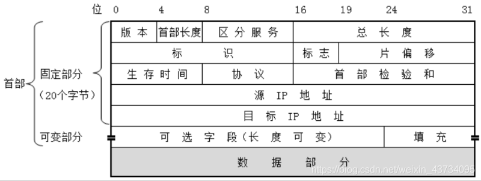
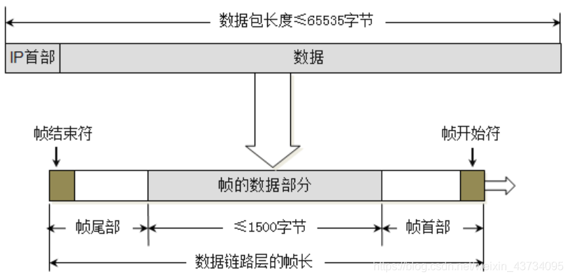
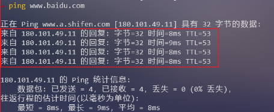
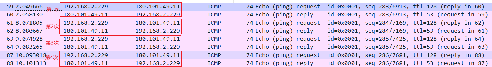
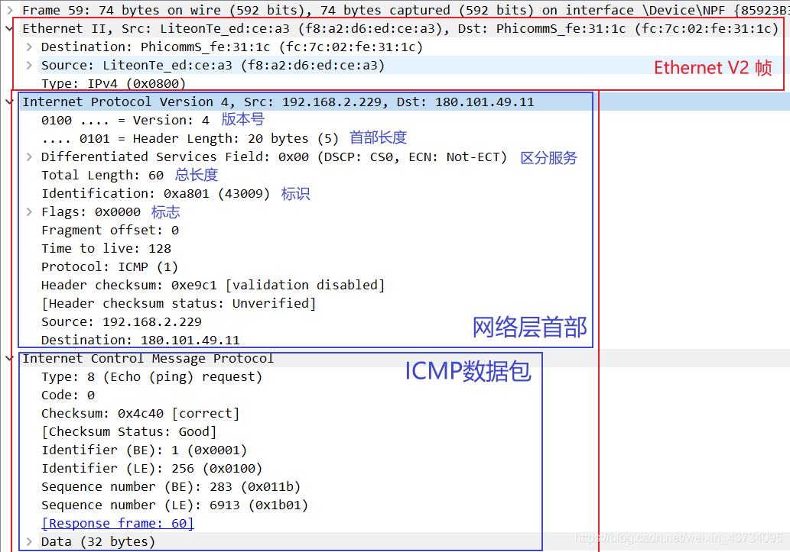
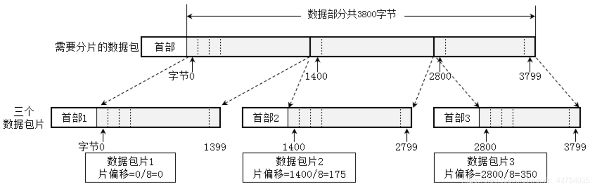
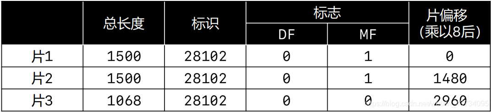
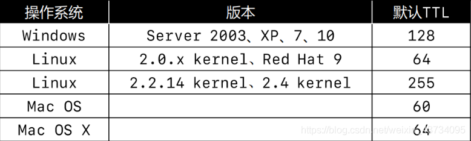
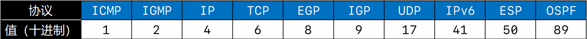

# 网络层
网络层数据包（IP数据包，Packet）由`首部`、`数据` 两部分组成
`数据`：很多时候是由传输层传递下来的`数据段（Segment）`

## 网络层首部 - 版本、首部长度、区分服务

### 版本（Version）
- 占4位
- 0b0100：IPv4
- 0b0110：IPv6

### 首部长度（Header Length）
- 占4位，二进制乘以4才是最终长度
- 0b0101：20（最小值）
- 0b1111：60（最大值）

### 区分服务（Differentiated Services Field）

- 占8位
- 可以用于提高网络的服务质量（QoS，Quality of Service），这个了解即可

### 网络层首部 - 总长度
总长度（Total Length）

- 占16位
- 首部 + 数据的长度之和，最大值是 65535

> 由于帧的数据不能超过1500字节，所以过大的IP数据包，需要 分片（fragments） 传输给数据链路层，每一片都有自己的网络层首部（IP首部）

### 网络层首部 - 标识、标志
标识（Identification）

- 占16位
- 数据包的ID，当数据包过大进行分片时，同一个数据包的所有片的标识都是一样的
- 有一个计数器专门管理数据包的ID，每发出一个数据包，ID就加1

### 标志（Flags）
- 占3位
- 第1位（Reserved Bit）：保留
- 第2位（Don’t Fragment）：1代表不允许分片，0代表允许分片
- 第3位（More Fragments）：1代表不是最后一片，0代表是最后一片

##【实践】ping 的几个用法、wireshark抓包
`ping /?` 查看ping的用法
`ping ip地址 -l 数据包大小` 发送指定大小的数据包(`ping www.baidu.com -l 1400`)
`ping ip地址 -f`不允许网络层分块 (`ping www.baidu.com -l 2000 -f`)

通过 Wireshark 抓包查看 `ping www.baidu.com` 发送的包

通过 ping 命令，实际上发送了4次 ICMP数据包：

通过 Wireshark 可以证实：

### 网络层首部 - 片偏移
片偏移（Fragment Offset）

- 占13位
- 片偏移乘以8：字节偏移（wireshark显示的是字节偏移）
- 每一片的长度一定是8的整数倍

`ping ke.qq.com -l 4000` 以前可以往腾讯课程发长度为4000的数据包，现在似乎不行了。。

### 网络层首部 - 生存时间
生存时间（Time To Live，TTL）

- 占8位
- 每个路由器在转发之前会将TTL减1，一旦发现TTL减为0，路由器会返回错误报告
- 观察使用`ping`命令后的TTL，能够推测出对方的操作系统、中间经过了多少个路由器

### 【实践】根据TTL追踪经过路由器
ping ip地址 -i TTL 设置TTL的值
通过 tracert、pathping 命令，可以跟踪数据包经过了哪些路由器

### 网络层首部 - 协议、首部校验和
协议（Protocol）

- 占8位
- 表明所封装的数据是使用了什么协议

### 首部校验和（Header Checksum）
用于检查首部是否有错误

---
 
我的实验:

[wireshark抓取IP数据包-不分片](https://www.bilibili.com/video/BV15g411v7WY/)

[wireshark抓取IP数据包-分片](https://www.bilibili.com/video/BV1ot4y1F7VB/)

