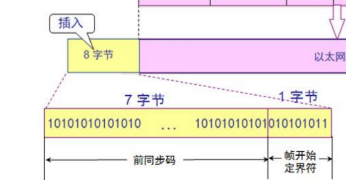
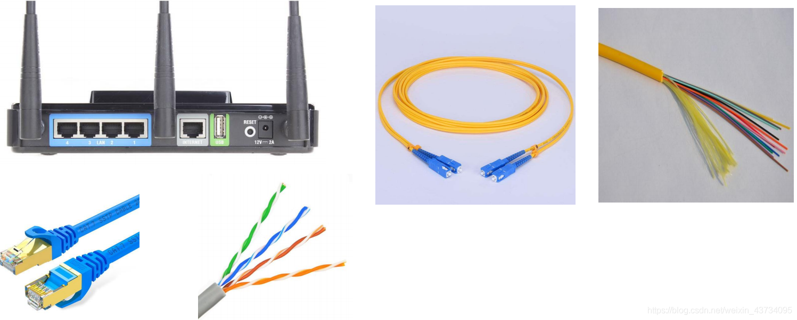
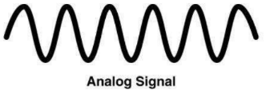
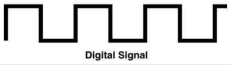
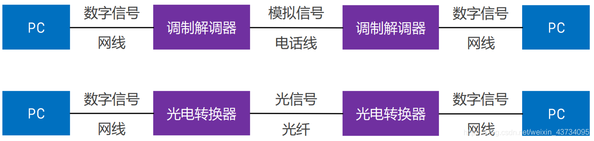

## 网络互联模型（了解请求过程、网络分层）

请求过程：

物理层的1代表前同步码：
后面的 Ethernet V2帧格式有讲。

网络分层：

## 物理层（Physical）
物理层定义了接口标准、线缆标准、传输速率、传输方式等

## 数字信号、模拟信号
模拟信号（Analog Signal）
- 连续的信号，适合长距离传输
- 抗干扰能力差，受到干扰时波形变形很难纠正

数字信号（Digital Signal）
- 离散的信号，不适合长距离传输
- 抗干扰能力强，受到干扰时波形失真可以修复

## 数据通信模型
局域网通信模型：

注：网线一般不能超过100米；数字信号适用于短距离传输。

广域网通信模型：

## 信道（单工、半双工、全双工）
信道：信息传输的通道，一条传输介质上（比如网线）上可以有多条信道

单工通信
- 信号只能往一个方向传输，任何时候都不能改变信号的传输方向
- 比如无线电广播、有线电视广播

半双工通信

- 信号可以双向传输，但必须是交替进行，同一时间只能往一个方向传输
- 比如对讲机

全双工通信
- 信号可以同时双向传输
- 比如手机（打电话，听说同时进行）
