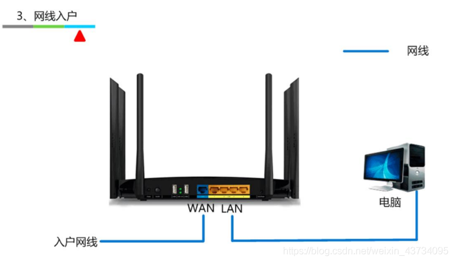

# 路由
在不同网段之间转发数据，需要有路由器的支持

默认情况下，路由器只知道跟它直连的网段，非直连的网段需要通过 静态路由、动态路由 告诉它。

1、静态路由

- 管理员手动添加路由信息
- 适用于小规模网络

2、动态路由

路由器通过路由选择协议（比如RIP、OSPF）自动获取路由信息
适用于大规模网络

## 实践1 - 让4台主机之间可以互相通信

路由器0的路由表：

路由器1的路由表：

## 实践2 - 让4台主机之间可以互相通信

## 数据包的传输过程（简）
这里仅仅是简述一下数据包的传输过程，后面详细学到网络分层时，会再次详细讲解数据包的传输过程。

源IP、目标IP 没有变过；源MAC、目标MAC 一直在变。

## 第一个包的丢失

如图，从 `192.168.1.10/24` 往 `192.168.2.10/24` 虽然可以 ping 通，但是却丢失了第一个数据包。

原因是：计算机0 往路由器发送了 ARP包，路由器收到后回复了 ARP包，从而计算机0就开始发送 ICMP包，路由器0收到 ICMP包后准备发往计算机1，但是路由器还不知道计算机1的MAC地址，所以要往计算机1发送ARP包，因此就把ICMP包给丢了，所以第一次 ping 会超时。

## 网络 (Network)、互联网 (internet)、因特网 (Internet）

全世界最大的互联网是：因特网（Internet）

- 将全世界所有的计算机都连接在一起
- 一般使用大写 I 开头的 Internet 特指因特网
- 日常生活中说的：你的电脑上不了网。其实就是指：你的电脑没有连接到因特网。

## ISP（互联网服务提供商）

ISP（Internet Service Provider），Internet 服务提供商，比如移动、电信、网通、铁通等。我们平时拉的宽带都是通过 ISP 连接到 Internet 的。

平时见到左边的下载列表，其实是给使用不同 ISP 的用户对应的选择。

## 网络分类（局域网、城域网、广域网）
按照网络的范围进行分类，可以分为：局域网、城域网、广域网等

- 局域网（ Local Area Network, LAN ）

1. 一般是范围在几百米到十几公里内的计算机所构成的计算机网络
2. 常用于公司、家庭、学校、医院、机关、一幢大楼等
3. 局域网中使用最广泛的网络技术叫：以太网（ Ethernet）
4. 在电脑、手机上经常见到的一个英文 WLAN（Wireless LAN ），意思是无线局域网

- 城域网（Metropolitan Area Network，MAN）
1. 一般范围是数十公里到数百公里，可以覆盖一个城市

- 广域网（Wide Area Network，WAN）
1. 一般范围是几百公里到几千公里，可以覆盖一个国家。通常都需要租用 ISP 的线路。

## 常见接口（FastEthernet、GigabitEthernet、Serial）

- FastEthernet —— 快速以太网接口（100M）
- GigabitEthernet —— 千兆以太网接口（1000M）
- Serial —— 串行接口

## 上网方式（电话线入户、光纤入户、网线入户、无线路由器）

ADSL电话拨号上网（Asymmetric Digital Subscriber Line ）

非对称数字用户线路，提供上、下行不对称的传输带宽

猫（ Modem），调制解调器，进行数字信号和模拟信号的转换

光猫（ Optical Modem），光调制解调器，进行数字信号和光信号的转换

家用无线路由器的逻辑结构

## 公网IP、私网IP
IP地址也分为：公网IP、私网IP

公网IP（Public）
- Internet 上的路由器中只有到达公网的路由表，没有到达私网的路由表
- 公网IP 由因特网信息中心（Internet Network Information Cetner, Inter NIC ）统一分配和管理
- ISP 需要向 Inter NIC 申请 公网IP

私网IP（Private）主要用于局域网。下面是保留的私网网段
- A类：10.0.0.0/8，1个A类网络
- B类：172.16.0.0/16 ~ 172.31.0.0/16，16个B类网络
- C类：192.168.0.0/24 ~ 192.168.255.0/24，256个C类网络

## NAT（Network Address Translation）

私网IP 访问 Internet 需要进行 NAT 转换为 公网IP，这一步可以由路由器完成。

NAT 的特点

- 节约公网IP资源
- 隐藏内部真实IP

NAT 的分类
- 静态转换
手动配置NAT映射表
一对一转换

- 动态转换
定义外部地址池，动态随机转换
一对一转换

- PAT（Port Address Translation）
多对一转换，最大程度节约公网IP资源
采用端口多路复用方式，通过端口号标识不同的数据流
目前应用最广泛的NAT实现方式

