# 传输层（ Transport）

传输层有2个协议：

- `TCP（Transmission Control Protocol）`，传输控制协议
- `UDP（User Datagram Protocol）`，用户数据报协议

## UDP 协议（数据格式、检验和）

### 数据格式
UDP是无连接的，减少了建立和释放连接的开销

UDP尽最大能力交付，不保证可靠交付，因此不需要维护一些复杂的参数，首部只有8个字节（TCP的首部至少20个字节）

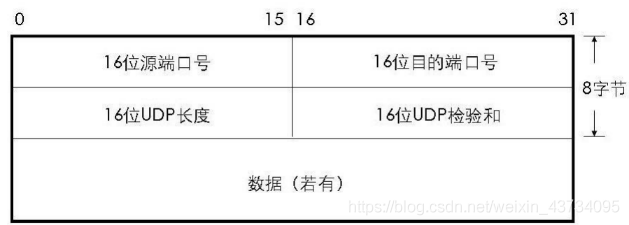

UDP长度（Length）占16位：首部的长度 + 数据的长度

### 检验和（Checksum）
检验和的计算内容：伪首部 + 首部 + 数据

伪首部：仅在计算检验和时起作用，并不会传递给网络层
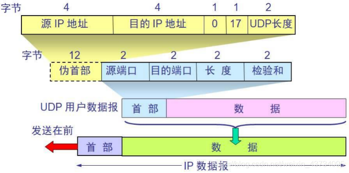

## 端口（Port）

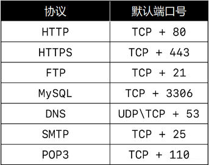
UDP首部中`端口`是占用`2字节`

可以推测出端口号的取值范围是：`0~65535`

> 客户端的源端口是临时开启的随机端口

防火墙可以设置开启\关闭某些端口来提高安全性

常用命令：

- `netstat –an`：查看被占用的端口
- `netstat –anb`：查看被占用的端口、占用端口的应用程序
- `telnet 主机 端口`：查看是否可以访问主机的某个端口
安装telnet：控制面板 – 程序 – 启用或关闭Windows功能 – 勾选“Telnet Client” – 确定

## TCP
TCP的几个要点：

- 可靠传输
- 流量控制
- 拥塞控制
- 连接管理（建立连接、释放连接）
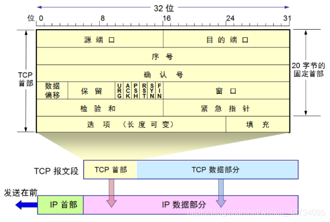

### TCP - 数据偏移、保留

### 数据偏移

- 占4位，取值范围是 0b0101 ~ 0b1111（5~15）
- `数据偏移 * 4 = 首部长度(Header Length)`
- 首部长度是 20 ~ 60 字节

### 保留
- 占6位，目前全为0

> TCP 关于保留字段的细节,有些资料中，TCP首部的 保留(Reserved)字段 占3位，标志(Flags) 字段占9位（Wireshark中也是如此）

---

`UDP的首部` 中有个 16 位的字段记录了`整个UDP报文段的长度（首部+数据）`。
但是，`TCP的首部` 中仅仅有个 4 位的字段记录了 `TCP报文段的首部长度`，并没有字段记录TCP报文段的数据长度。

- UDP首部中占16位的长度字段是冗余的，纯粹是为了保证首部是32位对齐
- TCP\UDP的数据长度，完全可以由IP数据包的首部推测出来
传输层的数据长度 = 网络层的总长度 - 网络层的首部长度 - 传输层的首部长度

### TCP - 检验和（ CheckSum）
跟`UDP`一样，`TCP检验和`的计算内容：`伪首部 + 首部 + 数据`
伪首部：占用12字节，仅在计算检验和时起作用，并不会传递给网络层
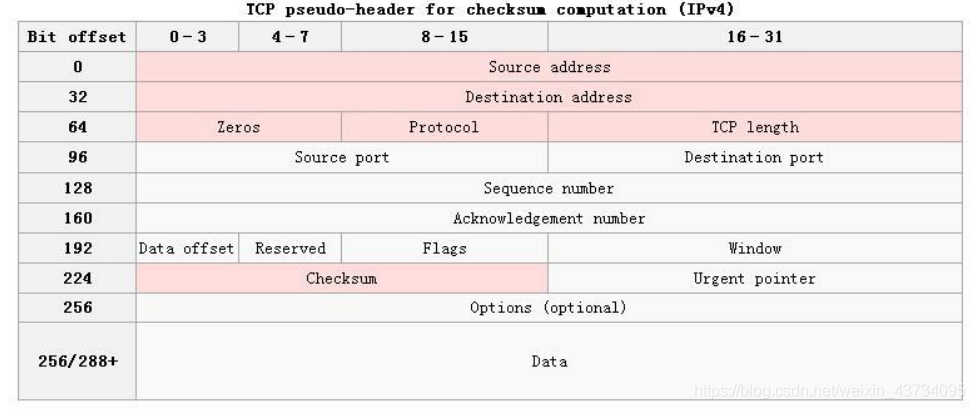

### TCP - 标志位（Flags）URG、ACK、PSH、RST、SYN、FIN

- URG（Urgent）
当 `URG = 1`时，紧急指针(`urgent pointer`)字段才有效。表明当前报文段中有紧急数据，应优先尽快传送

- ACK（Acknowledgment）
当 `ACK = 1`时，确认号(`Acknowledgment number`)字段才有效

- PSH（Push）
当 `PSH = 1`时,意思是发送方,当前数据发完了, 叫接收方从缓冲区读到应用程序中。

- RST（Reset）
当 `RST = 1` 时，表明连接中出现严重差错，必须释放连接，然后再重新建立连接

- SYN（Synchronization）
当 `SYN = 1、ACK = 0` 时，表明这是一个建立连接的请求
若对方同意建立连接，则回复 `SYN = 1、ACK = 1`

- FIN（Finish）
当 `FIN = 1` 时，表明数据已经发送完毕，要求释放连接

## TCP - 序号、确认号、窗口

### 序号（Sequence Number）
- 占4字节
- 首先，在传输过程的每一个字节都会有一个编号
- 在建立连接后，`序号`代表：`这一次传给对方的TCP数据部分的第一个字节的编号`

### 确认号（Acknowledgment Number）
- 占4字节
- 在建立连接后，确认号代表：期望对方下一次传过来的TCP数据部分的第一个字节的编号

### 窗口（Window）
- 占2字节
- 这个字段有`流量控制`功能，用以`告知对方下一次允许发送的数据大小`（字节为单位）

## TCP -【可靠传输】
可靠传输是为了保证包的完整性，当有丢包、受到三次重复确认等情况，就会重新发包。

## TCP -【可靠传输】- 停止等待ARQ协议
`ARQ（Automatic Repeat–reQuest）`，自动重传请求

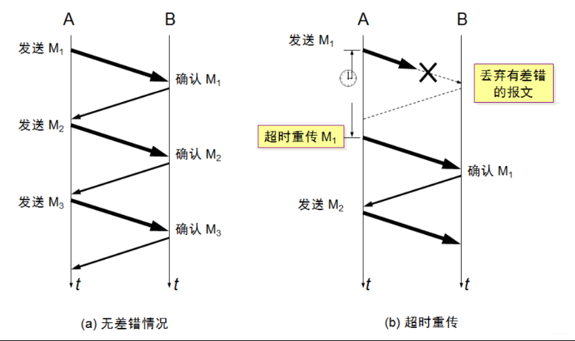

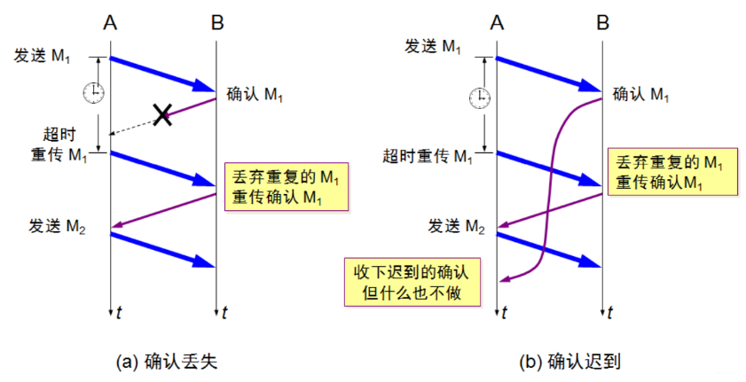

重传次数
> 若有个包重传了N次还是失败，会一直持续重传到成功为止么？

> 这个取决于系统的设置，比如有些系统，重传5次还未成功就会发送 reset报文(RST) 断开TCP连接
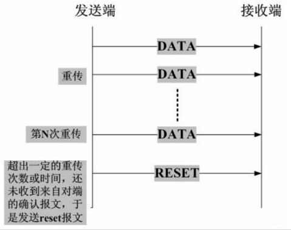

## TCP -【可靠传输】- 连续ARQ协议+滑动窗口协议
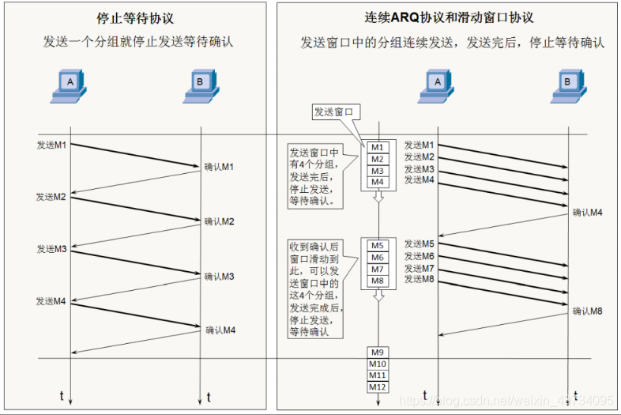

如果接收窗口`最多能接收4个包`，但`发送方只发了2个包`，接收方如何确定后面还有没有2个包？

等待一定时间后没有第3个包，就会返回确认收到2个包给发送方
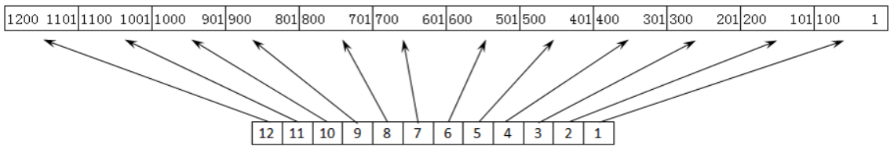

现在假设每一组数据是100个字节，代表一个数据段的数据，每一组给一个编号
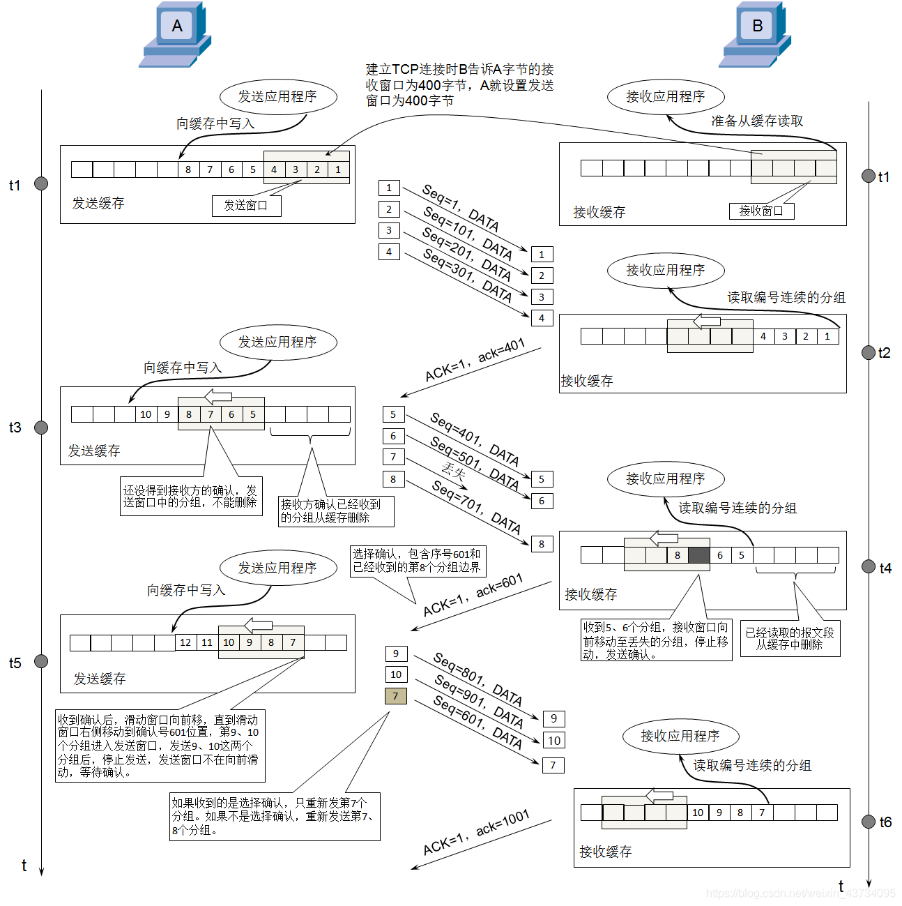

## TCP -【可靠传输】- SACK（选择性确定）
在TCP通信过程中，如果发送序列中间某个数据包丢失（比如1、2、3、4、5中3丢失了）

TCP会通过重传`最后确认的分组后续的分组`（最后确认的是2，会重传3、4、5）

这样原先已经正确传输的分组也可能重复发送（比如4、5），降低了TCP性能

为改善上述情况，发展出了 `SACK（Selective acknowledgment，选择性确认`）技术

- 告诉发送方哪些数据丢失，哪些数据已经提前收到
- 使TCP只重新发送丢失的包（比如3），不用发送后续所有的分组（比如4、5）
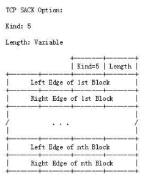

SACK信息会放在TCP首部的选项(`TCP Options`)部分

- Kind：占1字节。值为5代表这是SACK选项
- Length：占1字节。表明SACK选项一共占用多少字节
- Left Edge：占4字节，左边界
- Right Edge：占4字节，右边界

一对边界信息需要占用8字节，由于TCP首部的选项部分最多40字节，所以

- SACK选项最多携带4组边界信息
- SACK选项的最大占用字节数 = 4 * 8 + 2 = 34

> 思考
为什么选择在传输层就将数据“大卸八块”分成多个段，而不是等到网络层再分片传递给数据链路层？

> 因为可以提高重传的性能
需要明确的是：可靠传输是在传输层进行控制的
如果在传输层不分段，一旦出现数据丢失，整个传输层的数据都得重传
如果在传输层分了段，一旦出现数据丢失，只需要重传丢失的那些段即可

## TCP -【流量控制】
流量控制是`点对点`、`端对端`，两台设备之间的。

如果接收方的缓存区满了，发送方还在疯狂着发送数据

- 接收方只能把收到的数据包丢掉，大量的丢包会极大着浪费网络资源
- 所以要进行`流量控制`

什么是`流量控制`？

- 让发送方的发送速率不要太快，让接收方来得及接收处理

原理
- 通过确认报文中`窗口字段`来控制发送方的发送速率
- 发送方的发送窗口大小`不能超过`接收方给出窗口大小
- 当发送方收到接收`窗口的大小为0`时，发送方就会停止发送数据

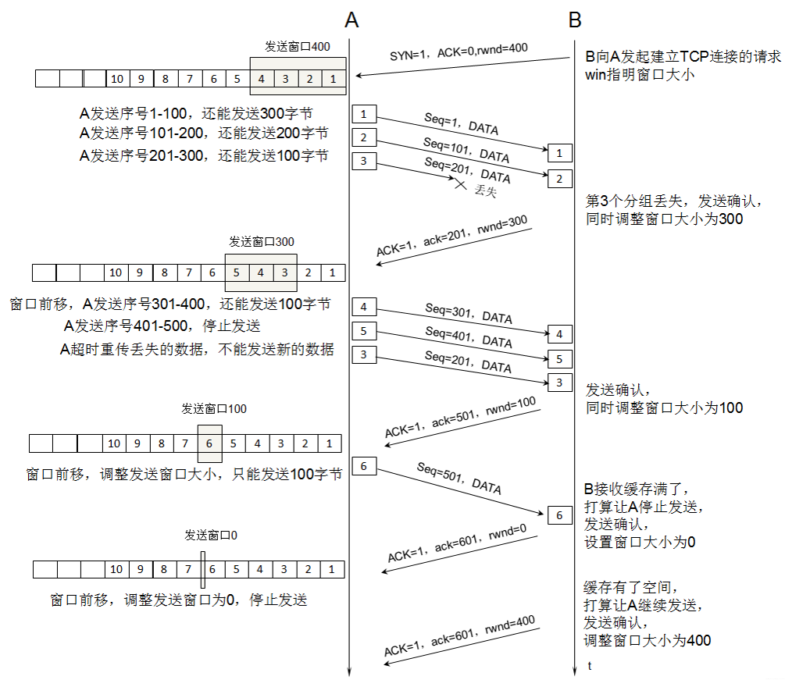

`rwind = receive window = 接收窗口`

### TCP -【流量控制】- 特殊情况
有一种特殊情况：

- 一开始，接收方给发送方发送了0窗口的报文段
- 后面，接收方又有了一些存储空间，给发送方发送的非0窗口的报文段丢失了
- 发送方的发送窗口一直为0，双方陷入僵局

解决方案：
- 当发送方收到0窗口通知时，这时发送方停止发送报文
- 并且同时开启一个定时器，隔一段时间就发个测试报文去询问接收方最新的窗口大小
- 如果接收的窗口大小还是为0，则发送方再次刷新启动定时器

## TCP -【拥塞控制】

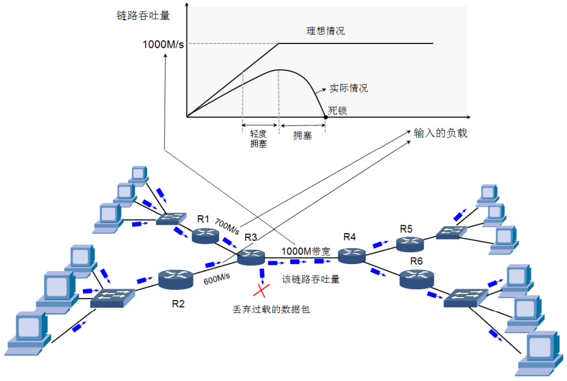

拥塞控制
- 防止过多的数据注入到网络中
- 避免网络中的路由器或链路过载

拥塞控制是一个全局性的过程
- 涉及到所有的主机、路由器
- 以及与降低网络传输性能有关的所有因素
- 是大家共同努力的结果

相比而言，流量控制是点对点通信的控制

TCP - 拥塞控制方法

- 慢开始（slow start，慢启动）
- 拥塞避免（congestion avoidance）
- 快速重传（fast retransmit）
- 快速恢复（fast recovery）

几个概念
- `MSS（Maximum Segment Size）`：每个段最大的数据部分大小（在建立连接时确定）
一般是 MTU(1500) - 20 - 20 = 1460
- `cwnd（congestion window）`：拥塞窗口
- `rwnd（receive window）`：接收窗口
- `swnd（send window）`：发送窗口swnd = min(cwnd, rwnd)

### TCP -【拥塞控制】- 慢开始（slow start）
`cwnd`的初始值比较小，然后随着数据包被接收方确认（收到一个ACK）
cwnd就`成倍增长（指数级）`

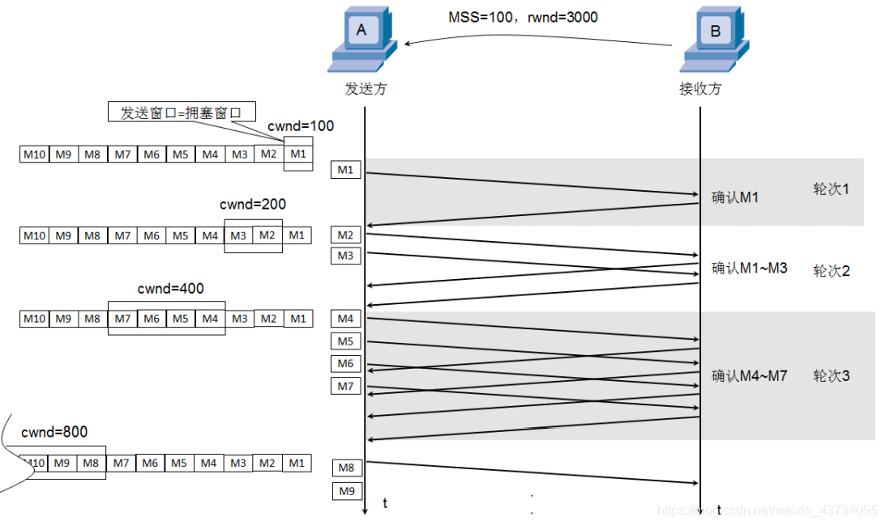

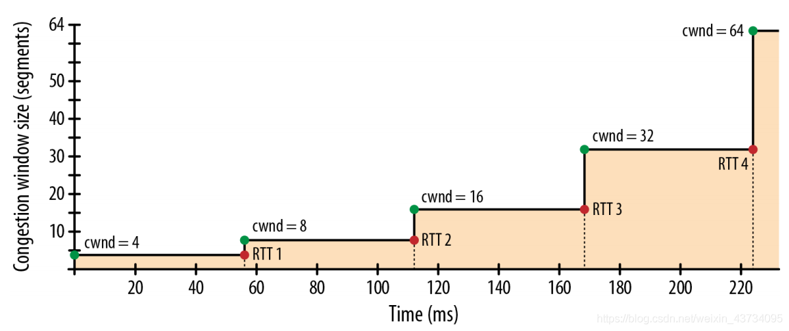

### TCP -【拥塞控制】- 拥塞避免（congestion avoidance）

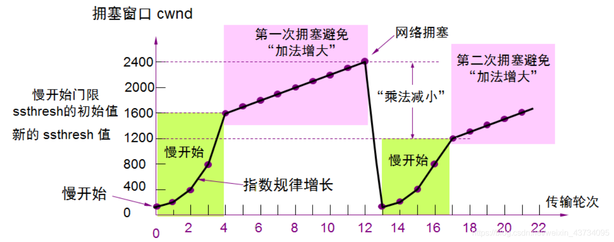

`ssthresh (slow start threshold)`：慢开始阈值，`cwnd`达到阈值后，开始`拥塞避免（加法增大）`

`拥塞避免（加法增大）`：拥塞窗口`cwind``缓慢增大`，以防止网络过早出现拥塞

`乘法减小`：只要出现网络拥塞，把`ssthresh`减为拥塞峰值的一半，同时执行慢开始算法（cwnd又恢复到初始值）

- 当网络出现频繁拥塞时，ssthresh值就下降的很快

### TCP -【拥塞控制】- 快重传、快恢复

`快重传：`
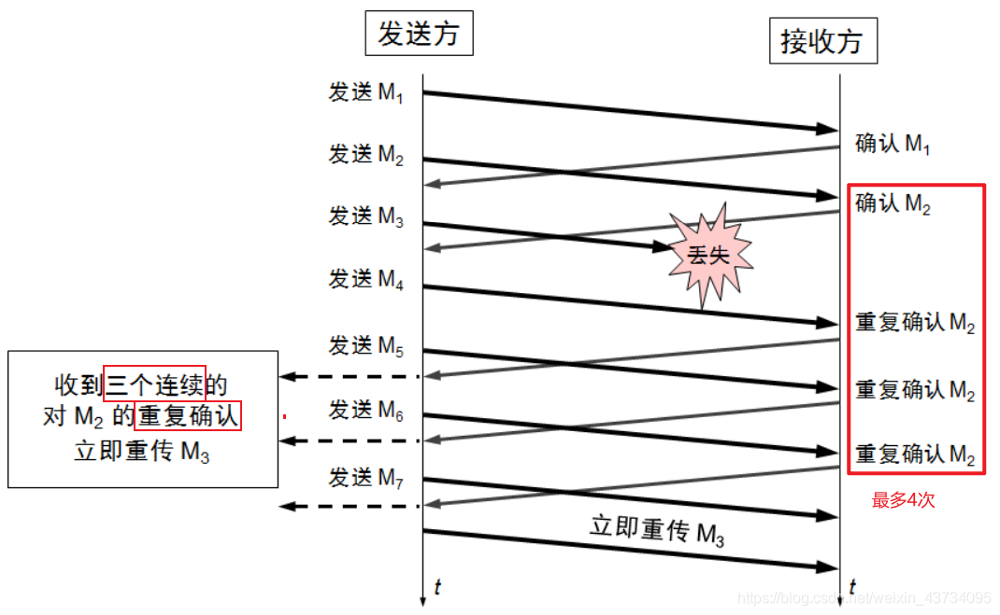

`快恢复：`
当发送方连续收到三个重复确认，说明网络出现拥塞

- 就执行`乘法减小`算法，把ssthresh减为拥塞峰值的一半
与慢开始不同之处是现在`不执行慢开始算法`，即`cwnd`现在不恢复到初始值

- 而是把cwnd值设置为新的ssthresh值（减小后的值）
- 然后开始执行拥塞避免算法（“加法增大”），使拥塞窗口缓慢地线性增大

`快重传 + 快恢复：`
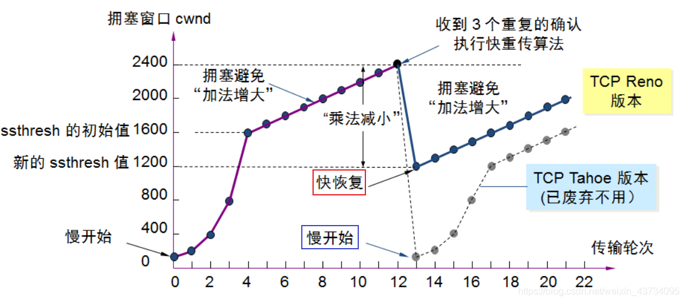

发送窗口的最大值swnd = min(接收窗口cwnd, 堵塞窗口rwnd)

- 当 rwnd < cwnd 时，是接收方的接收能力限制发送窗口的最大值
- 当 cwnd < rwnd 时，则是网络的拥塞限制发送窗口的最大值

## TCP - 序号、确认号（详细步骤）

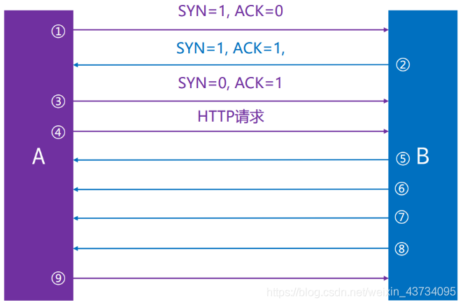

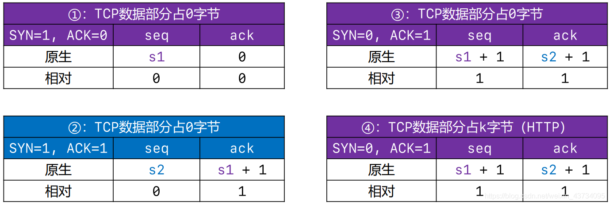

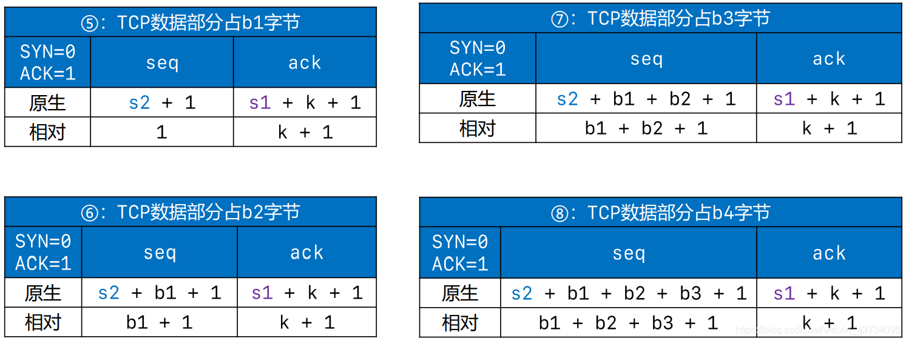

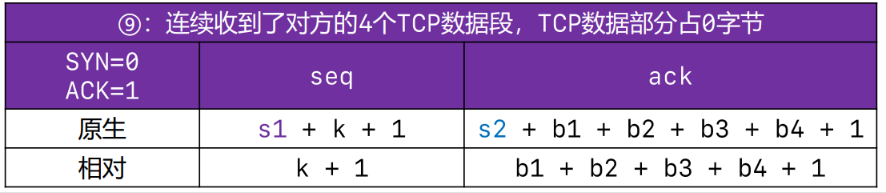

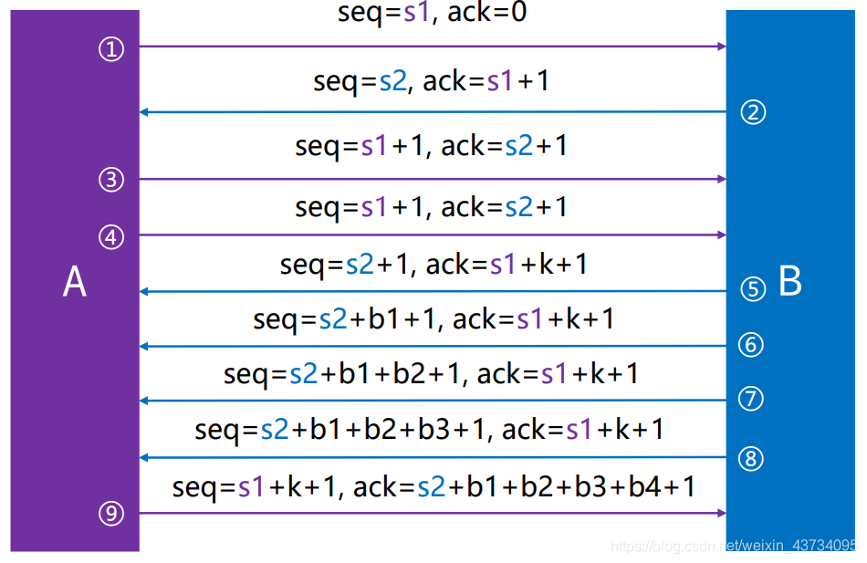

序号、确认好 —— 相对：

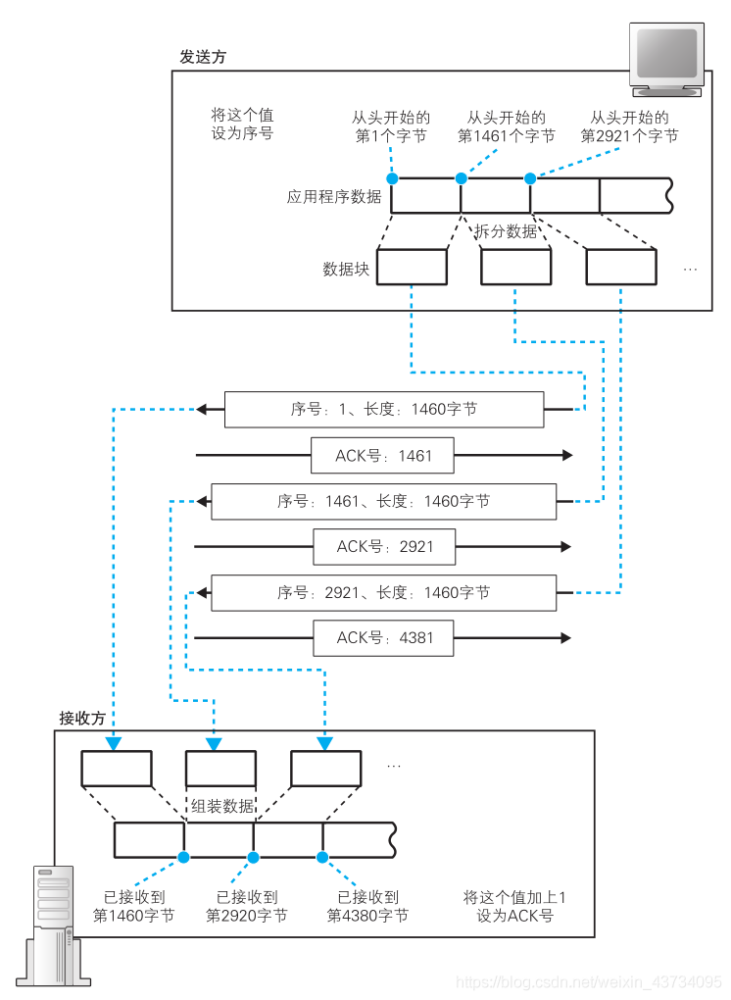

序号、确认号 —— 原生：
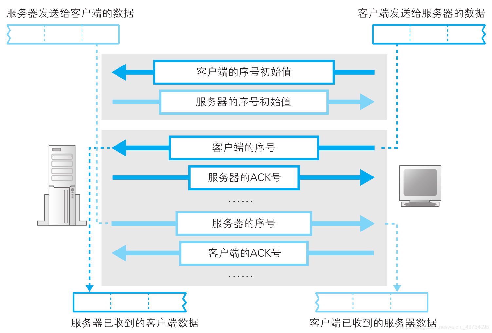

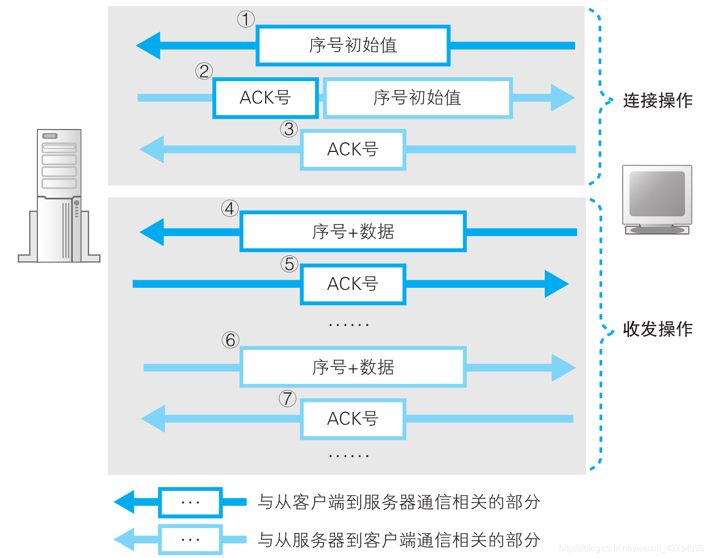

### TCP -【建立连接】- 3次握手

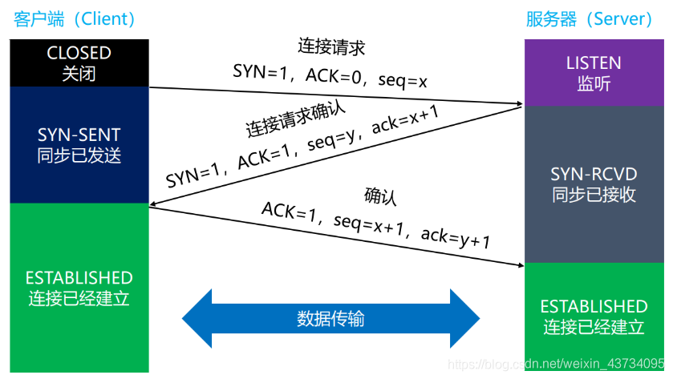

- `CLOSED`：client处于关闭状态
- `LISTEN`：server处于监听状态，等待client连接
- `SYN-RCVD`：表示server接受到了SYN报文，当收到client的ACK报文后，它会进入到 ESTABLISHED 状态
- `SYN-SENT`：表示client已发送SYN报文，等待server的第2次握手
- `ESTABLISHED`：表示连接已经建立

### TCP -【建立连接】- 前2次握手的特点
SYN 都设置为1

数据部分的长度都为0

TCP头部的长度一般是32字节

- 固定头部：20字节
- 选项部分：12字节

双方会交换确认一些信息

比如`MSS`、是否支持`SACK`、`Window scale（窗口缩放系数）` 等
- 这些数据都放在了TCP头部的`选项部分中`（12字节）

> 为什么建立连接的时候，要进行3次握手？2次不行么？
主要目的：防止server端一直等待，浪费资源
如果建立连接只需要2次握手，可能会出现的情况：

- 假设client发出的第一个连接请求报文段，因为网络延迟，在连接释放以后的某个时间才到达server
- 本来这是一个早已失效的连接请求，但server收到此失效的请求后，误认为是client再次发出的一个新的连接请求
- 于是server就向client发出确认报文段，同意建立连接
- 如果不采用“3次握手”，那么只要server发出确认，新的连接就建立了
- 由于现在client并没有真正想连接服务器的意愿，因此不会理睬server的确认，也不会向server发送数据
- 但server却以为新的连接已经建立，并一直等待client发来数据，这样，server的很多资源就白白浪费掉了
采用`三次握手`的办法可以防止上述现象发生

- 例如上述情况，client没有向【server的确认】发出确认，server由于收不到确认，就知道client并没有要求建立连接

> 如果第3次握手失败了，会怎么处理？

- 此时server的状态为 `SYN-RCVD`，若等不到client的 ACK，server会重新发送 SYN+ACK 包
- 如果server多次重发 `SYN+ACK` 都等不到client的 ACK，就会发送 `RST`包，强制关闭连接

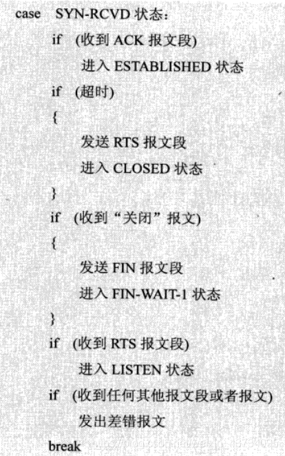

### TCP -【释放连接】- 4次挥手

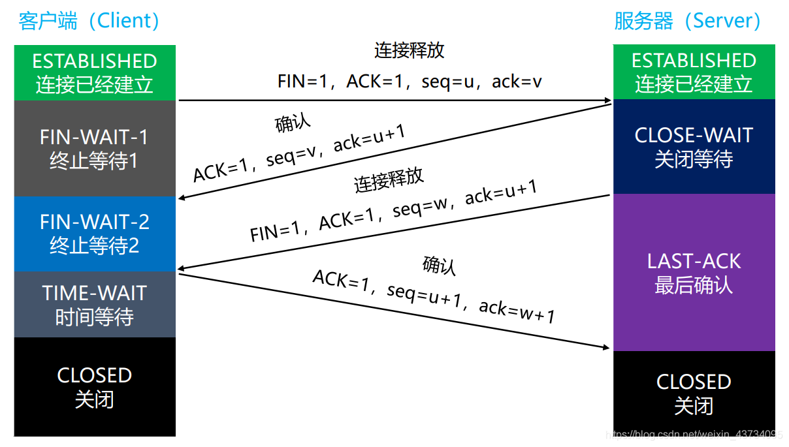

`FIN-WAIT-1`：表示想主动关闭连接
向对方发送了FIN报文，此时进入到FIN-WAIT-1状态

`CLOSE-WAIT`：表示在等待关闭
当对方发送FIN给自己，自己会回应一个ACK报文给对方，此时则进入到CLOSE-WAIT状态
在此状态下，需要考虑自己是否还有数据要发送给对方，如果没有，发送FIN报文给对方

`FIN-WAIT-2`：只要对方发送ACK确认后，主动方就会处于FIN-WAIT-2状态，然后等待对方发送FIN报文

`CLOSING`：一种比较罕见的例外状态
- 表示你发送FIN报文后，并没有收到对方的ACK报文，反而却也收到了对方的FIN报文
- 如果双方几乎在同时准备关闭连接的话，那么就出现了双方同时发送FIN报文的情况，也即会出现CLOSING状态
- 表示双方都正在关闭连接

`LAST-ACK`：被动关闭一方在发送FIN报文后，最后等待对方的ACK报文
当收到ACK报文后，即可进入CLOSED状态了

`TIME-WAIT`：表示收到了对方的FIN报文，并发送出了ACK报文，就等 `2MSL` 后即可进入CLOSED状态了
如果FIN-WAIT-1状态下，收到了对方同时带FIN标志和ACK标志的报文时
可以直接进入到TIME-WAIT状态，而无须经过FIN-WAIT-2状态

`CLOSED`：关闭状态

由于有些状态的时间比较短暂，所以很难用 `netstat`命令看到，比如`SYN-RCVD`、`FIN-WAIT-1`等

### TCP -【释放连接】- 细节
1、TCP/IP协议栈在设计上，`允许任何一方先发起断开请求`。这里演示的是client主动要求断开

2、client发送ACK后，需要有个TIME-WAIT阶段，等待一段时间后，再真正关闭连接

- 一般是等待2倍的 `MSL（Maximum Segment Lifetime`，最大分段生存期）
MSL是TCP报文在Internet上的最长生存时间
每个具体的TCP实现都必须选择一个确定的MSL值，`RFC 1122` 建议是2分钟
可以防止本次连接中产生的数据包误传到下一次连接中
（因为本次连接中的数据包都会在2MSL时间内消失了）

3、如果client发送ACK后马上释放了，然后又因为网络原因，server没有收到client的ACK，server就会重发FIN，这时可能出现的情况是

- ① client没有任何响应，服务器那边会干等，甚至多次重发FIN，浪费资源
- ② client有个新的应用程序刚好分配了同一个端口号，新的应用程序收到FIN后马上开始执行断开连接的操作，本来它可能是想跟server建立连接的

> 为什么释放连接的时候，要进行4次挥手？
TCP是全双工模式

`第1次挥手`：当主机1发出FIN报文段时

- 表示主机1告诉主机2，主机1已经没有数据要发送了，但是，此时主机1还是可以接受来自主机2的数据

`第2次挥手`：当主机2返回ACK报文段时
- 表示主机2已经知道主机1没有数据发送了，但是主机2还是可以发送数据到主机1的

`第3次挥手`：当主机2也发送了FIN报文段时
- 表示主机2告诉主机1，主机2已经没有数据要发送了

`第4次挥手`：当主机1返回ACK报文段时

- 表示主机1已经知道主机2没有数据发送了。随后正式断开整个TCP连接

### TCP -【释放连接】- 抓包实践
有时候在使用抓包工具的时候，有可能只会看到`3次挥手`

这其实是将第2、3次挥手合并了

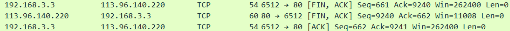

当server接收到client的FIN时，如果server后面也没有数据要发送给client了

- 这时，server就可以将第2、3次挥手合并，同时告诉client两件事
1、已经知道client没有数据要发
2、server已经没有数据要发了

## 常见问题（长连接、短链接）
如果建立连接后不需要进行数据交互就会关闭，那就是短连接。

如果建立连接后需要进行数据交互以后再关闭，那就是长连接。

原文链接：https://blog.csdn.net/weixin_43734095/article/details/112498827