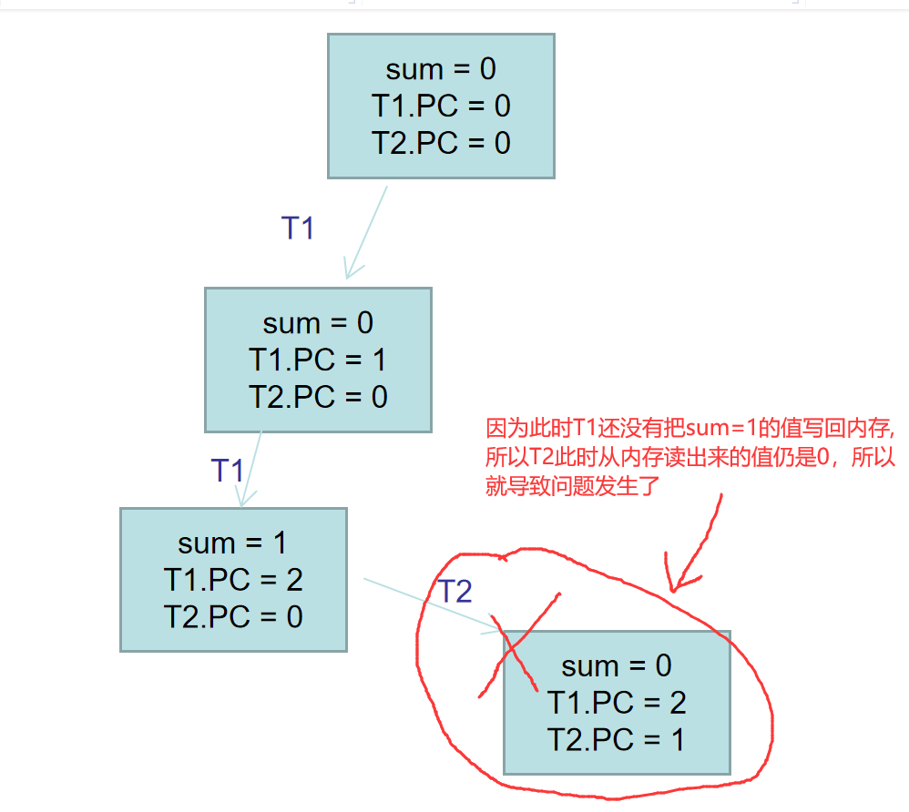
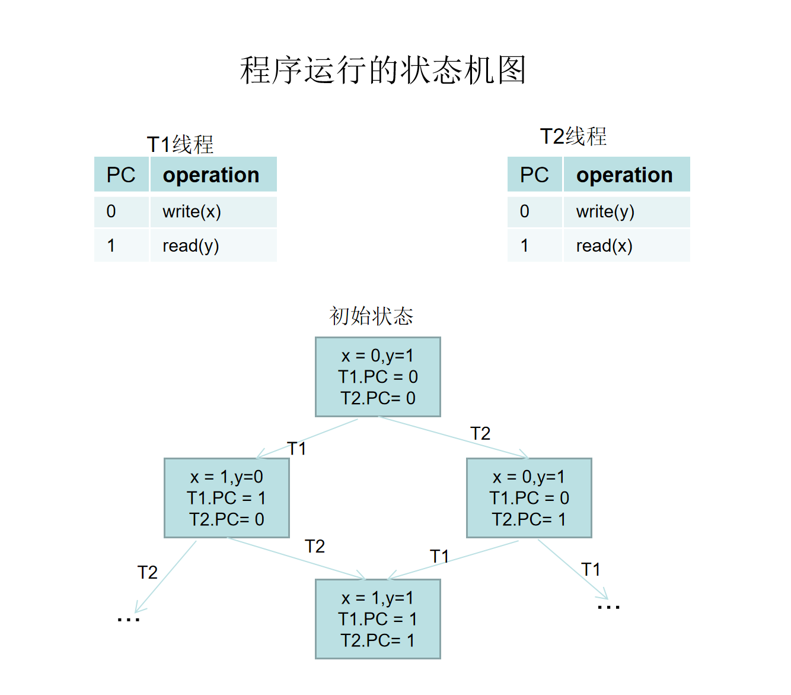

# 并发的基本单位：线程

共享内存的多个执行流

- 执行流拥有独立的堆栈/寄存器
- 共享全部的内存 (指针可以互相引用)

用状态机的视角就很容易理解了！

这里使用一个封装好的简单线程库, 代码如下:
```C
#include <stdlib.h>
#include <stdio.h>
#include <string.h>
#include <stdatomic.h>
#include <assert.h>
#include <unistd.h>
#include <pthread.h>

#define NTHREAD 64
enum { T_FREE = 0, T_LIVE, T_DEAD, };
struct thread {
  int id, status;
  pthread_t thread;
  void (*entry)(int);
};

struct thread tpool[NTHREAD], *tptr = tpool;

void *wrapper(void *arg) {
  struct thread *thread = (struct thread *)arg;
  thread->entry(thread->id);
  return NULL;
}

void create(void *fn) {
  assert(tptr - tpool < NTHREAD);
  *tptr = (struct thread) {
    .id = tptr - tpool + 1,
    .status = T_LIVE,
    .entry = fn,
  };
  pthread_create(&(tptr->thread), NULL, wrapper, tptr);
  ++tptr;
}

void join() {
  for (int i = 0; i < NTHREAD; i++) {
    struct thread *t = &tpool[i];
    if (t->status == T_LIVE) {
      pthread_join(t->thread, NULL);
      t->status = T_DEAD;
    }
  }
}

__attribute__((destructor)) void cleanup() {
  join();
}
```

接下来写一个简单的多线程程序:
```C
#include "thread.h" // gcc a.c -lpthread 
void Ta() { while (1) { printf("a"); } }
void Tb() { while (1) { printf("b"); } }

int main() {
  create(Ta);
  create(Tb);
}
```
运行后可以看到程序控制台可以交替打印程序字符`a`和`b`

这样操作系统就会把不同的线程放到不同的处理器上跑了。使用`top`命令可以验证，可以看到CPU的使用率超过了100%。
```
 PID USER      PR  NI    VIRT    RES    SHR S  %CPU  %MEM     TIME+ COMMAND
  798 lws       20   0  100964   2596    468 S 245.3   0.0   0:34.89 a.out
```

## 证明线程确实共享内存

```C
#include "thread.h" //gcc shm-test.c -lpthread
int x = 0;

void Thello(int id) {
  usleep(id * 100000);
  printf("Hello from thread #%c\n", "123456789ABCDEF"[x++]);
}

int main() {
  for (int i = 0; i < 10; i++) {
    create(Thello);
  }
}
```
可以看到程序依次输出`Hello from thread #[1..A]`
说明`x`全局变量是被所有线程共享的。

## 证明线程具有独立堆栈 (以及确定它们的范围)

```C
#include "thread.h" // gcc stack-probe.c -lpthread

__thread char *base, *cur; // thread-local variables
__thread int id;

// objdump to see how thread-local variables are implemented
__attribute__((noinline)) void set_cur(void *ptr) { cur = ptr; }
__attribute__((noinline)) char *get_cur()         { return cur; }

void stackoverflow(int n) {
  set_cur(&n);
  if (n % 1024 == 0) {
    int sz = base - get_cur();
    printf("Stack size of T%d >= %d KB\n", id, sz / 1024);
  }
  stackoverflow(n + 1);
}

void Tprobe(int tid) {
  id = tid;
  base = (void *)&tid;
  stackoverflow(0);
}

int main() {
  setbuf(stdout, NULL); // NULL 表示关闭缓冲
  for (int i = 0; i < 4; i++) {
    create(Tprobe);
  }
}
```
```
gcc stack-probe.c -lpthread && ./a.out | sort -nk 6

....省略....
Stack size of T3 >= 8000 KB
Stack size of T3 >= 8064 KB
Stack size of T3 >= 8128 KB
[1]    6249 segmentation fault  ./a.out |
       6250 done                sort -nk 6
```
因为 `8128 / 1024 = 7.93`,因此估算线程栈大小为 `1024 * 8`,即`8192`kb, 我们用`ulimit -s`命令也可以看到确实是8192.

--- 
### thread local实现原理?
看如下代码
```C
#include "thread.h" //threadLocal.c

__thread int num = 100;

void Ta() {
  num = 666;
  printf("num at Ta is %d --> %p\n",num, &num);
}

void Tb() {
  num = 777;
  printf("num at Tb is %d --> %p\n",num, &num);
}

int main(int argc, char const *argv[])
{
  create(Ta);
  sleep(2);
  create(Tb);
  join();
  printf("num at main is %d --> %p\n",num, &num);
  return 0;
}
```
```
> gcc threadLocal.c -o tl -lpthread && ./tl
num at Ta is 666 --> 0x7fd353ccd6fc
num at Tb is 777 --> 0x7fd3534cc6fc
num at main is 100 --> 0x7fd353cce73c
```
可以看到,打印的指针地址都不一样,说明thread local本后本质上是为每一个线程的创建了`num`变量的副本.

用`objdump -d -j .text tl`,反汇编
```
00000000000013e0 <main>:
    省略
    141f:       64 8b 04 25 fc ff ff    mov    %fs:0xfffffffffffffffc,%eax #把变量num的值复制给eax
    省略
```
至于threal local是怎么配合寄存器`fs`实现的, 目前还没搞懂，留待以后再深究


### 创建线程执行了什么系统调用?
用`strace ./a.out`可以跟踪系统调用, 发现`pthread_create`实际上是执行了`clone`系统调用


## 多线程带来的问题

来看一段代码:
```C
#include "thread.h" // sum.c

#define N 100000000

long sum = 0;

void Tsum() {
  for (int i = 0; i < N; i++) {
    sum++;
  }
}

int main() {
  create(Tsum);
  create(Tsum);
  join();
  printf("sum = %ld\n", sum);
}
```
这个程序是两个线程对变量`sum`++动作, 我们期望最终结果是`200000000`,但是结果并非如我所愿.

我们反汇编 Tsum的代码, `sum++`的代码如下,在这里可以看到C代码虽然是一行, 但是对应的机器指令有三行, 
```
    134d:       48 8b 05 d4 2c 00 00    mov    0x2cd4(%rip),%rax        # 4028 <sum>
    1354:       48 83 c0 01             add    $0x1,%rax
    1358:       48 89 05 c9 2c 00 00    mov    %rax,0x2cc9(%rip)        # 4028 <sum>
``` 
总结就是3步, 1.从内存读sum的值(`read`), 2.sum加1(`add`), 3.把sum的值写回内存(`write`)。

下面是程序执行的状态图分析:



于是我们用内联汇编来优化`sum++`操作,
```C
void Tsum() {
  for (int i = 0; i < N; i++) {
    // sum++;
    asm volatile("add $1, %0": "+m"(sum));
  }
}
```

编译,然后我们看到 `sum++`编译后的汇编指令由原来的3条, 变成`addl   $0x1,0x2cd4(%rip)  # 4028 <sum>`

然后再执行,结果如下:
```
> ./a.out
sum = 100082161
```
依然得不到正确的答案, 在这里看到`sum++`即使被我们优化成一条汇编指令, 运行结果依然不对。这是因为我我们的CPU是多核的,不同的线程会放到不同的CPU去执行,所以还会由问题。
如果CPU是单核的,那么结果就会对了。

我们的CPU是多核的,那怎么验证它在单核下运行就对呢,我们可以使用`taskset`命令来设置进程到`CPU`的亲和性。演示如下:
```
➜  concurrency while true; do taskset --cpu-list 0 ./a.out; done
sum = 200000000
sum = 200000000
sum = 200000000
sum = 200000000
sum = 200000000
```
验证完毕,证明我们的猜想是对的。

回到上一个问题,`addl $0x1,0x2cd4(%rip)  # 4028 <sum>` 为什么在多核CPU就会有问题呢? 

> TODO 后面再回答,涉及多核CPU的硬件模型

## `lock`前缀
什么是`lock prefix`, 参看,[LOCK Prefix (lock)](https://docs.oracle.com/cd/E19455-01/806-3773/instructionset-128/index.html)
或者[《Intel® 64 and IA-32 Architectures Developer's Manual: Vol. 3A》的8.1章](https://www.intel.com/content/www/us/en/architecture-and-technology/64-ia-32-architectures-software-developer-vol-3a-part-1-manual.html)

于是我们在前面程序的`asm volatile("add $1, %0": "+m"(sum));` 加上`lock prefix`后变成`asm volatile("lock add $1, %0": "+m"(sum));`
然后重新编译执行,结果如下:
```
> while true; do ./a.out; done
sum = 200000000
sum = 200000000
sum = 200000000
sum = 200000000
sum = 200000000
```
这里我们可以看到,每次的输出结果都是对的, 但是同时也感觉的使用 `lock prefix, 明显感受到程序变慢了`

从上面的例子分析中, 可以看到
- 在`单核`处理器,`x++`这样的操作, 也无法保证其原子性
- 在`多核`处理器, 线程是并行执行的,`一条汇编指令`, 也无法把证其原子性

所以历史上,1960s，大家争先在共享内存上实现原子性 (互斥),但几乎所有的实现都是错的，直到 [Dekker's Algorithm](https://en.wikipedia.org/wiki/Dekker%27s_algorithm)，还只能保证两个线程的互斥


## 编译选项对多线程程序的影响
还是回到之前的`sum++`的例子, 代码如下:
```C
#include "thread.h" // sum.c

#define N 100000000

long sum = 0;

void Tsum() {
  for (int i = 0; i < N; i++) {
    sum++;
  }
}

int main() {
  create(Tsum);
  create(Tsum);
  join();
  printf("sum = %ld\n", sum);
}
```
我们分辨用不同的编译选项来编译`sum.c`
```
> gcc -O1 sum.c -lpthread
> while true; do ./a.out; done
sum = 100000000
sum = 100000000
sum = 100000000
....
> gcc -O2 sum.c -lpthread
> while true; do ./a.out; done
sum = 200000000
sum = 200000000
sum = 200000000
```

可以看到, 用`-O1`和`-O2`之间的差异.接下来我们用反汇编分析一下:
- `-01`下的反汇编
```
00000000000011c3 <Tsum>:
    11c3:  f3 0f 1e fa             endbr64
    11c7:  48 8b 15 5a 2e 00 00    mov    0x2e5a(%rip),%rdx     # 4028 <sum> 取出原来的sum,值赋值给rdx
    11ce:  b8 00 e1 f5 05          mov    $0x5f5e100,%eax       # eax = 0x5f5e100,即100000000
    11d3:  83 e8 01                sub    $0x1,%eax             # eax减一
    11d6:  75 fb                   jne    11d3 <Tsum+0x10>      # eax不等于0就跳转到11d3处
    11d8:  48 8d 82 00 e1 f5 05    lea    0x5f5e100(%rdx),%rax  # 相当于rax = rdx + 100000000
    11df:  48 89 05 42 2e 00 00    mov    %rax,0x2e42(%rip)    # 4028 <sum>
    11e6:  c3                      retq
```
上面的反汇编相当于, 把sum 赋值给rdx, 然后做了很多循环, 然后rdx = rdx + 100000000, 然后rax = rdx,最后sum = rax.

- `-02`下的反汇编
```
0000000000001230 <Tsum>:
    1230:  f3 0f 1e fa           endbr64
    1234:  48 81 05 e9 2d 00 00  addq   $0x5f5e100,0x2de9(%rip)  # 4028 <sum> # 直接把100000000赋值给sum,但依然无法保证正确性
    123b:  00 e1 f5 05
    123f:  c3
```

可以看到编译优化选项也会带了问题。

## 编译优化给多线程带来的问题
我们再来看一个例子:
```C
extern int done; // a.c
void join() {
  while (!done);
}
```
我们使用`-O2`选项编译并查看反汇编
```
> gcc -c -O2 a.c -o a.o && objdump -d a.o
a.o:     file format elf64-x86-64
Disassembly of section .text:
0000000000000000 <join>:
   0:   f3 0f 1e fa             endbr64 
   4:   8b 05 00 00 00 00       mov    0x0(%rip),%eax        # a <join+0xa>
   a:   85 c0                   test   %eax,%eax
   c:   75 02                   jne    10 <join+0x10>  # 先判断条件
   e:   eb fe                   jmp    e <join+0xe>    # 死循环
  10:   c3                      retq
```

我们从上面的反汇编可以看到, 在编译器眼里,程序似乎是`按照单线程模型去优化代码的`,在`多线程下会丧失掉原来C语言的语义`,其优化形式形如下代码:
```C
while (!done);
// would be optimized to
if (!done) while (1);
```

那怎么解决呢, 我们可以使用一下两种办法, 在代码中插入`优化不能穿越`的 `barrier:`
- `volatile`关键字
```C
extern int volatile done; // a.c
void join() {
  while (!done);
}
```

- `compiler barrier`
```C
extern int done; // a.c
void join() {
  while (!done) {
    asm volatile ("" ::: "memory"); // compiler barrier
  }
}
```
上面两种处理方法都会被编译成如下的汇编代码,即每次循环的时候都会从内存里面读取值:
```
   8:   8b 05 00 00 00 00       mov    0x0(%rip),%eax        # e <join+0xe>
   e:   85 c0                   test   %eax,%eax
  10:   74 f6                   je     8 <join+0x8>
```


## memory order

来看一份代码:
```C
#include "thread.h" // memory-order.c

int x = 0, y = 0;

void T1() {
  x = 1;
  asm volatile("" ::: "memory"); // compiler barrier,告诉编译器不要优化我,保证下面读取y之前,一点先把x的值写入内存
  printf("y = %d\t", y);
}

void T2() {
  y = 1;
  asm volatile("" ::: "memory"); // compiler barrier
  printf("x = %d\t", x);
}

int main(int argc, char const *argv[])
{
    create(T1);
    create(T2);
    join();
    printf("\n");
    return 0;
}
```

上面那行`asm volatile("" ::: "memory");`是干什么的呢?这行代码是编译器屏障(`compiler barrier`),意思是告诉编译器不要自作聪明地优化指令。
首先现代编译器认为如果有必要,在不影响指令依赖关系的情况下会对指令重排序,使之更好地满足CPU的指令流水线。
下来我们来看一下,在`-O2`编译选项,加与不加`compiler barrier`的编译结果,值演示函数`T1`:

- 没有加`compiler barrier`
```
> gcc memory-order.c  -lpthread -O2 && objdump -d -j .text a.out | grep -A 10 T1
0000000000001240 <T1>:
    1240:       f3 0f 1e fa             endbr64
    1244:       8b 15 da 2d 00 00       mov    0x2dda(%rip),%edx        # 4024 <y> #从内存读取y的值
    124a:       48 8d 35 b3 0d 00 00    lea    0xdb3(%rip),%rsi        # 2004 <_IO_stdin_used+0x4>
    1251:       bf 01 00 00 00          mov    $0x1,%edi
    1256:       31 c0                   xor    %eax,%eax
    1258:       c7 05 c6 2d 00 00 01    movl   $0x1,0x2dc6(%rip)        # 4028 <x> #把x的值写入内存
    125f:       00 00 00
    1262:       e9 59 fe ff ff          jmpq   10c0 <__printf_chk@plt>
    1267:       66 0f 1f 84 00 00 00    nopw   0x0(%rax,%rax,1)
    126e:       00 00
```
在上面可以看到确实发生指令重排序了, 因为读取y的值的指令放在了写x值到内存指令的前面

- 加上`compiler barrier`
```
> gcc memory-order.c  -lpthread -O2 && objdump -d -j .text a.out | grep -A 10 T1
0000000000001240 <T1>:
    1240:       f3 0f 1e fa             endbr64
    1244:       c7 05 da 2d 00 00 01    movl   $0x1,0x2dda(%rip)        # 4028 <x>  #把x的值写入内存
    124b:       00 00 00
    124e:       8b 15 d0 2d 00 00       mov    0x2dd0(%rip),%edx        # 4024 <y>  #从内存读取y的值
    1254:       48 8d 35 a9 0d 00 00    lea    0xda9(%rip),%rsi        # 2004 <_IO_stdin_used+0x4>
    125b:       bf 01 00 00 00          mov    $0x1,%edi
    1260:       31 c0                   xor    %eax,%eax
    1262:       e9 59 fe ff ff          jmpq   10c0 <__printf_chk@plt>
    1267:       66 0f 1f 84 00 00 00    nopw   0x0(%rax,%rax,1)
    126e:       00 00
```

通过上面的比较可以看到, `compiler barrier`的作用是: `告诉编译器,我这里插入了一个屏障,而且这个屏障前后之间的指令顺序是严格按照源代码所定义的,不可以重排序`


现在我们把`memory-order.c`的`compiler barrier`的那行代码重新加回去,编译并且多次运行,结果如下:
```
> gcc memory-order.c -lpthread -O2
> while true; do ./a.out; done | head -n 100000 | sort | uniq -c
     17 x = 0   y = 0
  27867 x = 0   y = 1
    298 x = 1   y = 0
     10 y = 0   x = 0
  70445 y = 0   x = 1
   1363 y = 1   x = 0
```

从上面的结果来看, 我们惊讶地发现, 竟然出现了`x`和`y`同时为`0`!!!!!

下来我们来画出程序的状态机图:




从上面的状态机图来分析, 无论是`T1`还是`T2`线程,无论是谁先走一步, 不可能出现`x`和`y`同时为`0`的情况。

但是事实上,我们也看到了, 结果确实打印出了同时为`0`的情况.

这是为什么呢?这就不得不介绍计算机的体系结构了

## 计算机体系结构

从处理器的角度来看, 现代处理器`也是 (动态) 编译器`！,单个处理器把汇编代码 (用电路)`编译`成更小的微指令(`μops`),
每个`μop` 都有`Fetch`, `Issue`, `Execute`, `Commit` 四个阶段。
处理器可以同时拿出多个没有`数据依赖(data denpency)`的`μops`来执行, 达到`指令级并行(Instruction-Level Parallelism)`

具体请参考书籍: [计算机体系结构:量化方法研究](https://book.douban.com/subject/20452387/)

这就会导致之前程序`memory-order.c`执行结果同时出现为`0`的情况,所以之前所画的状态机模型,在这里就不适合了。

当然,我们也可以像之前那样, 用`taskset`命令把程序绑定到特定的CPU，那么结果就是对的。

所以处理器满足单处理器的`eventual memory consistency`的执行,但在多处理器上就无法串行(序列)化

> 那我怎么解决这个问题呢?
我们可以在`memory-order.c`,程序中把`asm volatile("" ::: "memory");`使用`mfence`指令。以`T1`函数为例子如下:
```C
void T1() {
  x = 1;
  // asm volatile("" ::: "memory"); // compiler barrier
  asm volatile ("mfence"); // 等价于 __sync_synchronize();
  printf("y = %d\t", y);
}
```
> `mfence`指令,在`多核处理器的硬件层面中`, 保证上面实例程序的`x`写到主存(`main memory`)中,然后再执行`mfence`后的语句。

- MFENCE (Pentium 4 and more recent processor families only)

 Serializes all store and load operations that occurred prior to the MFENCE instruction in the 
program instruction stream.
摘自《Intel® 64 and IA-32 Architectures Developer's Manual: Vol. 3A》

然后再执行程序, 就再也看不到`x`和`y`为`0`的结果了。

## 宽松内存模型
TODO