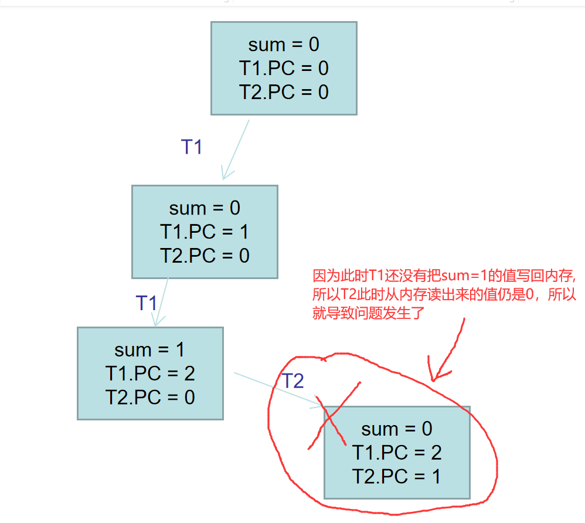
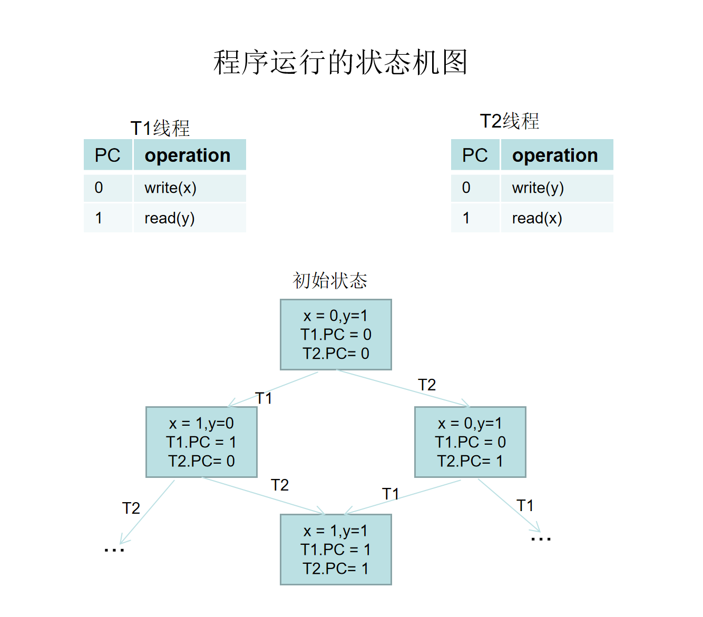
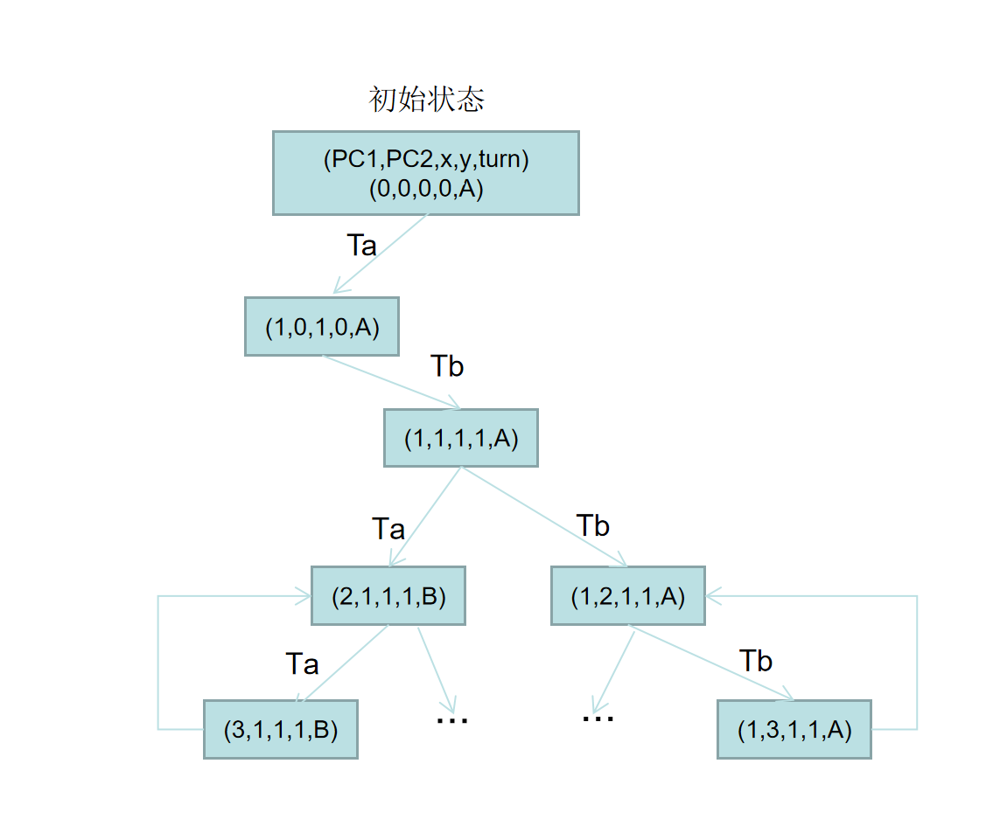

# 并发的基本单位：线程

共享内存的多个执行流

- 执行流拥有独立的堆栈/寄存器
- 共享全部的内存 (指针可以互相引用)

用状态机的视角就很容易理解了！

这里使用一个封装好的简单线程库, 代码如下:
```C
#include <stdlib.h>
#include <stdio.h>
#include <string.h>
#include <stdatomic.h>
#include <assert.h>
#include <unistd.h>
#include <pthread.h>

#define NTHREAD 64
enum { T_FREE = 0, T_LIVE, T_DEAD, };
struct thread {
  int id, status;
  pthread_t thread;
  void (*entry)(int);
};

struct thread tpool[NTHREAD], *tptr = tpool;

void *wrapper(void *arg) {
  struct thread *thread = (struct thread *)arg;
  thread->entry(thread->id);
  return NULL;
}

void create(void *fn) {
  assert(tptr - tpool < NTHREAD);
  *tptr = (struct thread) {
    .id = tptr - tpool + 1,
    .status = T_LIVE,
    .entry = fn,
  };
  pthread_create(&(tptr->thread), NULL, wrapper, tptr);
  ++tptr;
}

void join() {
  for (int i = 0; i < NTHREAD; i++) {
    struct thread *t = &tpool[i];
    if (t->status == T_LIVE) {
      pthread_join(t->thread, NULL);
      t->status = T_DEAD;
    }
  }
}

__attribute__((destructor)) void cleanup() {
  join();
}
```

接下来写一个简单的多线程程序:
```C
#include "thread.h" // gcc a.c -lpthread 
void Ta() { while (1) { printf("a"); } }
void Tb() { while (1) { printf("b"); } }

int main() {
  create(Ta);
  create(Tb);
}
```
运行后可以看到程序控制台可以交替打印程序字符`a`和`b`

这样操作系统就会把不同的线程放到不同的处理器上跑了。使用`top`命令可以验证，可以看到CPU的使用率超过了100%。
```
 PID USER      PR  NI    VIRT    RES    SHR S  %CPU  %MEM     TIME+ COMMAND
  798 lws       20   0  100964   2596    468 S 245.3   0.0   0:34.89 a.out
```

## 证明线程确实共享内存

```C
#include "thread.h" //gcc shm-test.c -lpthread
int x = 0;

void Thello(int id) {
  usleep(id * 100000);
  printf("Hello from thread #%c\n", "123456789ABCDEF"[x++]);
}

int main() {
  for (int i = 0; i < 10; i++) {
    create(Thello);
  }
}
```
可以看到程序依次输出`Hello from thread #[1..A]`
说明`x`全局变量是被所有线程共享的。

## 证明线程具有独立堆栈 (以及确定它们的范围)

```C
#include "thread.h" // gcc stack-probe.c -lpthread

__thread char *base, *cur; // thread-local variables
__thread int id;

// objdump to see how thread-local variables are implemented
__attribute__((noinline)) void set_cur(void *ptr) { cur = ptr; }
__attribute__((noinline)) char *get_cur()         { return cur; }

void stackoverflow(int n) {
  set_cur(&n);
  if (n % 1024 == 0) {
    int sz = base - get_cur();
    printf("Stack size of T%d >= %d KB\n", id, sz / 1024);
  }
  stackoverflow(n + 1);
}

void Tprobe(int tid) {
  id = tid;
  base = (void *)&tid;
  stackoverflow(0);
}

int main() {
  setbuf(stdout, NULL); // NULL 表示关闭缓冲
  for (int i = 0; i < 4; i++) {
    create(Tprobe);
  }
}
```
```
gcc stack-probe.c -lpthread && ./a.out | sort -nk 6

....省略....
Stack size of T3 >= 8000 KB
Stack size of T3 >= 8064 KB
Stack size of T3 >= 8128 KB
[1]    6249 segmentation fault  ./a.out |
       6250 done                sort -nk 6
```
因为 `8128 / 1024 = 7.93`,因此估算线程栈大小为 `1024 * 8`,即`8192`kb, 我们用`ulimit -s`命令也可以看到确实是8192.

--- 
### thread local实现原理?
看如下代码
```C
#include "thread.h" //threadLocal.c

__thread int num = 100;

void Ta() {
  num = 666;
  printf("num at Ta is %d --> %p\n",num, &num);
}

void Tb() {
  num = 777;
  printf("num at Tb is %d --> %p\n",num, &num);
}

int main(int argc, char const *argv[])
{
  create(Ta);
  sleep(2);
  create(Tb);
  join();
  printf("num at main is %d --> %p\n",num, &num);
  return 0;
}
```
```
> gcc threadLocal.c -o tl -lpthread && ./tl
num at Ta is 666 --> 0x7fd353ccd6fc
num at Tb is 777 --> 0x7fd3534cc6fc
num at main is 100 --> 0x7fd353cce73c
```
可以看到,打印的指针地址都不一样,说明thread local本后本质上是为每一个线程的创建了`num`变量的副本.

用`objdump -d -j .text tl`,反汇编
```
00000000000013e0 <main>:
    省略
    141f:       64 8b 04 25 fc ff ff    mov    %fs:0xfffffffffffffffc,%eax #把变量num的值复制给eax
    省略
```
至于threal local是怎么配合寄存器`fs`实现的, 目前还没搞懂，留待以后再深究


### 创建线程执行了什么系统调用?
用`strace ./a.out`可以跟踪系统调用, 发现`pthread_create`实际上是执行了`clone`系统调用


## 多线程带来的问题

来看一段代码:
```C
#include "thread.h" // sum.c

#define N 100000000

long sum = 0;

void Tsum() {
  for (int i = 0; i < N; i++) {
    sum++;
  }
}

int main() {
  create(Tsum);
  create(Tsum);
  join();
  printf("sum = %ld\n", sum);
}
```
这个程序是两个线程对变量`sum`++动作, 我们期望最终结果是`200000000`,但是结果并非如我所愿.

我们反汇编 Tsum的代码, `sum++`的代码如下,在这里可以看到C代码虽然是一行, 但是对应的机器指令有三行, 
```
    134d:       48 8b 05 d4 2c 00 00    mov    0x2cd4(%rip),%rax        # 4028 <sum>
    1354:       48 83 c0 01             add    $0x1,%rax
    1358:       48 89 05 c9 2c 00 00    mov    %rax,0x2cc9(%rip)        # 4028 <sum>
``` 
总结就是3步, 1.从内存读sum的值(`read`), 2.sum加1(`add`), 3.把sum的值写回内存(`write`)。

下面是程序执行的状态图分析:



于是我们用内联汇编来优化`sum++`操作,
```C
void Tsum() {
  for (int i = 0; i < N; i++) {
    // sum++;
    asm volatile("add $1, %0": "+m"(sum));
  }
}
```

编译,然后我们看到 `sum++`编译后的汇编指令由原来的3条, 变成`addl $0x1,0x2cd4(%rip)  # 4028 <sum>`

然后再执行,结果如下:
```
> ./a.out
sum = 100082161
```
依然得不到正确的答案, 在这里看到`sum++`即使被我们优化成一条汇编指令, 运行结果依然不对。这是因为我我们的CPU是多核的,不同的线程会放到不同的CPU去执行,所以还会由问题。
如果CPU是单核的,那么结果就会对了。

我们的CPU是多核的,那怎么验证它在单核下运行就对呢,我们可以使用`taskset`命令来设置进程到`CPU`的亲和性。演示如下:
```
> while true; do taskset --cpu-list 0 ./a.out; done
sum = 200000000
sum = 200000000
sum = 200000000
sum = 200000000
sum = 200000000
```
验证完毕,证明我们的猜想是对的。

回到上一个问题,`addl $0x1,0x2cd4(%rip)  # 4028 <sum>` 为什么在多核CPU就会有问题呢? 

因为现代`x86-64`处理器在处理这条`CISC`风格的机器指令时，可能会将上面一条指令将其拆分为对应的三种不同`微指令（uOp`：`LOAD`、`ADD`、`STORE`,因为这样中可以做到`指令级并行(Instruction-Level Parallelism)`。其中，`LOAD`指令会首先从给定内存地址处读出当前的数据值；`ADD`指令则会根据用户传入的立即数参数，来计算出更新后的数据值；最后`STORE`指令会将这个结果数据值更新到对应的内存中。同之前多条机器指令的实现类似(比如`x++`)，这些微指令在操作系统的线程调度下，也可能存在着交替执行的过程，因此也有着产生数据竞争的风险。

参考书籍: [计算机体系结构:量化方法研究](https://book.douban.com/subject/20452387/)

## `lock`前缀
什么是`lock prefix`
> the processor’s LOCK# signal to be asserted during execution of the accompanying instruction (turns the 
instruction into an atomic instruction). In a multiprocessor environment, the LOCK# signal ensures that the 
processor has exclusive use of any shared memory while the signal is asserted.

摘自《Intel® 64 and IA-32 Architectures Software Developer’s Manual Volume 2》

于是我们在前面程序的`asm volatile("add $1, %0": "+m"(sum));` 加上`lock prefix`后变成`asm volatile("lock add $1, %0": "+m"(sum));`
然后重新编译执行,结果如下:
```
> while true; do ./a.out; done
sum = 200000000
sum = 200000000
sum = 200000000
sum = 200000000
sum = 200000000
```
这里我们可以看到,每次的输出结果都是对的, 但是同时也感觉的使用 `lock prefix, 明显感受到程序变慢了`

从上面的例子分析中, 可以看到
- 在`单核`处理器,`x++`这样的操作, 也无法保证其原子性
- 在`多核`处理器, 线程是并行执行的,`一条汇编指令`, 也无法把证其原子性

所以历史上,1960s，大家争先在共享内存上实现原子性 (互斥),但几乎所有的实现都是错的，直到 [Dekker's Algorithm](https://en.wikipedia.org/wiki/Dekker%27s_algorithm)，还只能保证两个线程的互斥


## 编译选项对多线程程序的影响
还是回到之前的`sum++`的例子, 代码如下:
```C
#include "thread.h" // sum.c

#define N 100000000

long sum = 0;

void Tsum() {
  for (int i = 0; i < N; i++) {
    sum++;
  }
}

int main() {
  create(Tsum);
  create(Tsum);
  join();
  printf("sum = %ld\n", sum);
}
```
我们分辨用不同的编译选项来编译`sum.c`
```
> gcc -O1 sum.c -lpthread
> while true; do ./a.out; done
sum = 100000000
sum = 100000000
sum = 100000000
....
> gcc -O2 sum.c -lpthread
> while true; do ./a.out; done
sum = 200000000
sum = 200000000
sum = 200000000
```

可以看到, 用`-O1`和`-O2`之间的差异.接下来我们用反汇编分析一下:
- `-01`下的反汇编
```
00000000000011c3 <Tsum>:
    11c3:  f3 0f 1e fa             endbr64
    11c7:  48 8b 15 5a 2e 00 00    mov    0x2e5a(%rip),%rdx     # 4028 <sum> 取出原来的sum,值赋值给rdx
    11ce:  b8 00 e1 f5 05          mov    $0x5f5e100,%eax       # eax = 0x5f5e100,即100000000
    11d3:  83 e8 01                sub    $0x1,%eax             # eax减一
    11d6:  75 fb                   jne    11d3 <Tsum+0x10>      # eax不等于0就跳转到11d3处
    11d8:  48 8d 82 00 e1 f5 05    lea    0x5f5e100(%rdx),%rax  # 相当于rax = rdx + 100000000
    11df:  48 89 05 42 2e 00 00    mov    %rax,0x2e42(%rip)    # 4028 <sum>
    11e6:  c3                      retq
```
上面的反汇编相当于, 把sum 赋值给rdx, 然后做了很多循环, 然后rdx = rdx + 100000000, 然后rax = rdx,最后sum = rax.

- `-02`下的反汇编
```
0000000000001230 <Tsum>:
    1230:  f3 0f 1e fa           endbr64
    1234:  48 81 05 e9 2d 00 00  addq   $0x5f5e100,0x2de9(%rip)  # 4028 <sum> # 直接把100000000赋值给sum,但依然无法保证正确性
    123b:  00 e1 f5 05
    123f:  c3
```

可以看到编译优化选项也会带了问题。

## 编译优化给多线程带来的问题
我们再来看一个例子:
```C
extern int done; // a.c
void join() {
  while (!done);
}
```
我们使用`-O2`选项编译并查看反汇编
```
> gcc -c -O2 a.c -o a.o && objdump -d a.o
a.o:     file format elf64-x86-64
Disassembly of section .text:
0000000000000000 <join>:
   0:   f3 0f 1e fa             endbr64 
   4:   8b 05 00 00 00 00       mov    0x0(%rip),%eax        # a <join+0xa>
   a:   85 c0                   test   %eax,%eax
   c:   75 02                   jne    10 <join+0x10>  # 先判断条件
   e:   eb fe                   jmp    e <join+0xe>    # 死循环
  10:   c3                      retq
```

我们从上面的反汇编可以看到, 在编译器眼里,程序似乎是`按照单线程模型去优化代码的`,在`多线程下会丧失掉原来C语言的语义`,其优化形式形如下代码:
```C
while (!done);
// would be optimized to
if (!done) while (1);
```

那怎么解决呢, 我们可以使用一下两种办法, 在代码中插入`优化不能穿越`的 `barrier:`
- `volatile`关键字
```C
extern int volatile done; // a.c
void join() {
  while (!done);
}
```

- `compiler barrier`
```C
extern int done; // a.c
void join() {
  while (!done) {
    asm volatile ("" ::: "memory"); // compiler barrier
  }
}
```
上面两种处理方法都会被编译成如下的汇编代码,即每次循环的时候都会从内存里面读取值:
```
   8:   8b 05 00 00 00 00       mov    0x0(%rip),%eax        # e <join+0xe>
   e:   85 c0                   test   %eax,%eax
  10:   74 f6                   je     8 <join+0x8>
```


## memory order

来看一份代码:
```C
#include "thread.h" // memory-order.c

int x = 0, y = 0;

void T1() {
  x = 1;
  asm volatile("" ::: "memory"); // compiler barrier,告诉编译器不要优化我,保证下面读取y之前,一点先把x的值写入内存
  printf("y = %d\t", y);
}

void T2() {
  y = 1;
  asm volatile("" ::: "memory"); // compiler barrier
  printf("x = %d\t", x);
}

int main(int argc, char const *argv[])
{
    create(T1);
    create(T2);
    join();
    printf("\n");
    return 0;
}
```

上面那行`asm volatile("" ::: "memory");`是干什么的呢?这行代码是编译器屏障(`compiler barrier`),意思是告诉编译器不要自作聪明地优化指令。
首先现代编译器认为如果有必要,在不影响指令依赖关系的情况下会对指令重排序,使之更好地满足CPU的指令流水线。
下来我们来看一下,在`-O2`编译选项,加与不加`compiler barrier`的编译结果,值演示函数`T1`:

- 没有加`compiler barrier`
```
> gcc memory-order.c  -lpthread -O2 && objdump -d -j .text a.out | grep -A 10 T1
0000000000001240 <T1>:
    1240:       f3 0f 1e fa             endbr64
    1244:       8b 15 da 2d 00 00       mov    0x2dda(%rip),%edx        # 4024 <y> #从内存读取y的值
    124a:       48 8d 35 b3 0d 00 00    lea    0xdb3(%rip),%rsi        # 2004 <_IO_stdin_used+0x4>
    1251:       bf 01 00 00 00          mov    $0x1,%edi
    1256:       31 c0                   xor    %eax,%eax
    1258:       c7 05 c6 2d 00 00 01    movl   $0x1,0x2dc6(%rip)        # 4028 <x> #把x的值写入内存
    125f:       00 00 00
    1262:       e9 59 fe ff ff          jmpq   10c0 <__printf_chk@plt>
    1267:       66 0f 1f 84 00 00 00    nopw   0x0(%rax,%rax,1)
    126e:       00 00
```
在上面可以看到确实发生指令重排序了, 因为读取y的值的指令放在了写x值到内存指令的前面

- 加上`compiler barrier`
```
> gcc memory-order.c  -lpthread -O2 && objdump -d -j .text a.out | grep -A 10 T1
0000000000001240 <T1>:
    1240:       f3 0f 1e fa             endbr64
    1244:       c7 05 da 2d 00 00 01    movl   $0x1,0x2dda(%rip)        # 4028 <x>  #把x的值写入内存
    124b:       00 00 00
    124e:       8b 15 d0 2d 00 00       mov    0x2dd0(%rip),%edx        # 4024 <y>  #从内存读取y的值
    1254:       48 8d 35 a9 0d 00 00    lea    0xda9(%rip),%rsi        # 2004 <_IO_stdin_used+0x4>
    125b:       bf 01 00 00 00          mov    $0x1,%edi
    1260:       31 c0                   xor    %eax,%eax
    1262:       e9 59 fe ff ff          jmpq   10c0 <__printf_chk@plt>
    1267:       66 0f 1f 84 00 00 00    nopw   0x0(%rax,%rax,1)
    126e:       00 00
```

通过上面的比较可以看到, `compiler barrier`的作用是: `告诉编译器,我这里插入了一个屏障,而且这个屏障前后之间的指令顺序是严格按照源代码所定义的,不可以重排序`


现在我们把`memory-order.c`的`compiler barrier`的那行代码重新加回去,编译并且多次运行,结果如下:
```
> gcc memory-order.c -lpthread -O2
> while true; do ./a.out; done | head -n 100000 | sort | uniq -c
     17 x = 0   y = 0
  27867 x = 0   y = 1
    298 x = 1   y = 0
     10 y = 0   x = 0
  70445 y = 0   x = 1
   1363 y = 1   x = 0
```

从上面的结果来看, 我们惊讶地发现, 竟然出现了`x`和`y`同时为`0`!!!!!

下来我们来画出程序的状态机图:




从上面的状态机图来分析, 无论是`T1`还是`T2`线程,无论是谁先走一步, 不可能出现`x`和`y`同时为`0`的情况。

但是事实上,我们也看到了, 结果确实打印出了同时为`0`的情况.

这是为什么呢?这就不得不介绍计算机的体系结构了

## 计算机体系结构

从处理器的角度来看, 现代处理器`也是 (动态) 编译器`！,单个处理器把汇编代码 (用电路)`编译`成更小的微指令(`μops`),
每个`μop` 都有`Fetch`, `Issue`, `Execute`, `Commit` 四个阶段。
处理器可以同时拿出多个没有`数据依赖(data denpency)`的`μops`来执行, 达到`指令级并行(Instruction-Level Parallelism)`

具体请参考书籍: [计算机体系结构:量化方法研究](https://book.douban.com/subject/20452387/)

这就会导致之前程序`memory-order.c`执行结果同时出现为`0`的情况,所以之前所画的状态机模型,在这里就不适合了。

当然,我们也可以像之前那样, 用`taskset`命令把程序绑定到特定的CPU，那么结果就是对的。

所以处理器满足单处理器的`eventual memory consistency`的执行,但在多处理器上就无法串行(序列)化

> 那我怎么解决这个问题呢?
我们可以在`memory-order.c`,程序中把`asm volatile("" ::: "memory");`使用`mfence`指令。以`T1`函数为例子如下:
```C
void T1() {
  x = 1;
  // asm volatile("" ::: "memory"); // compiler barrier
  asm volatile ("mfence"); // 等价于 __sync_synchronize();
  printf("y = %d\t", y);
}
```
> `mfence`指令,在`多核处理器的硬件层面中`, 保证上面实例程序的`x`写到主存(`main memory`)中,然后再执行`mfence`后的语句。

- MFENCE (Pentium 4 and more recent processor families only)

Performs a serializing operation on all load-from-memory and store-to-memory instructions that were issued prior 
the MFENCE instruction. This serializing operation guarantees that every load and store instruction that precedes 
the MFENCE instruction in program order becomes globally visible before any load or store instruction that follows 
the MFENCE instruction. The MFENCE instruction is ordered with respect to all load and store instructions

摘自《Intel® 64 and IA-32 Architectures Software Developer’s Manual Volume 2》

然后再执行程序, 就再也看不到`x`和`y`为`0`的结果了。

## 硬件内存模型

[Hardware Memory Models by Russ Cox](https://research.swtch.com/hwmm)

`Russ Cox`还是MIT 教授,讲OS的课程 [CS 6.828](https://pdos.csail.mit.edu/6.828/2021/xv6/book-riscv-rev2.pdf)

---

# 理解并发程序执行

互斥：保证两个线程不能同时执行一段代码。

回到上面`sum.c`的例子,我们使得两个县城不能同时执行`sum++`,于是插入`神秘代码`，使得`sum.c`(或者任意其他代码) 能够正常工作

```C
void Tsum() {
  // 神秘代码
  sum++;
  // 神秘代码
}
```

失败的尝试:
```C
int locked = UNLOCK;

void critical_section() {
retry:
  if (locked != UNLOCK) { // #1
    goto retry;
  }
  locked = LOCK;    // #2

  // critical section

  locked = UNLOCK;
}
```
因为处理器不能保证这里的`#1(load)` 和 `#2(store)`的原子性, 所以这里是错误的.

## Peterson算法

[Peterson算法](https://en.wikipedia.org/wiki/Peterson%27s_algorithm)

以厕所包厢为例子:
A 和 B 争用厕所的包厢

- 想进入包厢之前，A/B 都要先举起自己的旗子
  - A 确认旗子举好以后，往厕所门上贴上`B 正在使用`的标签
  - B 确认旗子举好以后，往厕所门上贴上`A 正在使用`的标签
- 然后，如果对方的旗子举起来，且门上的名字不是自己，等待
  - 否则可以进入包厢
- 出包厢后，放下自己的旗子

代码如下:
```C
#include "thread.h" // peterson-simple.c

#define A 1
#define B 2

atomic_int nested;
atomic_long count;

void critical_section() {
  long cnt = atomic_fetch_add(&count, 1);
  assert(atomic_fetch_add(&nested, 1) == 0);
  atomic_fetch_add(&nested, -1);
}

int volatile x = 0, y = 0, turn = A;

void TA() {
    while (1) {
/* PC=1 */  x = 1; //举旗子
/* PC=2 */  turn = B; //贴标签
/* PC=3 */  while (y && turn == B); //如果对方的旗子举起来,且门上的名字不是自己,等待
            critical_section();
/* PC=4 */  x = 0;
    }
}

void TB() {
  while (1) {
/* PC=1 */  y = 1;
/* PC=2 */  turn = A;
/* PC=3 */  while (x && turn == A) ;
            critical_section();
/* PC=4 */  y = 0;
  }
}

int main() {
  create(TA);
  create(TB);
}
```

下面来画一下程序的状态机图`(PC1,PC2,x,y,turn);`



如上图所示, 正是因为状态机有了环,`Peterson算法`可以实现两个线程(在Sequential 内存模下)实现互斥。

我们编译并运行程序, 结果如下:
```
> gcc peterson-simple.c -lpthread && ./a.out
a.out: peterson-simple.c:11: critical_section: Assertion `atomic_fetch_add(&nested, 1) == 0' failed.
[1]    1480 abort      ./a.out
```
可以看到,结果还是翻车了, 这是因为上面的`peterson-simple.c`的`Peterson算法`只能实现`Sequential 内存模`下的内存模型的两个线程的互斥。

而我的电脑是硬件内存模型是`x86 Total Store Order (x86-TSO)`,所以需要`内存屏障`来保障`Peterson算法`的正确性,于是有了一下代码:
```C
#include "thread.h" // peterson-barrier.c

#define A 1
#define B 2

#define BARRIER __sync_synchronize()

atomic_int nested;
atomic_long count;

void critical_section() {
  long cnt = atomic_fetch_add(&count, 1);
  int i = atomic_fetch_add(&nested, 1) + 1;
  if (i != 1) {
    printf("%d threads in the critical section @ count=%ld\n", i, cnt);
    assert(0);
  }
  atomic_fetch_add(&nested, -1);
}

int volatile x = 0, y = 0, turn;

void TA() {
  while (1) {
    x = 1;                   BARRIER;
    turn = B;                BARRIER; // <- this is critcal for x86
    while (1) {
      if (!y) break;         BARRIER;
      if (turn != B) break;  BARRIER;
    }
    critical_section();
    x = 0;                   BARRIER;
  }
}

void TB() {
  while (1) {
    y = 1;                   BARRIER;
    turn = A;                BARRIER; // <- this is critcal for x86
    while (1) {
      if (!x) break;         BARRIER;
      if (turn != A) break;  BARRIER;
    }
    critical_section();
    y = 0;                   BARRIER;
  }
}

int main() {
  create(TA);
  create(TB);
}
```
现在再执行`gcc peterson-barrier.c -lpthread && ./a.out`,代码可以正常运行了

> 思考: 哪些`barrier`是多余的? 除了`<- this is critcal for x86`那一行标注的,其他的可以去掉。

### Model Checker
用python写Model Checker代码, 来自动画多线程程序的状态机模型,具体略。


# 共享内存上的互斥

我们可以看到,根据之前的经验, 其实实现互斥根本是很难的, 因为`不能同时读/写共享内存`。

即使是上面的`Peterson算法`用软件方式可以正确实现线程互斥, 但是其编程模型非常复杂,也难理解,性能也不高,而且还只能实现两个线程之间的互斥,使用起来也不友好。

那么有没有什么办法可以解决上面的问题呢? 即执行`load + store`的时候可以以原子方式指令?

于是软件做不了,那就硬件来做, 于是`原子指令`来了.

`X86`硬件能为我们提供一条`瞬间完成`的`读 + 写`指令

- 请所有人闭上眼睛，看一眼 (`load`)，然后贴上标签 (`store`)
  - 如果多人同时请求，硬件选出一个`胜者`
- `败者`要等`胜者`完成后才能继续执行

## x86 原子操作

- LOCK指令前缀(`lock prefix`)
```C
  asm volatile("lock add $1, %0": "+m"(sum));
```
这个`lock`前缀之前已经介绍过了

- `xchg` 指令
```C
int xchg(volatile int *addr, int newval) {
  int result;
  asm volatile ("lock xchg %0, %1"
    : "+m"(*addr), "=a"(result) : "1"(newval)); //xchg已是带lock效果的原子指令,这里lock前缀可以不加
  return result;
}
```
> The XCHG instruction always asserts the LOCK# signal regardless of the presence or absence of 
the LOCK prefix. 

> 摘自《Intel® 64 and IA-32 Architectures Software Developer’s Manual Volume 2》

- 更多的原子操作
[stdatomic.h](https://en.cppreference.com/w/cpp/header/stdatomic.h)

原子指令的模型
- 保证之前的 store 都写入内存
- 保证 load/store 不与原子指令乱序

`Lock`指令的现代实现

在 L1 cache 层保持一致性 (ring/mesh bus)

- 相当于每个 cache line 有分别的锁
- store(x) 进入 L1 缓存即保证对其他处理器可见
  - 但要小心 store buffer 和乱序执行

L1 cache line 根据状态进行协调(`MESI协议`)
- M (Modified), 脏值
- E (Exclusive), 独占访问
- S (Shared), 只读共享
- I (Invalid), 不拥有 cache line

[lock 指令实现第40~48分钟](https://www.bilibili.com/video/BV1ja411h7jt)

## 自旋锁

我们可以 使用`xchg`指令来实现自旋锁,代码如下:
```C
// Spinlock
typedef int spinlock_t;
#define SPIN_INIT() 0

static inline int atomic_xchg(volatile int *addr, int newval) {
  int result;
  asm volatile ("lock xchg %0, %1":
    "+m"(*addr), "=a"(result) : "1"(newval) : "memory");
  return result;
}

void spin_lock(spinlock_t *lk) {
  while (1) {
    intptr_t value = atomic_xchg(lk, 1);
    if (value == 0) {
      break;
    }
  }
}
void spin_unlock(spinlock_t *lk) {
  atomic_xchg(lk, 0); // 其实这里可以不用atomic_xchg, 直接 *lk = 0
}
```

## RISC-V: 另一种原子操作的设计

考虑常见的原子操作：

- atomic test-and-set(`CMPXCHG`)
  - reg = load(x); if (reg == XX) { store(x, YY); }
- lock xchg(`XCHG`)
  - reg = load(x); store(x, XX);
- lock add(`LOCK prefix`)
  - t = load(x); t++; store(x, t);

它们的本质都是:
1. load
2. exec (处理器本地寄存器的运算)
3. store

### Load-Reserved/Store-Conditional (LR/SC)

`LR`:在内存上标记`reserved` (盯上你了)，中断、其他处理器写入都会导致标记消除
```
lr.w rd, (rs1)
rd = M[rs1]
reserve M[rs1]
```

`SC`: 如果`盯上`未被解除，则写入
```
sc.w rd, rs2, (rs1)
  if still reserved:
    M[rs1] = rs2
    rd = 0
  else:
    rd = nonzero
```

### Compare-and-Swap 的 LR/SC 实现
```C
int cas(int *addr, int cmp_val, int new_val) {
  int old_val = *addr;
  if (old_val == cmp_val) {
    *addr = new_val; return 0;
  } else { return 1; }
}
```

```
cas:
  lr.w  t0, (a0)       # Load original value.
  bne   t0, a1, fail   # Doesn’t match, so fail.
  sc.w  t0, a2, (a0)   # Try to update.
  bnez  t0, cas        # Retry if store-conditional failed.
  li a0, 0             # Set return to success.
  jr ra                # Return.
fail:
  li a0, 1             # Set return to failure.
  jr ra                # Return
```

## 互斥锁 (Mutex Lock)

讲互斥锁之前先说一下自旋锁的缺陷:

- 性能问题 (0)
  - 自旋 (共享变量) 会触发处理器间的缓存同步，延迟增加

- 性能问题 (1)
  - 除了进入临界区的线程，其他处理器上的线程都在空转
  - 争抢锁的处理器越多，利用率越低

- 性能问题 (2)
  - 操作系统不`感知`线程在做什么,获得自旋锁的线程可能被操作系统切换出去
  - 实现 100% 的资源浪费

下面用一段代码来测试一下自旋锁的性能问题:
```C
#include "thread.h" // sum-scalability.c
#include "thread-sync.h"

#define N 10000000
spinlock_t lock = SPIN_INIT();
// mutex_t lock;

long n, sum = 0;

void Tsum() {
  for (int i = 0; i < n; i++) {
    spin_lock(&lock);
    sum++;
    spin_unlock(&lock);
  }
}

int main(int argc, char *argv[]) {
  assert(argc == 2);
  int nthread = atoi(argv[1]);
  n = N / nthread;
  for (int i = 0; i < nthread; i++) {
    create(Tsum);
  }
  join();
  assert(sum == n * nthread);
}

```
其中`thread-sync.h`代码如下,里面会包含`自旋锁`和接下来要讲的`互斥锁`,以及后面的要讲的`条件变量`和`信号量`
```C
#include <semaphore.h>

// Spinlock
typedef int spinlock_t;
#define SPIN_INIT() 0

static inline int atomic_xchg(volatile int *addr, int newval) {
  int result;
  asm volatile ("lock xchg %0, %1":
    "+m"(*addr), "=a"(result) : "1"(newval) : "memory");
  return result;
}

void spin_lock(spinlock_t *lk) {
  while (1) {
    intptr_t value = atomic_xchg(lk, 1);
    if (value == 0) {
      break;
    }
  }
}
void spin_unlock(spinlock_t *lk) {
  atomic_xchg(lk, 0);
}

// Mutex
typedef pthread_mutex_t mutex_t;
#define MUTEX_INIT() PTHREAD_MUTEX_INITIALIZER
void mutex_lock(mutex_t *lk)   { pthread_mutex_lock(lk); }
void mutex_unlock(mutex_t *lk) { pthread_mutex_unlock(lk); }

// Conditional Variable
typedef pthread_cond_t cond_t;
#define COND_INIT() PTHREAD_COND_INITIALIZER
#define cond_wait pthread_cond_wait
#define cond_broadcast pthread_cond_broadcast
#define cond_signal pthread_cond_signal

// Semaphore
#define P sem_wait
#define V sem_post
#define SEM_INIT(sem, val) sem_init(sem, 0, val)
```

使用互斥锁然后用不同的线程数去测试,结果如下:
```
> gcc sum-scalability.c -lpthread
> time ./a.out 1
./a.out 1  0.13s user 0.00s system 94% cpu 0.141 total
> time ./a.out 2
./a.out 2  1.42s user 0.00s system 198% cpu 0.715 total
> time ./a.out 4
./a.out 4  6.18s user 0.00s system 395% cpu 1.564 total
> time ./a.out 32
./a.out 32  102.31s user 0.00s system 797% cpu 12.827 total
```
可以看到,随着线程的增多,性能急剧下降。

### 自旋锁的使用场景:

- 临界区几乎不`拥堵`,即并发很小,很容易争抢到锁,并且线程抢到锁之后很快就释放资源
- 持有自旋锁时(通过开关中断)禁止执行流切换,操作系统内核的并发数据结构 (短临界区)


### 实现线程 + 长临界区的互斥
互斥锁通过操作系统内核态实现
- syscall(SYSCALL_lock, &lock);
  - 试图获得lock，但如果失败，就切换到其他线程
- syscall(SYSCALL_unlock, &lock);
  - 释放lock，如果有等待锁的线程就唤醒

一个互斥锁的现实生活中的比喻, 操作系统比喻成游泳馆更衣室管理员

- 先到的人 (线程)
  - 成功获得手环，进入游泳馆
  - *lock = 🔒，系统调用直接返回
- 后到的人 (线程)
  - 不能进入游泳馆，排队等待
  - 线程放入等待队列，执行线程切换 (yield)
- 洗完澡出来的人 (线程)
- 交还手环给管理员；管理员把手环再交给排队的人
- 如果等待队列不空，从等待队列中取出一个线程允许执行
- 如果等待队列为空，*lock = ✅

> 管理员(OS)使用自旋锁确保自己处理手环的过程是原子的


## 关于自选和互斥的一些分析
自旋锁 (线程直接共享 locked)

- 更快的 fast path
  - `xchg` 成功 → 立即进入临界区，开销很小
- 更慢的 slow path
  - `xchg` 失败 → 浪费 CPU 自旋等待

互斥(睡眠)锁 (通过系统调用访问 locked)
- 更快的 slow path
  - 上锁失败线程不再占用CPU
- 更慢的 fast path
  - 即便上锁成功也需要进出内核 (syscall)


## Futex: Fast Userspace muTexes
> 小孩子才做选择。我当然是全都要啦！
涉及操作系统的人,也想到了这一点,他们综合了这两种锁的优点, 于是`Futex(Fast Userspace muTexes)`来了。

- `Fast path`: 一条原子指令，上锁成功立即返回,即在用户态获得锁,马上返回
- `Slow path`: 用户态上锁失败，然后执行系统调用睡眠

> Java里面的AQS(`AbstractQueuedSynchronizer`)和`Synchronized`关键字其实也是基于这种思想

把`sum-scalability.c`的锁换成`mutex`,再用`strace ./a.out 32`,发现互斥锁(`mutex`)背后执行的是`futex`系统调用.