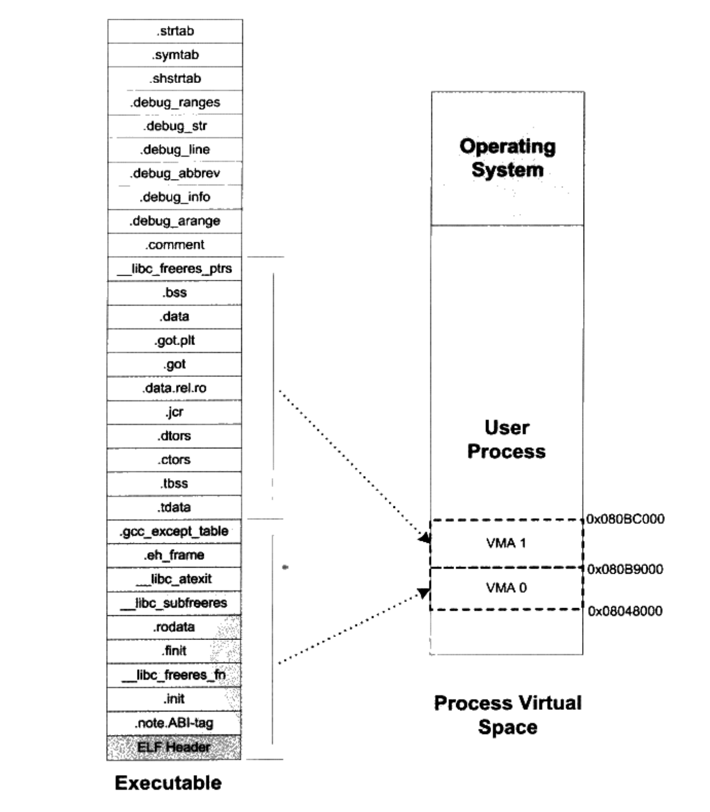
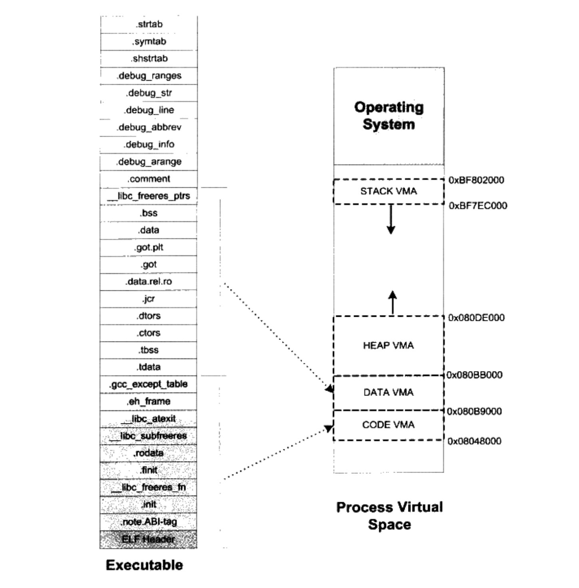

# 可执行文件的装载与进程

## 进程虚拟空间分布

ELF文件的链接视图和执行视图

我们知道在elf文件中, 会包括不同的`section`,例如`.text`,`.data`,`.rodata`,`.bss`,`.init`等等。

elf文件会被操作系统装载至一个叫虚拟内存区域(VMA,Virtual Memory Area),如果程序以`section`为单位装载到`VMA`中,当程序的`section`增多时,就会造成空间的浪费。因为我们知道，ELF文件被映射时，是以系统的页(Page)长度作为单位的，那么每个段在映射时的长度应该都是系统页长度的整数倍:如果不是，那么多余部分也将占用一个页。一个ELF文件中往往有十几个段，那么内存空间的浪费是可想而知的。有没有办法尽量减少这种内存浪费呢?

当我们站在操作系统装载可执行文件的角度看问题时,可以发现它实际上并不关心可执行文件各个段所包含的实际内容，操作系统只关心一些跟装载相关的问题，最主要的是段的权限（可读、可写、可执行)。ELF文件中，段的权限往往只有为数不多的几种组合，基本是三种:

- 以`.text` section为代表的权限为可读可执行的段。
- 以`.data` section和`.bss` section为代表的权限为可读可写的段。
- 以 `.rodata` section为代表的权限为只读的段。

那么我们可以找到一个很简单的方案就是:对于相同权限的`section`，把它们合并到一起当作一个段进行映射。比如有两个段分别叫`.text`和`.init`，它们包含的分别是程序的可执行代码和初始化代码，并且它们的权限相同，都是可读并且可执行的。假设`.text`为4097字节，`.init` 为512字节，这两个段分别映射的话就要占用三个页面，但是，如果将它们合并成一起映射的话只须占用两个页面。


ELF可执行文件引入了一个概念叫做`Segment`，一个`Segment`包含一个或多个属性类似的`Section`。正如我们上面的例子中看到的，如果将`.text` section和`.init` section合并在一起看作是一个`Segment`，那么装载的时候就可以将它们看作一个整体一起映射，也就是说映射以后在进程虚存空间中只有一个相对应的`VMA`，而不是两个，这样做的好处是可以很明显地减少页面内部碎片，从而节省了内存空间。

> 我们很难将`Segment`和`Section`这两个词从中文的翻译上加以区分，因为很多时候`Section`也被翻译成`段`，我们也没有很严格区分这两个英文词汇和两个中文词汇`段`和`节`之间的相互翻译。很明显，从链接的角度看，ELF 文件是按`Section`存储的，事实也的确如此;从装载的角度看，ELF文件又可以按照`Segment`划分。我们在这里就对`Segment`不作翻译，一律按照原词。

`Segment`的概念实际上是从装载的角度重新划分了ELF的各个段。在将目标文件链接成可执行文件的时候，链接器会尽量把相同权限属性的`section`分配在同一空间。比如可读可执行的段都放在一起，这种段的典型是`.text` section;可读可写的段都放在一起，这种段的典型是`.data` section。在ELF中把这些属性相似的、又连在一起的段叫做一个`Segment`，而系统正是按照`Segment`而不是`Section`来映射可执行文件的。


下面的例子是一个很小的程序，程序本身是不停地循环执行`sleep`操作，除非用户发信号给它，否则就一直运行。它的源代码如下:
```C
// SectionMapping.c
// gcc --static SectionMapping.c -o SectionMapping.elf
#include <stdlib.h>

int main() {
    while(1) {
        sleep(1000);
    }
    return 0;
}
```

然后使用`readelf`查看`section`, 这里可以看到`SectionMapping.elf`一共有32 sections

```➜  readelf -S SectionMapping.elf
There are 32 section headers, starting at offset 0xd4618:

Section Headers:
  [Nr] Name              Type             Address           Offset
       Size              EntSize          Flags  Link  Info  Align
  [ 0]                   NULL             0000000000000000  00000000
       0000000000000000  0000000000000000           0     0     0
  [ 1] .note.gnu.propert NOTE             0000000000400270  00000270
       0000000000000020  0000000000000000   A       0     0     8
  ....[省略]
  [30] .strtab           STRTAB           0000000000000000  000cd5f8
       0000000000006ec5  0000000000000000           0     0     1
  [31] .shstrtab         STRTAB           0000000000000000  000d44bd
       0000000000000157  0000000000000000           0     0     1
Key to Flags:
  W (write), A (alloc), X (execute), M (merge), S (strings), I (info),
  L (link order), O (extra OS processing required), G (group), T (TLS),
  C (compressed), x (unknown), o (OS specific), E (exclude),
  l (large), p (processor specific)
```

我们可以使用`readelf`命令来查看ELF的`Segment`。正如描述`Section`属性的结构叫做段表，描述`Segment`的结构叫程序头(`Program Header`)，它描述了ELF文件该如何被操作系统映射到进程的虚拟空间:

```
➜  chapter5 readelf -l SectionMapping.elf

Elf file type is EXEC (Executable file)
Entry point 0x401b90
There are 10 program headers, starting at offset 64

Program Headers:
  Type           Offset             VirtAddr           PhysAddr
                 FileSiz            MemSiz              Flags  Align
  LOAD           0x0000000000000000 0x0000000000400000 0x0000000000400000
                 0x0000000000000518 0x0000000000000518  R      0x1000
  LOAD           0x0000000000001000 0x0000000000401000 0x0000000000401000
                 0x000000000009398d 0x000000000009398d  R E    0x1000
  LOAD           0x0000000000095000 0x0000000000495000 0x0000000000495000
                 0x00000000000266dd 0x00000000000266dd  R      0x1000
  LOAD           0x00000000000bc0c0 0x00000000004bd0c0 0x00000000004bd0c0
                 0x0000000000005170 0x00000000000068c0  RW     0x1000
  NOTE           0x0000000000000270 0x0000000000400270 0x0000000000400270
                 0x0000000000000020 0x0000000000000020  R      0x8
  NOTE           0x0000000000000290 0x0000000000400290 0x0000000000400290
                 0x0000000000000044 0x0000000000000044  R      0x4
  TLS            0x00000000000bc0c0 0x00000000004bd0c0 0x00000000004bd0c0
                 0x0000000000000020 0x0000000000000060  R      0x8
  GNU_PROPERTY   0x0000000000000270 0x0000000000400270 0x0000000000400270
                 0x0000000000000020 0x0000000000000020  R      0x8
  GNU_STACK      0x0000000000000000 0x0000000000000000 0x0000000000000000
                 0x0000000000000000 0x0000000000000000  RW     0x10
  GNU_RELRO      0x00000000000bc0c0 0x00000000004bd0c0 0x00000000004bd0c0
                 0x0000000000002f40 0x0000000000002f40  R      0x1

 Section to Segment mapping:
  Segment Sections...
   00     .note.gnu.property .note.gnu.build-id .note.ABI-tag .rela.plt
   01     .init .plt .text __libc_freeres_fn .fini
   02     .rodata .stapsdt.base .eh_frame .gcc_except_table
   03     .tdata .init_array .fini_array .data.rel.ro .got .got.plt .data __libc_subfreeres __libc_IO_vtables __libc_atexit .bss __libc_freeres_ptrs
   04     .note.gnu.property
   05     .note.gnu.build-id .note.ABI-tag
   06     .tdata .tbss
   07     .note.gnu.property
   08
   09     .tdata .init_array .fini_array .data.rel.ro .got
```

我们可以看到，这个可执行文件中共有10个`Segment`。从装载的角度看，我们目前只关心两个`LOAD`类型的`Segment`,因为只有它是需要被映射的,其他的诸如`NOTE`、`TLS`、`GNU_STACK`都是在装载时起辅助作用的，我们在这里不详细展开。可以用下图来表示`SectionMapping.elf`可执行文件的段与进程虚拟空间的映射关系。



由上图可以发现，`SectionMapping.elf`被重新划分成了三个部分，有一些段被归入可读可执行的，它们被统一映射到一个VMA0;另外一部分段是可读可写的，它们被映射到了 VMAl;还有一部分段在程序装载时没有被映射的，它们是一些包含调试信息和字符串表等段，这些段在程序执行时没有用，所以不需要被映射。很明显，所有相同属性的`Section`被归类到一个`Segment`，并且映射到同一个VMA。

## program header

ELF可执行文件中有一个专门的数据结构叫做程序头表( `Program Header Table`）用来保存`Segment`的信息。因为 ELF目标文件不需要被装载，所以它没有程序头表，而ELF的可执行文件和共享库文件都有。跟段表结构…样，程序头表也是·个结构体数组，它的结构体如下:

```C
// /usr/include/elf.h
typedef uint32_t Elf64_Word;
typedef uint64_t Elf64_Off;
typedef uint64_t Elf64_Addr;
typedef uint64_t Elf64_Xword;

typedef struct
{
  Elf64_Word	p_type;		/* Segment type */
  Elf64_Word	p_flags;		/* Segment flags */
  Elf64_Off	p_offset;		/* Segment file offset */
  Elf64_Addr	p_vaddr;		/* Segment virtual address */
  Elf64_Addr	p_paddr;		/* Segment physical address */
  Elf64_Xword	p_filesz;		/* Segment size in file */
  Elf64_Xword	p_memsz;		/* Segment size in memory */
  Elf64_Xword	p_align;		/* Segment alignment */
} Elf64_Phdr;
```

`Elf64_Phdr` 各个成员的定义
| 成员 | 含义 |
| :----: | :----: |
| p_type | "Segment”的类型,基本上我们在这里只关注“LOAD”类型的“Segment”.“LOAD”类型的常量为1。还有几个类型诸如“DYNAMIC”、“INTERP"等我们在介绍ELF动态链接时还会碰到 |
| p_offset | "Segment"在文件中的偏移 |
| p_vaddr | "Segment"的第一个字节在进程虚拟地址空间的起始位置。整个程序头表中，所有“LOAD”类型的元素按照p_vaddr从小到大排列 |
| p_paddr | “Segment”的物理装戟地址 |
| p_filesz | "Segment"在ELF文件中所占空间的长度，它的值可能是0，因为有可能这个"Segment"在ELF文件中不存在内容 |
| p_memsz | "Segment"在进程虚拟地址空间中所占用的长度，它的值也可能是0 |
| p_flags | "Segment"的权限属性，比如可读“R”、可写“W”、和可执行“X” |
| p_align | "Segment"的对齐属性，实际对其字节等于2的p_align次方 |

对于`LOAD`类型的`Segment`来说，`p_memsz` 的值不可以小于`p_filesz`，否则就是不符合常理的。但是，如果`p_memsz`的值大于`p_filesz`又是什么意思呢?如果`p_memsz`大于`p_filesz`，就表示该`Segment`在内存中所分配的空间大小超过文件中实际的大小，这部分“多余”的部分则全部填充为“O”。这样做的好处是，我们在构造ELF可执行文件时不需要再额外设立BSS的`Segment`了，可以把数据`Segment`的`p_memsz`扩大，那些额外的部分就是 BSS。因为`.data` section和 BSS的唯一区别就是:`.data` section从文件中初始化内容，而BSS section的内容全都初始化为0。这也就是我们在前面的例子中只看到了两个“LOAD”类型的段，而不是三个,BSS已经被合并到了数据类型的段里面。

## 堆和栈

在操作系统里面，VMA除了被用来映射可执行文件中的各个`Segment`以外，它还可以有其他的作用，操作系统通过使用VMA来对进程的地址空间进行管理。我们知道进程在执行的时候它还需要用到栈(Stack)、堆（Heap）等空间，事实上它们在进程的虚拟空间中的表现也是以VMA的形式存在的，很多情况下，一个进程中的栈和堆分别都有一个对应的VMA。在 Linux 下，我们可以通过查看`/proc`来查看进程的虚拟空间分布:

```
$ ./SectionMapping.elf &
[1] 864
$ cat /proc/864/maps
00400000-00401000 r--p 00000000 08:10 121759                             ./SectionMapping.elf
00401000-00495000 r-xp 00001000 08:10 121759                             ./SectionMapping.elf
00495000-004bc000 r--p 00095000 08:10 121759                             ./SectionMapping.elf
004bd000-004c0000 r--p 000bc000 08:10 121759                             ./SectionMapping.elf
004c0000-004c3000 rw-p 000bf000 08:10 121759                             ./SectionMapping.elf
004c3000-004c4000 rw-p 00000000 00:00 0
016d9000-016fc000 rw-p 00000000 00:00 0                                  [heap]
7ffc6681b000-7ffc6683c000 rw-p 00000000 00:00 0                          [stack]
7ffc66908000-7ffc6690c000 r--p 00000000 00:00 0                          [vvar]
7ffc6690c000-7ffc6690d000 r-xp 00000000 00:00 0                          [vdso]
```

> 上面的输出结果中:第一列是VMA的地址范围;第二列是VMA的权限，"r”表示可读，"w”表示可写，“x”表示可执行，"p”表示私有（Cow, Copy on Write )，“s"表示共享。第三列是偏移，表示VMA对应的Segment在映像文件中的偏移;第四列表示映像文件所在设备的主设备号和次设备号;第五列表示映像文件的节点号。最后一列是映像文件的路径。

我们可以看到进程中有10个VMA，只有前五个是映射到可执行文件中的两个Segment。另外五个段的文件所在设备主设备号和次设备号及文件节点号都是0，则表示它们没有映射到文件中，这种VMA叫做匿名虚拟内存区域(Anonymous Virtual Memory Area)。我们可以看到有两个区域分别是堆（Heap）和栈(Stack)。这两个VMA几乎在所有的进程中存在，我们在C语言程序里面最常用的malloc()内存分配函数就是从堆里面分配的，堆由系统库管理，我们在后面会详细介绍关于堆的内容。栈一般也叫做堆栈，我们知道每个线程都有属于自己的堆栈，对于单线程的程序来讲，这个VMA堆栈就全都归它使用。另外有一个很特殊的VMA叫做“vdso”，它的地址已经位于内核空间了，事实上它是一个内核的模块，进程可以通过访问这个VMA来跟内核进行一些通信，这里我们就不具体展开了。


通过上面的例子，让我们小结关于进程虚拟地址空间的概念:操作系统通过给进程空间划分出一个个VMA来管理进程的虚拟空间;基本原则是将相同权限属性的、有相同映像文件的映射成一个VMA;一个进程基本上可以分为如下几种 VMA区域:

- 代码VMA，权限只读、可执行;有映像文件。
- 数据VMA，权限可读写、可执行;有映像文件。
- 堆VMA，权限可读写、可执行:无映像文件，匿名，可向上扩展。
- 栈VMA，权限可读写、不可执行;无映像文件，匿名，可向下扩展。



