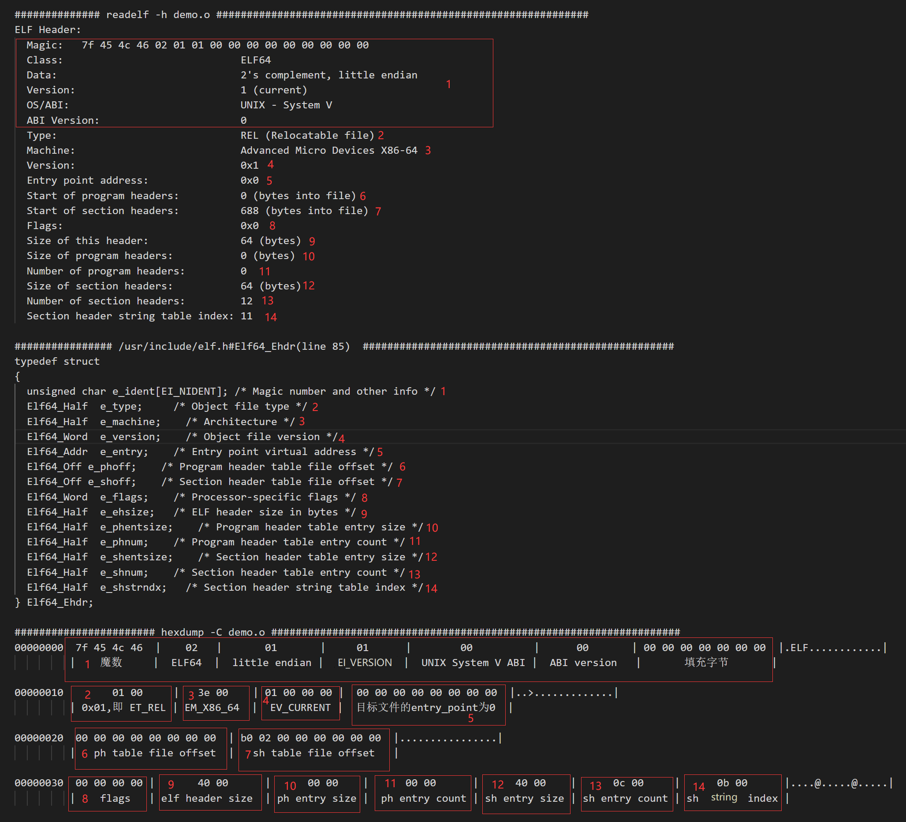
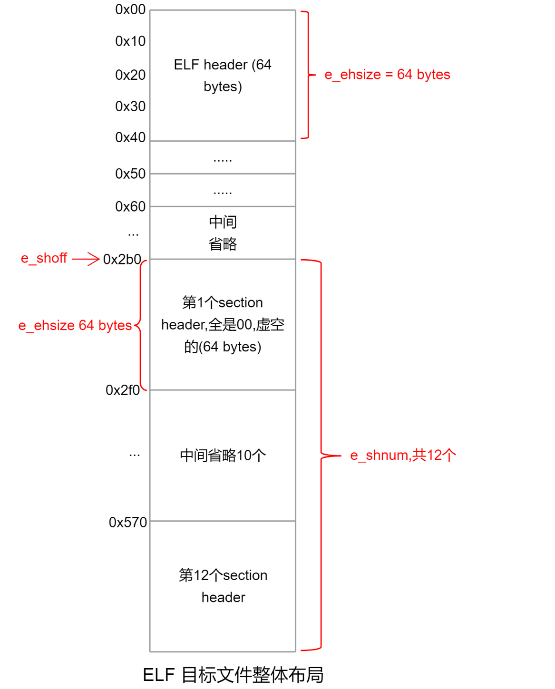
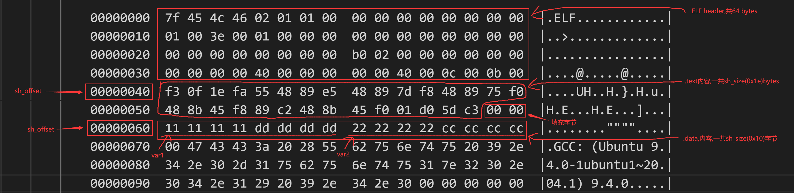

# 目标文件ELF详解

## elf 文件header

用下面C代码作例子来解释
```C
// gcc -c demo.c -o demo.o
unsigned long long var1 = 0xdddddddd11111111;
unsigned long long var2 = 0xcccccccc22222222;

int add(unsigned long long a, unsigned long long b)
{
    return a + b;
}
```

查看文件类型:
```
➜  file demo.o
demo.o: ELF 64-bit LSB relocatable, x86-64, version 1 (SYSV), not stripped
```

查看文件的二进制信息:
```
00000000  7f 45 4c 46 02 01 01 00  00 00 00 00 00 00 00 00  |.ELF............|
00000010  01 00 3e 00 01 00 00 00  00 00 00 00 00 00 00 00  |..>.............|
00000020  00 00 00 00 00 00 00 00  b0 02 00 00 00 00 00 00  |................|
00000030  00 00 00 00 40 00 00 00  00 00 40 00 0c 00 0b 00  |....@.....@.....|
00000040  f3 0f 1e fa 55 48 89 e5  48 89 7d f8 48 89 75 f0  |....UH..H.}.H.u.|
00000050  48 8b 45 f8 89 c2 48 8b  45 f0 01 d0 5d c3 00 00  |H.E...H.E...]...|
00000060  11 11 11 11 dd dd dd dd  22 22 22 22 cc cc cc cc  |........""""....|
00000070  00 47 43 43 3a 20 28 55  62 75 6e 74 75 20 39 2e  |.GCC: (Ubuntu 9.|
00000080  34 2e 30 2d 31 75 62 75  6e 74 75 31 7e 32 30 2e  |4.0-1ubuntu1~20.|
00000090  30 34 2e 31 29 20 39 2e  34 2e 30 00 00 00 00 00  |04.1) 9.4.0.....|
000000a0  04 00 00 00 10 00 00 00  05 00 00 00 47 4e 55 00  |............GNU.|
000000b0  02 00 00 c0 04 00 00 00  03 00 00 00 00 00 00 00  |................|
000000c0  14 00 00 00 00 00 00 00  01 7a 52 00 01 78 10 01  |.........zR..x..|
000000d0  1b 0c 07 08 90 01 00 00  1c 00 00 00 1c 00 00 00  |................|
000000e0  00 00 00 00 1e 00 00 00  00 45 0e 10 86 02 43 0d  |.........E....C.|
000000f0  06 55 0c 07 08 00 00 00  00 00 00 00 00 00 00 00  |.U..............|
00000100  00 00 00 00 00 00 00 00  00 00 00 00 00 00 00 00  |................|
00000110  01 00 00 00 04 00 f1 ff  00 00 00 00 00 00 00 00  |................|
00000120  00 00 00 00 00 00 00 00  00 00 00 00 03 00 01 00  |................|
00000130  00 00 00 00 00 00 00 00  00 00 00 00 00 00 00 00  |................|
00000140  00 00 00 00 03 00 02 00  00 00 00 00 00 00 00 00  |................|
00000150  00 00 00 00 00 00 00 00  00 00 00 00 03 00 03 00  |................|
00000160  00 00 00 00 00 00 00 00  00 00 00 00 00 00 00 00  |................|
00000170  00 00 00 00 03 00 05 00  00 00 00 00 00 00 00 00  |................|
00000180  00 00 00 00 00 00 00 00  00 00 00 00 03 00 06 00  |................|
00000190  00 00 00 00 00 00 00 00  00 00 00 00 00 00 00 00  |................|
000001a0  00 00 00 00 03 00 07 00  00 00 00 00 00 00 00 00  |................|
000001b0  00 00 00 00 00 00 00 00  00 00 00 00 03 00 04 00  |................|
000001c0  00 00 00 00 00 00 00 00  00 00 00 00 00 00 00 00  |................|
000001d0  08 00 00 00 11 00 02 00  00 00 00 00 00 00 00 00  |................|
000001e0  08 00 00 00 00 00 00 00  0d 00 00 00 11 00 02 00  |................|
000001f0  08 00 00 00 00 00 00 00  08 00 00 00 00 00 00 00  |................|
00000200  12 00 00 00 12 00 01 00  00 00 00 00 00 00 00 00  |................|
00000210  1e 00 00 00 00 00 00 00  00 64 65 6d 6f 2e 63 00  |.........demo.c.|
00000220  76 61 72 31 00 76 61 72  32 00 61 64 64 00 00 00  |var1.var2.add...|
00000230  20 00 00 00 00 00 00 00  02 00 00 00 02 00 00 00  | ...............|
00000240  00 00 00 00 00 00 00 00  00 2e 73 79 6d 74 61 62  |..........symtab|
00000250  00 2e 73 74 72 74 61 62  00 2e 73 68 73 74 72 74  |..strtab..shstrt|
00000260  61 62 00 2e 74 65 78 74  00 2e 64 61 74 61 00 2e  |ab..text..data..|
00000270  62 73 73 00 2e 63 6f 6d  6d 65 6e 74 00 2e 6e 6f  |bss..comment..no|
00000280  74 65 2e 47 4e 55 2d 73  74 61 63 6b 00 2e 6e 6f  |te.GNU-stack..no|
00000290  74 65 2e 67 6e 75 2e 70  72 6f 70 65 72 74 79 00  |te.gnu.property.|
000002a0  2e 72 65 6c 61 2e 65 68  5f 66 72 61 6d 65 00 00  |.rela.eh_frame..|
000002b0  00 00 00 00 00 00 00 00  00 00 00 00 00 00 00 00  |................|
*
000002f0  1b 00 00 00 01 00 00 00  06 00 00 00 00 00 00 00  |................|
00000300  00 00 00 00 00 00 00 00  40 00 00 00 00 00 00 00  |........@.......|
00000310  1e 00 00 00 00 00 00 00  00 00 00 00 00 00 00 00  |................|
00000320  01 00 00 00 00 00 00 00  00 00 00 00 00 00 00 00  |................|
00000330  21 00 00 00 01 00 00 00  03 00 00 00 00 00 00 00  |!...............|
00000340  00 00 00 00 00 00 00 00  60 00 00 00 00 00 00 00  |........`.......|
00000350  10 00 00 00 00 00 00 00  00 00 00 00 00 00 00 00  |................|
00000360  08 00 00 00 00 00 00 00  00 00 00 00 00 00 00 00  |................|
00000370  27 00 00 00 08 00 00 00  03 00 00 00 00 00 00 00  |'...............|
00000380  00 00 00 00 00 00 00 00  70 00 00 00 00 00 00 00  |........p.......|
00000390  00 00 00 00 00 00 00 00  00 00 00 00 00 00 00 00  |................|
000003a0  01 00 00 00 00 00 00 00  00 00 00 00 00 00 00 00  |................|
000003b0  2c 00 00 00 01 00 00 00  30 00 00 00 00 00 00 00  |,.......0.......|
000003c0  00 00 00 00 00 00 00 00  70 00 00 00 00 00 00 00  |........p.......|
000003d0  2c 00 00 00 00 00 00 00  00 00 00 00 00 00 00 00  |,...............|
000003e0  01 00 00 00 00 00 00 00  01 00 00 00 00 00 00 00  |................|
000003f0  35 00 00 00 01 00 00 00  00 00 00 00 00 00 00 00  |5...............|
00000400  00 00 00 00 00 00 00 00  9c 00 00 00 00 00 00 00  |................|
00000410  00 00 00 00 00 00 00 00  00 00 00 00 00 00 00 00  |................|
00000420  01 00 00 00 00 00 00 00  00 00 00 00 00 00 00 00  |................|
00000430  45 00 00 00 07 00 00 00  02 00 00 00 00 00 00 00  |E...............|
00000440  00 00 00 00 00 00 00 00  a0 00 00 00 00 00 00 00  |................|
00000450  20 00 00 00 00 00 00 00  00 00 00 00 00 00 00 00  | ...............|
00000460  08 00 00 00 00 00 00 00  00 00 00 00 00 00 00 00  |................|
00000470  5d 00 00 00 01 00 00 00  02 00 00 00 00 00 00 00  |]...............|
00000480  00 00 00 00 00 00 00 00  c0 00 00 00 00 00 00 00  |................|
00000490  38 00 00 00 00 00 00 00  00 00 00 00 00 00 00 00  |8...............|
000004a0  08 00 00 00 00 00 00 00  00 00 00 00 00 00 00 00  |................|
000004b0  58 00 00 00 04 00 00 00  40 00 00 00 00 00 00 00  |X.......@.......|
000004c0  00 00 00 00 00 00 00 00  30 02 00 00 00 00 00 00  |........0.......|
000004d0  18 00 00 00 00 00 00 00  09 00 00 00 07 00 00 00  |................|
000004e0  08 00 00 00 00 00 00 00  18 00 00 00 00 00 00 00  |................|
000004f0  01 00 00 00 02 00 00 00  00 00 00 00 00 00 00 00  |................|
00000500  00 00 00 00 00 00 00 00  f8 00 00 00 00 00 00 00  |................|
00000510  20 01 00 00 00 00 00 00  0a 00 00 00 09 00 00 00  | ...............|
00000520  08 00 00 00 00 00 00 00  18 00 00 00 00 00 00 00  |................|
00000530  09 00 00 00 03 00 00 00  00 00 00 00 00 00 00 00  |................|
00000540  00 00 00 00 00 00 00 00  18 02 00 00 00 00 00 00  |................|
00000550  16 00 00 00 00 00 00 00  00 00 00 00 00 00 00 00  |................|
00000560  01 00 00 00 00 00 00 00  00 00 00 00 00 00 00 00  |................|
00000570  11 00 00 00 03 00 00 00  00 00 00 00 00 00 00 00  |................|
00000580  00 00 00 00 00 00 00 00  48 02 00 00 00 00 00 00  |........H.......|
00000590  67 00 00 00 00 00 00 00  00 00 00 00 00 00 00 00  |g...............|
000005a0  01 00 00 00 00 00 00 00  00 00 00 00 00 00 00 00  |................|
000005b0
```

然后用不同的方式取查看`demo.o`这个目标文件里面有什么, 如下图(相同的内容用相同的数字标出):



这里用三种方式去了解elf文件的内容，总结如下:
- 1:  unsigned char	e_ident[EI_NIDENT];	其中EI_NIDENT为16,前4字节固定为 7f454c46的魔数,第5字节说明是ELF32或ELF64,第6字节是大端还是小端模式,第7字节固定为EI_VERSION,第8字节说名的是UNIX System V ABI,第9字节说明是ABI Version,最后7个字节为填充字节
- 2: elf文件类型,ET_REL是可重定位文件, ET_EXEC是可执行文件,还有其它类型请参考elf.h
- 3: 机器架构: 这里为x86-64 architecture
- 4: version, 固定为EV_CURRENT
- 5: 虚拟入口地址,因为本文件是目标可重定位文件, 所以为0
- 6: program header(ph)的开始的偏移位置, 目标文件没有program header.可执行elf才有,后面讲
- 7: section header(sh)的开始的偏移位置
- 8: e_flags, Processor specific flags for the ELF header e_flags field
- 9: elf header的大小为 sizeof(Elf64_Ehdr) = Elf64_Ehdr.e_ehsize = 64 bytes (红色)
- 10: 每一项program header(ph)的大小,因为目标文件没有ph,所以这里为0
- 11: program header项目的条数
- 12: 每一项section header(sh)的大小
- 13: section header项目的条数
- 14: Section header string table index(`.shstrtab`在`sh`中的下表索引)

从上面的分析可以看出, 目前可以总结出elf的布局如下: 



其中我们可以计算出`demo.o`目标文件的大小: 
`demo.o 大小 = e_ehsize + (e_shentsize * e_shnum ) = 688 + (64 * 12) = 1456 bytes`

使用 `ls -l demo.o`查看, 文件大小也是1456字节。 由此可见,section headers是一个类似数组的结构,并且在elf文件的最末尾。

另外, 留意到第一个section header项的二进制位全是0, 由此猜想第一个section header并不实际使用, 是一个虚空的section header.

---
<br>

## section header

上面我们了解了, ELF 目标文件的整体布局, 接下来我们再详细了解section header的详细内容。

每一项的`section header`的结构表示如下:
```C
// /usr/include/elf.h
typedef  uint32_t Elf64_Word;
typedef  uint64_t Elf64_Xword;
typedef  uint64_t Elf64_Addr;
typedef  uint64_t Elf64_Off;  

typedef struct
{
  Elf64_Word	sh_name;		/* Section name (string tbl index) */ // 
  Elf64_Word	sh_type;		/* Section type */                   
  Elf64_Xword	sh_flags;		/* Section flags */
  Elf64_Addr	sh_addr;		/* Section virtual addr at execution */
  Elf64_Off	sh_offset;     /* Section file offset */
  Elf64_Xword	sh_size;		/* Section size in bytes */
  Elf64_Word	sh_link;		/* Link to another section */
  Elf64_Word	sh_info;		/* Additional section information */
  Elf64_Xword	sh_addralign;  /* Section alignment */
  Elf64_Xword	sh_entsize;	/* Entry size if section holds table */
} Elf64_Shdr;
```

即每一项的`section header`大小为 64 bytes (`sizeof(Elf64_Shdr)`).

下面来逐项拆解 `Elf64_Shdr`结构体.

| 属性 | 说明 |
| :----: | :----: |
| sh_name | Section name段名,段名是个字符串,它位于一个叫做“.shstrtab”的字符串表。sh_name是段名字符串在“.shstrtab”中的偏移 |
| sh_type | Section type段的类型详见后文 "段的类型" |
| sh_flags | Section flag段的标志位详见后文 "段的标志位" |
| sh_addr | Section Address段虚拟地址, 如果该段可以被加载，则sh_addr为该段被加载后在进程地址空间中的虚拟地址;否则sh _addr为0 |
| sh_offset | Section Offset段偏移. 如果该段存在于文件中，则表示该段在文件中的偏移;否则无意义，比如sh_offset对于BSS段来说就没有意义 |
| sh_size | Section Size段的长度 | 
| sh_link | Section Link 和 Section Information 段链接信息,详见后文“段的链接信息”  |
| sh_info | Section Link 和 Section Information 段链接信息,详见后文“段的链接信息”  |
| sh_addralign | Section Address Alignment段地址对齐。有些段对段地址对齐有要求，比如我们假设有个段刚开始的位置包含了一个double变量,因为Intel x86系统要求浮点数的存储地址必须是本身的整数倍,也就是说保存double变量的地址必须是8字节的整数倍。这样对一个段来说，它的sh_addr 必须是8的整数倍。由于地址对齐的数量都是2的指数倍，sh_addralign表示是地址对齐数量中的指数，即sh_addrlign = 3表示对齐为2的3次方倍，即8倍，依此类推。所以一个段的地址sh _addr必须满足下面的条件，即sh _addr% (2*申sh_addralign)= 0。**表示指数运算。如果sh_addralign为0或1，则表示该段没有对齐要求 |
| sh_entsize | Section Entry Size项的长度。有些段包含了一些固定大小的项，比如符号表，它包含的每个符号所占的大小都是一样的。对于这种段，sh_entsize表示每个项的大小。如果为0，则表示该段不包含固定大小的项。 |


- 段的类型(sh_type)
```C
// /usr/include/elf.h
/* Legal values for sh_type (section type).  */
#define SHT_NULL	  0		/* Section header table entry unused */
#define SHT_PROGBITS	  1		/* Program data */
#define SHT_SYMTAB	  2		/* Symbol table */
#define SHT_STRTAB	  3		/* String table */
#define SHT_RELA	  4		/* Relocation entries with addends */
#define SHT_HASH	  5		/* Symbol hash table */
#define SHT_DYNAMIC	  6		/* Dynamic linking information */
#define SHT_NOTE	  7		/* Notes */
#define SHT_NOBITS	  8		/* Program space with no data (bss) */
#define SHT_REL		  9		/* Relocation entries, no addends */
#define SHT_SHLIB	  10		/* Reserved */
#define SHT_DYNSYM	  11		/* Dynamic linker symbol table */
#define SHT_INIT_ARRAY	  14		/* Array of constructors */
#define SHT_FINI_ARRAY	  15		/* Array of destructors */
#define SHT_PREINIT_ARRAY 16		/* Array of pre-constructors */
#define SHT_GROUP	  17		/* Section group */
#define SHT_SYMTAB_SHNDX  18		/* Extended section indeces */
#define	SHT_NUM		  19		/* Number of defined types.  */
#define SHT_LOOS	  0x60000000	/* Start OS-specific.  */
#define SHT_GNU_ATTRIBUTES 0x6ffffff5	/* Object attributes.  */
#define SHT_GNU_HASH	  0x6ffffff6	/* GNU-style hash table.  */
#define SHT_GNU_LIBLIST	  0x6ffffff7	/* Prelink library list */
#define SHT_CHECKSUM	  0x6ffffff8	/* Checksum for DSO content.  */
#define SHT_LOSUNW	  0x6ffffffa	/* Sun-specific low bound.  */
#define SHT_SUNW_move	  0x6ffffffa
#define SHT_SUNW_COMDAT   0x6ffffffb
#define SHT_SUNW_syminfo  0x6ffffffc
#define SHT_GNU_verdef	  0x6ffffffd	/* Version definition section.  */
#define SHT_GNU_verneed	  0x6ffffffe	/* Version needs section.  */
#define SHT_GNU_versym	  0x6fffffff	/* Version symbol table.  */
#define SHT_HISUNW	  0x6fffffff	/* Sun-specific high bound.  */
#define SHT_HIOS	  0x6fffffff	/* End OS-specific type */
#define SHT_LOPROC	  0x70000000	/* Start of processor-specific */
#define SHT_HIPROC	  0x7fffffff	/* End of processor-specific */
#define SHT_LOUSER	  0x80000000	/* Start of application-specific */
#define SHT_HIUSER	  0x8fffffff	/* End of application-specific */
```

- 段的标志位(sh_flags)
```C
// /usr/include/elf.h
/* Legal values for sh_flags (section flags).  */
#define SHF_WRITE	     (1 << 0)	/* Writable */
#define SHF_ALLOC	     (1 << 1)	/* Occupies memory during execution */
#define SHF_EXECINSTR	     (1 << 2)	/* Executable */
#define SHF_MERGE	     (1 << 4)	/* Might be merged */
#define SHF_STRINGS	     (1 << 5)	/* Contains nul-terminated strings */
#define SHF_INFO_LINK	     (1 << 6)	/* `sh_info' contains SHT index */
#define SHF_LINK_ORDER	     (1 << 7)	/* Preserve order after combining */
#define SHF_OS_NONCONFORMING (1 << 8)	/* Non-standard OS specific handling required */
#define SHF_GROUP	     (1 << 9)	/* Section is member of a group.  */
#define SHF_TLS		     (1 << 10)	/* Section hold thread-local data.  */
#define SHF_COMPRESSED	     (1 << 11)	/* Section with compressed data. */
#define SHF_MASKOS	     0x0ff00000	/* OS-specific.  */
#define SHF_MASKPROC	     0xf0000000	/* Processor-specific */
#define SHF_ORDERED	     (1 << 30)	/* Special ordering requirement (Solaris).  */
#define SHF_EXCLUDE	     (1U << 31)	/* Section is excluded unless referenced or allocated (Solaris).*/
```

对于系统保留的段,下表列举了他们的属性.
| name | sh_type | sh_flag|
| :----: | :----: | :----: |
| .bss | SHT_NOBITS | SHF_ALLOC+SHF_WRITE |
| .comment | SHT_PROGBITS | none |
| .data | SHT_PROGBITS | SHF_ALLOC + SHF_WRITE |
| .data1 | SHT_PROGBITS | SHF_ALLOC + SHF_WRITE |
| .debug | SHT_PROGBITS | none |
| .dynamic|  SHT_DYNAMIC | SHF_ALLOC + SHF_WRITE. 在有些系统.dynamic可能是只读的,所以没有SHF_WRITE标志位|
| .hash | SHT_HASH | SHF_ALLOC |
| .line | SHT_PROGBITS | none |
| .note | SHT_NOTE | none |
| .rodata | SHT_PROGBITS | SHF_ALLOC |
| .rodata1 | SHT_PROGBITS | SHF_ALLOC |
| .shstrtab | SHT_STRTAB | none |
| .strtab | SHT_STRTAB | 如果该ELF文件中有可装载的段须要用到该字符串表，那么该字符串表也将被装载到进程空间，则有SHF_ALLOC标志位 |
| .symtab | SHT_SYMTAB | 同字符串表.strtab|
| .text | SHT_PROGBITS | SHF_ALLOC + SHF_EXECINSTR |

- 段链接信息(sh_link、sh_info) 如果段的类型是与链接相关的(不论是动态链接或静态链接)，比如重定位表、符号表等，那么 sh_link 和 sh_info这两个成员所包含的意义如下表。对于其他类型的段，这两个成员没有意义。

| sh_type | sh_link | sh_info |
| :----: | :----: | :----: |
| SHT_DYNAMIC | 该段所使用的字符串表在段表中的下标 | 0 |
| SHT_HASH | 该段所使用的符号表在段表中的下标 | 0 |
| SHT_REL | 该段所使用的相应符号表在段表中的下标 | 该重定位表所作用的段,在段表中的下标 |
| SHT_RELA | 该段所使用的相应符号表在段表中的下标 | 该重定位表所作用的段,在段表中的下标 |
| SHT_SYMTAB | 操作系统相关的 | 操作系统相关的 |
| SHT_DYNSYM | 操作系统相关的 | 操作系统相关的 |
| other | SHN_UNDEF | 0 |

下面来使用一些例子来举例: 
因为第1项(下标为0)的section header是虚空的项, 并未实际使用,下面来研究第2项目。
从前面的知识我们可以知道,

### 第2项的section header其实偏移为`0x000002f0`,大小为64 bytes.

摘抄其二进制内容, 然后对照`Elf64_Shdr`, 说明如下:
```
000002f0  1b 00 00 00  |  01 00 00 00  |  06 00 00 00 00 00 00 00  |................|
            sh_name    |   sh_type     |          sh_flags         |

00000300  00 00 00 00 00 00 00 00  |  40 00 00 00 00 00 00 00  |........@.......|
                   sh_addr         |          sh_offset        |

00000310  1e 00 00 00 00 00 00 00  |  00 00 00 00  |  00 00 00 00  |................|
                   sh_size         |    sh_link    |    sh_info    |

00000320  01 00 00 00 00 00 00 00  |  00 00 00 00 00 00 00 00  |................|
                sh_addralign       |        sh_entsize         |             
```

- `sh_name`为 `0x1b`, 它表示一个偏移, 可以在`.shstrtab` section中找到, 在这里其对应的字符串为`.text`
- `sh_type` 为 `0x01`, 表示它是`SHT_PROGBITS`
- `sh_flags` 为 `0x06`, 即`0x06 = ((1 << 1) & (1 << 2))`, 亦即 `SHF_ALLOC + SHF_EXECINSTR`
- `sh_addr` 全为0, 该section的虚拟地址,在可重定位文件中,该值为0
-  `sh_offset` 为 `0x40`,表示该`section`的文件偏移地址, 可以看到这里`0x40`是挨在`ELF header(64 bytes)`后面
-  `sh_size` 为`0x1e`, 表明该`section`一共占用`0x1e`字节
- `sh_link` 和 `sh_info` 均为`0x00`,请参考, 段链接信息
- `sh_addralign` 为 `0x01`, 具体参考, `Elf64_Shdr`结构体说明
- `sh_entsize` 为 `0x00`,则表示该section不包含固定大小的项。 而有些`section`, 如`.symtab`,其包含的每个符号所占的大小都是一样的,那么它用`sh_entsize`来表示


### 第3项的section header其实偏移为`0x00000330`,大小为64 bytes.

摘抄其二进制内容, 然后对照`Elf64_Shdr`, 说明如下:
```
00000330  21 00 00 00  |  01 00 00 00  |  03 00 00 00 00 00 00 00  |................|
            sh_name    |   sh_type     |          sh_flags         |

00000340  00 00 00 00 00 00 00 00  |  60 00 00 00 00 00 00 00  |........@.......|
                   sh_addr         |          sh_offset        |

00000350  10 00 00 00 00 00 00 00  |  00 00 00 00  |  00 00 00 00  |................|
                   sh_size         |    sh_link    |    sh_info    |

00000360  08 00 00 00 00 00 00 00  |  00 00 00 00 00 00 00 00  |................|
                sh_addralign       |        sh_entsize         |             
```

- `sh_name`为 `0x21`, 它表示一个偏移, 可以在`.shstrtab` section中找到, 在这里其对应的字符串为`.data`
- `sh_type` 为 `0x01`, 表示它是`SHT_PROGBITS`
- `sh_flags` 为 `0x03`, 即`0x03 = ((1 << 0) & (1 << 1))`, 亦即 `SHF_WRITE + SHF_ALLOC`
- `sh_addr` 全为0, 该section的虚拟地址,在可重定位文件中,该值为0
-  `sh_offset` 为 `0x60`,表示该`section`的文件偏移地址, 可以看到这里`0x60`是挨在`.text` section后面
-  `sh_size` 为`0x10`, 表明该`section`一共占用`0x10`字节,其实就是变量`var1`和`var2`的值
- `sh_link` 和 `sh_info` 均为`0x00`,请参考, 段链接信息
- `sh_addralign` 为 `0x08`, 具体参考, `Elf64_Shdr`结构体说明
- `sh_entsize` 为 `0x00`,则表示该section不包含固定大小的项。 而有些`section`, 如`.symtab`,其包含的每个符号所占的大小都是一样的,那么它用`sh_entsize`来表示

<br>

> 上面的例子中, 直接通过分析二进制来解读`section header`太蛋疼了, 于是有下面两个命令(同时对照`Elf64_Shdr`)来帮我们分析。

我们可以使用以下命令来查看`section header`的内容, 具体如下:
```
➜  objdump -h demo.o

demo.o:     file format elf64-x86-64

Sections:
Idx Name          Size      VMA               LMA               File off  Algn
  0 .text         0000001e  0000000000000000  0000000000000000  00000040  2**0
                  CONTENTS, ALLOC, LOAD, READONLY, CODE
  1 .data         00000010  0000000000000000  0000000000000000  00000060  2**3
                  CONTENTS, ALLOC, LOAD, DATA
  2 .bss          00000000  0000000000000000  0000000000000000  00000070  2**0
                  ALLOC
  3 .comment      0000002c  0000000000000000  0000000000000000  00000070  2**0
                  CONTENTS, READONLY
  4 .note.GNU-stack 00000000  0000000000000000  0000000000000000  0000009c  2**0
                  CONTENTS, READONLY
  5 .note.gnu.property 00000020  0000000000000000  0000000000000000  000000a0  2**3
                  CONTENTS, ALLOC, LOAD, READONLY, DATA
  6 .eh_frame     00000038  0000000000000000  0000000000000000  000000c0  2**3
                  CONTENTS, ALLOC, LOAD, RELOC, READONLY, DATA
➜  readelf -S demo.o
There are 12 section headers, starting at offset 0x2b0:

Section Headers:
  [Nr] Name              Type             Address           Offset
       Size              EntSize          Flags  Link  Info  Align
  [ 0]                   NULL             0000000000000000  00000000
       0000000000000000  0000000000000000           0     0     0
  [ 1] .text             PROGBITS         0000000000000000  00000040
       000000000000001e  0000000000000000  AX       0     0     1
  [ 2] .data             PROGBITS         0000000000000000  00000060
       0000000000000010  0000000000000000  WA       0     0     8
  [ 3] .bss              NOBITS           0000000000000000  00000070
       0000000000000000  0000000000000000  WA       0     0     1
  [ 4] .comment          PROGBITS         0000000000000000  00000070
       000000000000002c  0000000000000001  MS       0     0     1
  [ 5] .note.GNU-stack   PROGBITS         0000000000000000  0000009c
       0000000000000000  0000000000000000           0     0     1
  [ 6] .note.gnu.propert NOTE             0000000000000000  000000a0
       0000000000000020  0000000000000000   A       0     0     8
  [ 7] .eh_frame         PROGBITS         0000000000000000  000000c0
       0000000000000038  0000000000000000   A       0     0     8
  [ 8] .rela.eh_frame    RELA             0000000000000000  00000230
       0000000000000018  0000000000000018   I       9     7     8
  [ 9] .symtab           SYMTAB           0000000000000000  000000f8
       0000000000000120  0000000000000018          10     9     8
  [10] .strtab           STRTAB           0000000000000000  00000218
       0000000000000016  0000000000000000           0     0     1
  [11] .shstrtab         STRTAB           0000000000000000  00000248
       0000000000000067  0000000000000000           0     0     1
Key to Flags:
  W (write), A (alloc), X (execute), M (merge), S (strings), I (info),
  L (link order), O (extra OS processing required), G (group), T (TLS),
  C (compressed), x (unknown), o (OS specific), E (exclude),
  l (large), p (processor specific)
```

`objdump -h` 和 `readelf -S` 都可以读取section header的信息, 但是`objdump`只是显示关键的 section, 而用`readelf`来查看则更详细。

## section content

上面经过分析了第2项和第3项的`section header`,下面来分析`section header`其对应的`section`内容,用如下截图(`hexdump -C demo.o部分截图`)来说明:



然后使用objdump 命令来查看`.text`和`.data`的内容
```
➜ objdump -D -j .text demo.o

demo.o:     file format elf64-x86-64

Disassembly of section .text:

0000000000000000 <add>:
   0:   f3 0f 1e fa             endbr64
   4:   55                      push   %rbp
   5:   48 89 e5                mov    %rsp,%rbp
   8:   48 89 7d f8             mov    %rdi,-0x8(%rbp)
   c:   48 89 75 f0             mov    %rsi,-0x10(%rbp)
  10:   48 8b 45 f8             mov    -0x8(%rbp),%rax
  14:   89 c2                   mov    %eax,%edx
  16:   48 8b 45 f0             mov    -0x10(%rbp),%rax
  1a:   01 d0                   add    %edx,%eax
  1c:   5d                      pop    %rbp
  1d:   c3                      retq
```
```
➜ objdump -s -j .data demo.o

demo.o:     file format elf64-x86-64

Contents of section .data:
 0000 11111111 dddddddd 22222222 cccccccc  ........""""....
```
从上可以看出使用`objdump`命令查看与我们的结果吻合。

---
<br>

上面提到说, `section header`的`sh_name`是一个偏移值,其内容在`.shstrtab section` 中.
下面来通过`readelf -x`来验证以下:
```
➜ readelf -x .shstrtab demo.o

Hex dump of section '.shstrtab':
  0x00000000 002e7379 6d746162 002e7374 72746162 ..symtab..strtab
  0x00000010 002e7368 73747274 6162002e 74657874 ..shstrtab..text
  0x00000020 002e6461 7461002e 62737300 2e636f6d ..data..bss..com
  0x00000030 6d656e74 002e6e6f 74652e47 4e552d73 ment..note.GNU-s
  0x00000040 7461636b 002e6e6f 74652e67 6e752e70 tack..note.gnu.p
  0x00000050 726f7065 72747900 2e72656c 612e6568 roperty..rela.eh
  0x00000060 5f667261 6d6500                     _frame.
```

果然,`.shstrtab`存放的是一堆字符串(每个以`\0`结尾), 而且 `.text`字符串的偏移是`0x1b`, `.data`字符串的偏移是`0x21`.

`.shstrtab`全程是`section header string table`,顾名思义是存放是跟`section header`相关的。另外还有`.strtable`(`string table`), 存放的是普通的字符串.我们也可以看一下其内容,
```
➜readelf -x .strtab demo.o

Hex dump of section '.strtab':
  0x00000000 0064656d 6f2e6300 76617231 00766172 .demo.c.var1.var
  0x00000010 32006164 6400                       2.add.
```
可以看到, `demo.c`,`var1`,`var2`,`add`都在这里

## symbol table

下来我们继续看符号表(symbol table)`.symtab`. 
前面我们在介绍`section header`的时候, 有一些`section`包含固定大小的项(`sh_entsize`),而`.symtab section`正是这种包含固定大小的项目, 

我把之前`readelf -S demo.o`抄过来, 仅保留`.symtab`部分.
```
Section Headers:
  [Nr] Name              Type             Address           Offset
       Size              EntSize          Flags  Link  Info  Align
  [ 9] .symtab           SYMTAB           0000000000000000  000000f8
       0000000000000120  0000000000000018          10     9     8
```
从上面得知, 我们知道`.symtab`占用(`sh_size`)`0x120`字节,每项占用`sh_entsize = sizeof(Elf64_Sym) = 0x18`字节. 即`.symtab`一共有`0x0c`项。

其中`Elf64_Sym`结构体正是用来表示`.symtab`的每一个项, 内容如下:
```C
// /usr/include/elf.h
typedef uint32_t Elf64_Word;
typedef uint16_t Elf64_Section;
typedef uint64_t Elf64_Addr;
typedef uint64_t Elf64_Xword;

typedef struct
{
  Elf64_Word	  st_name;		/* Symbol name (string tbl index) */
  unsigned char  st_info;		/* Symbol type and binding */
  unsigned char  st_other;		/* Symbol visibility */
  Elf64_Section  st_shndx;		/* Section index */
  Elf64_Addr	  st_value;		/* Symbol value */
  Elf64_Xword	  st_size;		/* Symbol size */
} Elf64_Sym;
```
这几个成员定义如下:
| 名称 | 说明 |
| :----: | :----: |
| st_name | 符号名。这个成员包含了该符号名在字符串表(.strtab)中的下标 |
| st_info | 符号类型和绑定信息，见下文“符号类型与绑定信息” |
| st_other | 描述了符号的可见性,见下文"符号可见性" |
| st_shndx |符号所在的段，见下文“符号所在段” |
| st_value | 符号相对应的值。这个值跟符号有关，可能是一个绝对值，也可能是一个地址等，不同的符号，它所对应的值含义不同,见下文“符号值” |
| st_size | 符号大小.对于包含数据的符号,这个值是该数据类型的大小。比如一个double型的符号它占用8个字节。如果该值为0，则表示该符号大小为0或未知 |

- 符号类型和绑定信息(st_info）

该成员低4位表示符号的类型(Symbol Type)，高12位表示符号绑定信息（Symbol Binding)，如下两个表。

符号可见性(Symbol Table Visibility(STV))

| 宏定义名 | 值 | 说明 | 
| :----: | :----: | :----: |
| STV_DEFAULT | 0 | 默认的可见性 |
| STV_INTERNAL | 1 | 处理器定义的隐藏类 |
| STV_HIDDEN | 2 | 符号对其他模块隐藏 |
| STV_PROTECTED | 3 | 不可抢占,不导出 |

符号绑定信息表(Symbol Table Binding(STB))

| 宏定义名 | 值 | 说明 | 
| :----: | :----: | :----: |
| STB_LOCAL | 0 | 局部符号，对于目标文件的外部不可见 |
| STB_GLOBAL | 1 | 全局符号，外部可见 |
| STB_WEAK | 2 | 弱引用 |

符号绑定信息表(Symbol Table Type(STT))

| 宏定义名 | 值 | 说明 | 
| :----: | :----: | :----: |
| STT_NOTYPE | 0 | 未知类型符号|
| STT_OBJECT | 1 | 该符号是个数据对象，比如变量、数组等 |
| STT_FUNC | 2 | 该符号是个函数或其他可执行代码 |
| STT_SECTION | 3 | 该符号表示一个段，这种符号必须是STB_LOCAL的 |
| STT_FILE | 4 | 该符号表示文件名，一般都是该目标文件所对应的源文件名,它一定是STB_LOCAL类型的，并且它的st_shndx一定是SHN_ABS |


- 符号所在段(st_shndx) 
如果符号定义在本目标文件中，那么这个成员表示符号所在的段在段表中的下标;但是如果符号不是定义在本目标文件中，或者对于有些特殊符号，`st_shndx`的值有些特殊，如下表所示。

| 宏定义名 | 值 | 说明 |
| :----: | :----: | :----: |
| SHN_ABS | 0xfff1 | 表示该符号包含了一个绝对的值。比如表示文件名的符号就属于这种类型的 |
| SHN_COMMON | 0xfff2 | 表示该符号是一个“COMMON块”类型的符号，一般来说，未初始化的全局符号定义就是这种类型的。有关“COMMON”详见“深入静态链接”之“COMMON块” |
| SHN_UNDEF | 0 | 表示该符号未定义。这个符号表示该符号在本目标文件被引用到,但是定义在其他目标文件中 |


- 符号值(st_value) 
每个符号都有一个对应的值，如果这个符号是一个函数或变量的定义，那么符号的值就是这个函数或变量的地址，更准确地讲应该按下面这几种情况区别对待。
在目标文件中，如果是符号的定义并且该符号不是“COMMON块”类型的(即st_shndx不为SHN_COMMON)，则st_value表示该符号在段中的偏移。即符号所对应的函数或变量位于由st_shndx 指定的段，偏移st_value 的位置。这也是目标文件中定义全局变量的符号的最常见情况。
在目标文件中，如果符号是“COMMON块”类型的(即st_shndx为SHN_COMMON),则st_value表示该符号的对齐属性。在可执行文件中，st_value表示符号的虚拟地址。这个虚拟地址对于动态链接器(后面会讲)来说十分有用。

我们可以使用`nm`或者`readelf -s`来查看符号表信息:
```
➜ nm -a demo.o
0000000000000000 b .bss
0000000000000000 n .comment
0000000000000000 d .data
0000000000000000 r .eh_frame
0000000000000000 n .note.GNU-stack
0000000000000000 r .note.gnu.property
0000000000000000 t .text
0000000000000000 T add
0000000000000000 a demo.c
0000000000000000 D var1
0000000000000008 D var2
➜ readelf -s demo.o

Symbol table '.symtab' contains 12 entries:
   Num:    Value          Size Type    Bind   Vis      Ndx Name
     0: 0000000000000000     0 NOTYPE  LOCAL  DEFAULT  UND
     1: 0000000000000000     0 FILE    LOCAL  DEFAULT  ABS demo.c
     2: 0000000000000000     0 SECTION LOCAL  DEFAULT    1
     3: 0000000000000000     0 SECTION LOCAL  DEFAULT    2
     4: 0000000000000000     0 SECTION LOCAL  DEFAULT    3
     5: 0000000000000000     0 SECTION LOCAL  DEFAULT    5
     6: 0000000000000000     0 SECTION LOCAL  DEFAULT    6
     7: 0000000000000000     0 SECTION LOCAL  DEFAULT    7
     8: 0000000000000000     0 SECTION LOCAL  DEFAULT    4
     9: 0000000000000000     8 OBJECT  GLOBAL DEFAULT    2 var1
    10: 0000000000000008     8 OBJECT  GLOBAL DEFAULT    2 var2
    11: 0000000000000000    30 FUNC    GLOBAL DEFAULT    1 add
```
可以看到`.symtab`一共有12项,其中第一项为虚空项。

关于符号表更详细介绍, 请参考: [符号表详解](./%E7%AC%A6%E5%8F%B7%E8%A1%A8%E8%AF%A6%E8%A7%A3.md)


## 特殊符号

当我们使用ld作为链接器来链接生产可执行文件时，它会为我们定义很多特殊的符号，这些符号并没有在你的程序中定义,但是你可以直接声明并且引用它,我们称之为特殊符号。其实这些符号是被定义在ld链接器的链接脚本中的。目前只须认为这些符号是特殊的，你无须定义它们，但可以声明它们并且使用。链接器会在将程序最终链接成可执行文件的时候将其解析成正确的值，注意，只有使用d链接生产最终可执行文件的时候这些符号才会存在。几个很具有代表性的特殊符号如下。

- `_executable_start`，该符号为程序起始地址，注意:不是入口地址，是程序的最开始的地址
- `_etext`或`_etext`或`etext`，该符号为代码段结束地址，即代码段最末尾的地址。`_edata` 或`edata`，该符号为数据段结束地址，即数据段最末尾的地址。
- `_end` 或`end`，该符号为程序结束地址。

以上地址都为程序被装载时的虚拟地址, 后面讲装载时再来回顾关于程序被装载后的虚拟地址。

例子:
```C
//
//SpecialSymbol.c
//

#include <stdio.h>

extern char __executable_start[];
extern char etext[], _etext[], __etext[];
extern char edata[], _edata[];
extern char end[], _end[];

int main()
{
        printf("Executable Start %X\n", __executable_start);
        printf("Text End %X %X %X\n", etext, _etext, __etext);
        printf("Data End %X %X\n", edata, _edata);
        printf("Executable End %X %X\n", end, _end);
        return 0;
}
```

输出:
```gcc SpecialSymbol.c
./a.out

Executable Start 400000
Text End 40061D 40061D 40061D
Data End 601034 601034
Executable End 601038 601038
```

---

<br>

参考阅读: 
https://refspecs.linuxbase.org/elf/elf.pdf