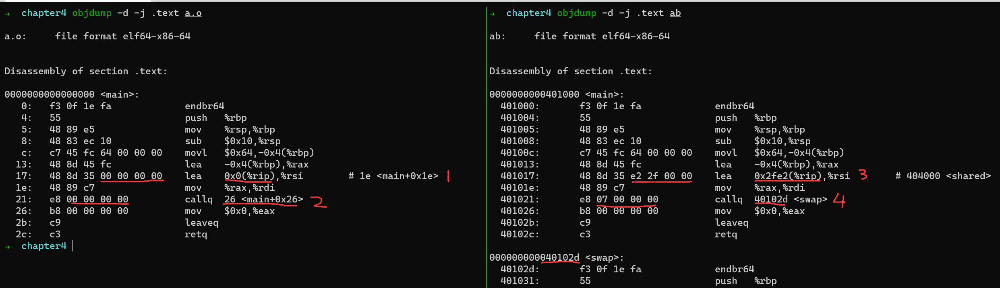
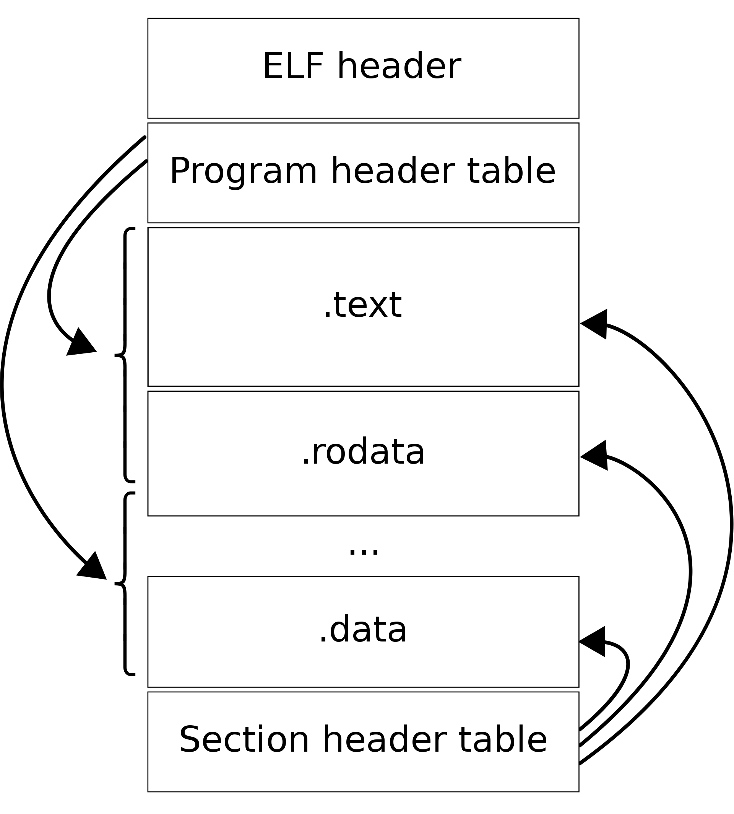
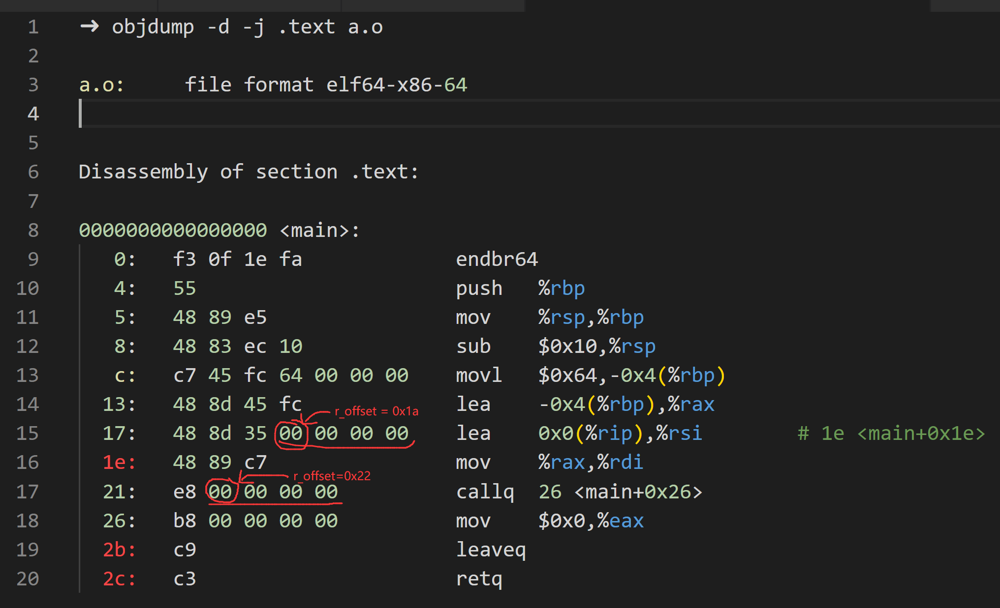
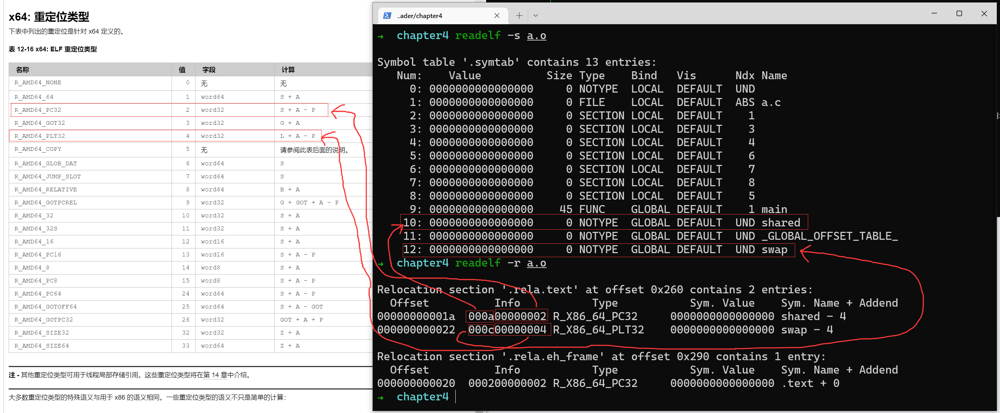
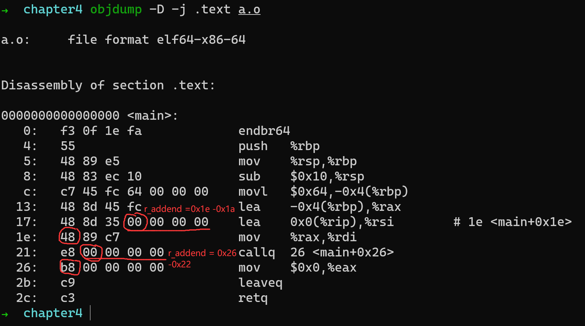
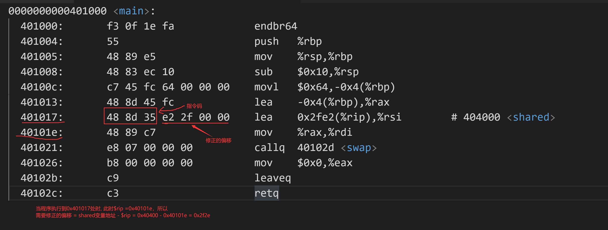

# 静态链接

有如下c文件:
```C
/* a.c */
extern int shared;

void swap(int* a, int* b);

int main() {
    int a = 100;
    swap(&a, &shared);
    return 0;
}
```

```C
/* b.c */
int shared = 1;

void swap(int* a, int* b) {
    *a ^= *b ^= *a ^= *b;
}
```

使用`gcc -fno-stack-protector -c a.c b.c`编译生成`a.o`,`b.o`, 使用`ld a.o b.o -e main -o ab`链接生成`ab`(`ab`运行会发生`segmentation fault`,目前忽略它)

下面我们来看看链接过程做了什么:

## 空间地址与分配

```
➜ objdump -h a.o

a.o:     file format elf64-x86-64

Sections:
Idx Name          Size      VMA               LMA               File off  Algn
  0 .text         0000002d  0000000000000000  0000000000000000  00000040  2**0
                  CONTENTS, ALLOC, LOAD, RELOC, READONLY, CODE
  1 .data         00000000  0000000000000000  0000000000000000  0000006d  2**0
                  CONTENTS, ALLOC, LOAD, DATA
  2 .bss          00000000  0000000000000000  0000000000000000  0000006d  2**0
                  ALLOC
  3 .comment      0000002c  0000000000000000  0000000000000000  0000006d  2**0
                  CONTENTS, READONLY
  4 .note.GNU-stack 00000000  0000000000000000  0000000000000000  00000099  2**0
                  CONTENTS, READONLY
  5 .note.gnu.property 00000020  0000000000000000  0000000000000000  000000a0  2**3
                  CONTENTS, ALLOC, LOAD, READONLY, DATA
  6 .eh_frame     00000038  0000000000000000  0000000000000000  000000c0  2**3
                  CONTENTS, ALLOC, LOAD, RELOC, READONLY, DATA
```

```
➜ objdump -h b.o

b.o:     file format elf64-x86-64

Sections:
Idx Name          Size      VMA               LMA               File off  Algn
  0 .text         0000004f  0000000000000000  0000000000000000  00000040  2**0
                  CONTENTS, ALLOC, LOAD, READONLY, CODE
  1 .data         00000004  0000000000000000  0000000000000000  00000090  2**2
                  CONTENTS, ALLOC, LOAD, DATA
  2 .bss          00000000  0000000000000000  0000000000000000  00000094  2**0
                  ALLOC
  3 .comment      0000002c  0000000000000000  0000000000000000  00000094  2**0
                  CONTENTS, READONLY
  4 .note.GNU-stack 00000000  0000000000000000  0000000000000000  000000c0  2**0
                  CONTENTS, READONLY
  5 .note.gnu.property 00000020  0000000000000000  0000000000000000  000000c0  2**3
                  CONTENTS, ALLOC, LOAD, READONLY, DATA
  6 .eh_frame     00000038  0000000000000000  0000000000000000  000000e0  2**3
                  CONTENTS, ALLOC, LOAD, RELOC, READONLY, DATA
```

```
➜ objdump -h ab

ab:     file format elf64-x86-64

Sections:
Idx Name          Size      VMA               LMA               File off  Algn
  0 .note.gnu.property 00000020  00000000004001c8  00000000004001c8  000001c8  2**3
                  CONTENTS, ALLOC, LOAD, READONLY, DATA
  1 .text         0000007c  0000000000401000  0000000000401000  00001000  2**0
                  CONTENTS, ALLOC, LOAD, READONLY, CODE
  2 .eh_frame     00000058  0000000000402000  0000000000402000  00002000  2**3
                  CONTENTS, ALLOC, LOAD, READONLY, DATA
  3 .data         00000004  0000000000404000  0000000000404000  00003000  2**2
                  CONTENTS, ALLOC, LOAD, DATA
  4 .comment      0000002b  0000000000000000  0000000000000000  00003004  2**0
                  CONTENTS, READONLY
```

- section 合并
从上面看出, ab的`.text`的大小(`0x7c`)等于 `a.o`的`.text`(`0x2d`)加上`b.o`的`.text`(`0x4f`),`.data`的情况也是。
说明在`ld`链接过程中把他们合并了。

使用如下命令`objdump -D -j .text ab`,确实是看到`swap`函数紧挨在`main`函数后面

- 分配虚拟地址

可以看到在.o的目标文件里面`VMA(virtual memory address)`都是0。而在可执行文件`AB`里面, 已经分配了VMA(`0x401000`).
使用`objdump -D -j .text ab`可以看到, `main`函数的虚拟地址也是为`0x401000`。
使用`gdb`验证，也是看到`main`函数的入口地址也是`0x401000`。(`starti`让程序停留在程序执行的第一条指令)
```
➜  gdb -q ./ab
Reading symbols from ./ab...
(No debugging symbols found in ./ab)
(gdb) starti
Starting program: /home/lws/os/linker_loader/chapter4/ab

Program stopped.
0x0000000000401000 in main ()
(gdb)
```
使用`readelf -h ab`,也可以看到`Entry point address:` 也是`0x401000`

## 符号解析与重定位



在目标文件中, 因为还不知道`shared`和 `swap`目标地址在哪里, 所以统统用`0`填充。
而到了链接后的可执行文件`ab`中,就填上了目标地址。

- 上图在`1 -> 3`中
 `lea 0x2fe2(%rip),%rsi`, 是把`shared`的变量的地址传送给寄存器`rsi`,以用作传参数。
其中`0x2fe2(%rip)`稍微有点难理解,我们从elf文件布局入手来解释一下.



elf执行文件的视图(图片来自维基百科), 其中从上到下为低地址到高地址.

我们执行的代码时放在`.text` section的, 而 `shared`是放在`.data` section的, 可以看到`.data`的地址比`.text`要高。

当程序执行到`0x401017`处时,`pc($rip)`指向下一条指令即`0x40101e`.所以`0x2fe2(%rip)`表示当前`pc`,再加上一个偏移值(`0x2fe2`), 就可以得到`shared`变量的地址了。即上面的 `数字3`那里, `&share = $rip + offest =  0x40101e + 0x2fe2 = 0x404000`

- 上图在`2 -> 4`中

`e8`是`call`的机器码, `e8` 后面的是地址的偏移量, 所以数字4标注那里, 相当于是相对地址`call 0x07`,即相当于绝对地址`call 0x40102d = (0x401026 + 0x07)`


## 重定位表

可重定位elf文件,它包含重定位表(relocation table),专门来保存冲顶问相关信息。对于`.text` section,那么会有一个相对应的`.rel.text`的section来保存其对应的重定位信息。`.data` section 也是有`.rel.data`来保存重定位信息。 可以使用`objdump -r`或`readelf -r`来查看重定位信息。

```
➜ objdump -r a.o

a.o:     file format elf64-x86-64

RELOCATION RECORDS FOR [.text]:
OFFSET           TYPE              VALUE
000000000000001a R_X86_64_PC32     shared-0x0000000000000004
0000000000000022 R_X86_64_PLT32    swap-0x0000000000000004


RELOCATION RECORDS FOR [.eh_frame]:
OFFSET           TYPE              VALUE
0000000000000020 R_X86_64_PC32     .text
➜ readelf -r a.o

Relocation section '.rela.text' at offset 0x260 contains 2 entries:
  Offset          Info           Type           Sym. Value    Sym. Name + Addend
00000000001a  000a00000002 R_X86_64_PC32     0000000000000000 shared - 4
000000000022  000c00000004 R_X86_64_PLT32    0000000000000000 swap - 4

Relocation section '.rela.eh_frame' at offset 0x290 contains 1 entry:
  Offset          Info           Type           Sym. Value    Sym. Name + Addend
000000000020  000200000002 R_X86_64_PC32     0000000000000000 .text + 0
```

从前面的`目标文件有什么`知识里面, 用`readelf -S a.o`。
```
➜  chapter4 readelf -S a.o
There are 13 section headers, starting at offset 0x318:

Section Headers:
  [Nr] Name              Type             Address           Offset
       Size              EntSize          Flags  Link  Info  Align
  [ 0]                   NULL             0000000000000000  00000000
       0000000000000000  0000000000000000           0     0     0
  [ 1] .text             PROGBITS         0000000000000000  00000040
       000000000000002d  0000000000000000  AX       0     0     1
  [ 2] .rela.text        RELA             0000000000000000  00000260
       0000000000000030  0000000000000018   I      10     1     8
       后面的内容省略
```

我们得知, `.rela.text` section是包含固定大小(`EntSize = 0x18`)的项的, 总共大小(`size`)为`0x30`,
我们得知该`.rela.text`一共有 `0x30 / 0x18 = 0x02`项。

从`/usr/include/elf.h`看到关于重定位项(`relocation entry`)的结构体有两个`Elf64_Rel`和`Elf64_Rela`,而我们这里看到的是`EntSize = 0x18`, 而`sizeof(Elf64_Rela) = 0x18`,因此可以断定我们这里使用的是`Elf64_Rela`, 其结构如下:
```C
// /usr/include/elf.h
typedef uint64_t Elf64_Addr;
typedef uint64_t Elf64_Xword;
typedef	int64_t  Elf64_Sxword;

typedef struct
{
  Elf64_Addr	r_offset;		/* Address */
  Elf64_Xword	r_info;			/* Relocation type and symbol index */
  Elf64_Sxword	r_addend;		/* Addend */
} Elf64_Rela;
```
字段说明如下,参考: https://docs.oracle.com/cd/E26926_01/html/E25910/chapter6-54839.html
- r_offset
```
重定位入口的偏移。对于可重定位文件来说，这个值是该重定位入口所要修正的位置的第一个字节相对于段起始的偏移;对于可执行文件或共享对象文件来说，这个值是该重定位入口所要修正的位置的第一个字节的虚拟地址。我们这里只关心可重定位文件的情况，可执行文件或共享对象文件的情况，将在下一章“动态链接”再作分析
```


- r_info

```
重定位入口的类型和符号。这个成员的低32位表示重定位入口的类型，高32位表示重定位入口的符号在符号表中的下标。因为各种处理器的指令格式不一样，所以重定位所修正的指令地址格式也不一样。每种处理器都有自己一套重定位入口的类型。对于可执行文件和共享目标文件来说，它们的重定位入口是动态链接类型的，请参考“动态链接”一章   
#define ELF64_R_SYM(i)			((i) >> 32)
#define ELF64_R_TYPE(i)			((i) & 0xffffffff)
#define ELF64_R_INFO(sym,type)		((((Elf64_Xword) (sym)) << 32) + (type))                       
```


> 这里`计算`那一列不太理解什么意思, 后面再符号解析寻址修正那里, 我会用实际的例子按照自己的理解去说明

- r_addend

```
  此成员指定常量加数，它代表引用位置与下一条指令的相对位置关系
```



## 符号解析

- `swap`寻址修正

使用命令`objdump -D -j .text ab`
```
➜  chapter4 objdump -D -j .text ab

ab:     file format elf64-x86-64


Disassembly of section .text:

0000000000401000 <main>:
  401000:       f3 0f 1e fa             endbr64
  401004:       55                      push   %rbp
  401005:       48 89 e5                mov    %rsp,%rbp
  401008:       48 83 ec 10             sub    $0x10,%rsp
  40100c:       c7 45 fc 64 00 00 00    movl   $0x64,-0x4(%rbp)
  401013:       48 8d 45 fc             lea    -0x4(%rbp),%rax
  401017:       48 8d 35 e2 2f 00 00    lea    0x2fe2(%rip),%rsi        # 404000 <shared>
  40101e:       48 89 c7                mov    %rax,%rdi
  401021:       e8 07 00 00 00          callq  40102d <swap>
  401026:       b8 00 00 00 00          mov    $0x0,%eax
  40102b:       c9                      leaveq
  40102c:       c3                      retq

000000000040102d <swap>:
  40102d:       f3 0f 1e fa             endbr64
  401031:       55                      push   %rbp
            .......
            省略后面的内容
```

从这里我们知道`main`函数虚地址是`0x401000`,`swap`函数的虚地址是`0x40102d`。 
而从前面我们可以知道`swap`符号的重定位信息,其`r.offset` 是 `0x22`, `r.addend` 是 `0x4`。我们可以知道修正的地址 = `0x07` = `swap函数地址 - (main函数地址 + r.offset + r.addend)` = `0x40102d - (0x401000 + 0x22 + 0x4)` = `0x07`
所以`e8(call)`指令填上修正后的地址`0x07`.


- `shared`寻址修正

使用`readelf -s ab` 命令可以查到`shared`变量的虚地址为`0x404000`.
下面用用图来解释, `shared`地址的修正过程.

